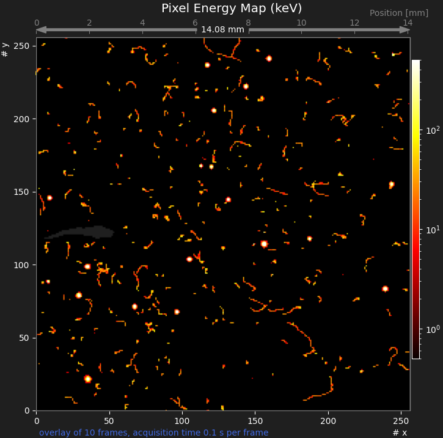
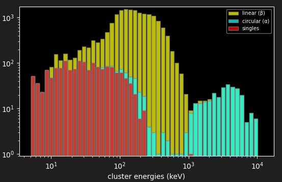

---
title: Educators Guide for the Advacam miniPIX (EDU) silicon pixel detector with mPIXdaq  
author: Günter Quast, February 2026
...

<head>
  
</head>

<!-- ------------------------------------------------------------------ -->

## Educators Guide for the Advacam miniPIX (EDU) silicon pixel detector with mPIXdaq  
                                                                    Vers. 1.0.1, February 2026  

The miniPIX (EDU) device is a modern silicon pixel detector to precisely measure 
the spacial distribution and magnitude of energy depositions caused by radiation 
emitted by radioactive samples. The visual impression of recorded energy depositions
resembles images produced by cloud chambers, with the additional advantage of  
quantitative, digital information with a spatial resolution of 55µm of the deposited 
energy is available. Recorded data sets can thus be analyzed to study in detail the properties of α, β and γ radiation.
The size of the sensitive area is 14.1 x 14.1 x 0.3 mm³, segmented into 256 x 256 pixels
with 0.300 mm depth, each covering an area of 55µm². The deposited energy in each pixel
is displayed as color-coded pixel in a tow-dimensional image.
Such images of different types of radiation give a direct impression of the ways how 
radiation interacts with matter: strongly localized ionization for α particles, long 
traces of ionization from β particles, and typically small energy deposits from 
electrons (i.e. β particles) produced by γ rays via the Compton process. 

### Analysis of radiation from natural samples

An typical image of radiation from a small sample of natural Pitchblende 
(Uraninit, Uranium Dioxide) is shown in the figure below.

> 

The circular "blobs" from emitted α particles, long tracks form β particles
and typically small objects from energy transfers of γ rays to electrons in 
the silicon are clearly distinguishable. 

With a thin plastic foil as absorber, the α and low-energy β signatures 
can be suppressed. As becomes clear from the image shown below, the rate of 
recorded objects is significantly reduced, and the typical signatures from
α particles ("blobs") are completely missing. 

> 

Finally, with an absorber of 2mm thick aluminum, only γ rays reach the sensor, 
leading to typical images as shown below.

> 

This sequence of images nicely demonstrates many features of radioactivity.
Appropriate radioactive samples with activities of some 10 Bq are freely 
available and can be bought from educational supply stores, e.g. 
[NTL](https://ntl.de/radioaktivitaet/4006-dr201-1c-columbit.html).

Installation and use of the *mPIXdaq* software as well as the options for data 
acquisition, data analysis and visualization are described in the *README* 
document of the package.

#### Pedagogical considerations

From a pedagogical point of view, it is very appealing to start from a 
natural phenomenon and let pupils or students discover the properties 
of radiation by themselves.  
In such an approach, the historical context becomes less important, as 
well as the sequence of developments of technological methods for radiation 
detection (electrometer, ionization chamber, Geiger counter, silicon detectors).
The advantage of this approach, relying on modern detection techniques, in 
contrast puts emphasis on the phenomenon of radioactivity itself and its 
interaction with materials.  
Furthermore, the high sensitivity of the miniPIX detector and its ability to 
clearly discriminate different types of radiation avoids the use of artificial, 
high-activity radioactive sources. With the *miniPIX* device, it is possible 
to perform background-free counting and energy determination of α particles,
or counting of β particles and γ rays with low-activity sources.

Images like the ones shown above may be produced using the *mPIXdaq* program, 
or also with the *Pixet* (basic) program the vendor provides together with 
the *minPIX* detector. 

*mPIXdaq*, however, provides a simple, transparent algorithm for clustering 
of pixels and for the characterization of cluster properties that rely solely 
on basic methods of data analysis, which are mastered already by undergraduate 
students. The *miniPIX* images may also serve as a motivation for younger 
high-school students to learn such techniques and gain experience. 

The algorithms are fast enough to be deployed on-line in low-rate scenarios,
thus providing quantitative results on particle rates and energy spectra. 
An example of linear and circular clusters and of single pixels is shown
below. 

  >  

*mPIXdaq* allows highly selective recording of special cluster types, thus
strongly discriminating the desired signatures against backgrounds. This 
approach permits studies with sources of much lower activities than needed 
in classical experiments e.g. to study the absorption of α particles in air.  

### Analysis of signatures of different types of radiation

Raw or clustered frame data as well as cluster properties in simple 
*.csv* file format can be stored on disk for subsequent analysis. 
In addition to the very beneficial visual impression it thus becomes 
possible to learn about and use computer-based methods to further 
study in detail the properties of energy depositions by different
types of particles.

### Advanced 

   - dependence of energy deposition as a function of energy:  
     pixel energy vs. track length
   - effect of β incidence angle  

