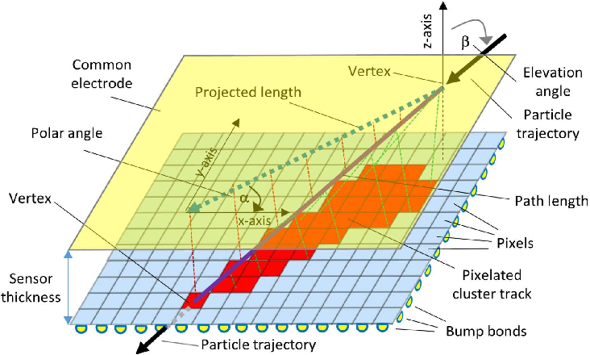
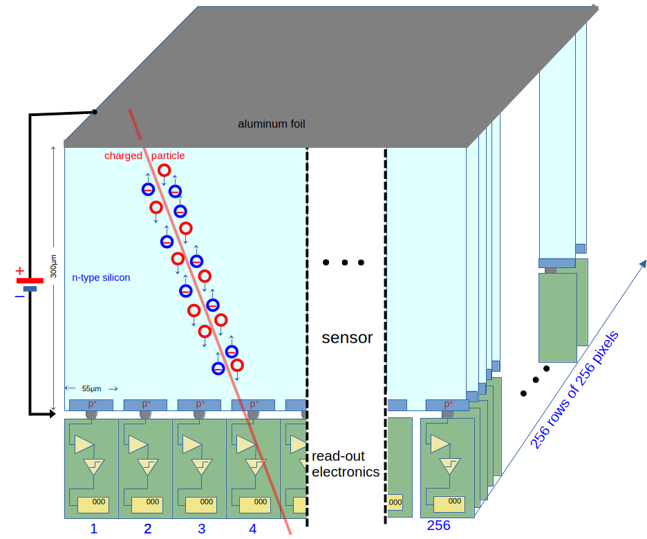
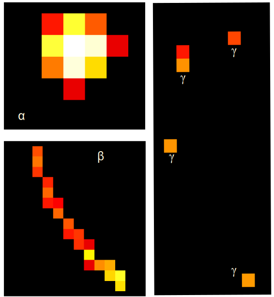

---
title: Educators Guide for the Advacam miniPIX (EDU) silicon pixel detector with mPIXdaq  
author: Günter Quast, February 2026
...

<head>
  
</head>

<!-- ------------------------------------------------------------------ -->

## Educators Guide for the Advacam miniPIX (EDU) silicon pixel detector with mPIXdaq  
                                                                    Vers. 1.0.1, February 2026  

This document is meant as a guide for educators who want to explore the possibilities
af a modern radiation detection sensor and its implications on new ways to teach
the subject of radioactivity at secondary and high-school level. 
Installation and use of the *mPIXdaq* software as well as the options for data 
acquisition, data analysis and visualization are described in the *README* 
document of the *mPIXdaq* package. 

### The miniPIX (EDU) and its educational potential  

The miniPIX (EDU) device is a modern silicon pixel detector to precisely measure 
the spacial distribution and magnitude of energy depositions caused by radiation 
emitted by radioactive samples. The visual impression of recorded energy depositions
resembles images produced by cloud chambers, with the additional advantage of  
quantitative, digital information with a spatial resolution of 55µm of the deposited 
energy is available. Recorded data sets can thus be analyzed to study in detail the
properties of α, β and γ radiation.

The size of the sensitive area is 14.1 x 14.1 x 0.3 mm³, segmented into 256 x 256 pixels
with 0.300 mm depth, each covering an area of 55µm². The deposited energy in each pixel
is displayed as color-coded pixel in a tow-dimensional image.
Such images of different types of radiation give a direct impression of the ways how 
radiation interacts with matter: strongly localized ionization for α particles, long 
traces of ionization from β particles, and typically small energy deposits from 
electrons (i.e. β particles) produced by γ rays via the Compton process. 

A schematic view of a charced-particle track in the sensitive detector material and the
projection of the energy deposits on the 256x256 readout pixels is shown in the figure below.

> 

Compared to other detection techniques, which simply count the occurrences of 
a single particle interactions in a large volume, the *miniPIX* is special because 
it integrates over all signals that occurred within a freely chosen exposure time
and shows records energy deposits with high spatial resolution. 

The basic operating principle of the detector is analogous other applications of silicon 
sensors for measurements of visible or infrared light, i.e. photo-diodes, or from
solar cells and digital cameras and should be well-known to students. 

The *miniPIX* is a technological masterpiece combining 65536 individual, 
radiation-sensitive pixels, arranged in an array of 256x256. Each pixel is connected 
to a pre-amplifier, discriminator and counting logic. During the freely selectable 
exposure time, signals from each pixel are integrated and read out as a single frame,
resembling an image produced by a digital camera. In a digital photo-camera, the number
of produced electron-hole pairs is proportional to the intensity of the incoming light. 
Here, instead, the electron-hole pairs are produced by charged particles, and their 
number and hence the collected charge is proportional to the energy deposited by the
traversing particle in the sensitive volume of the pixel. A schematic of the detector
is shown below. It consists of the actual sensor and a second chip connected to it
to provide the readout.

> 

If particle rates are sufficiently low to avoid overlaps of signatures in space and 
time, all  particle interactions are individually distinguishable and recorded and 
collected in one frame. The deposited energy in the pixels is encoded as a color 
scale in *miniPIX* frames, resulting in a very intuitive representation of the 
signatures produced by particles in the sensitive volume. 

Its high sensitivity and spatial mapping of energy deposits as well as the digitally
recorded data make the *miniPIX* superior to other, classical detectors. While it 
allows the same typical text-book measurements to be taken, like rate measurements 
or the  penetration depths of different types of radiation, more extensive 
possibilities open up:

 - direct observation of how radiation interacts with materials, 
 - discrimination of radiation types based on the pixel patterns, 
 - dependence of the measured rates from the distance to the source,
 - demonstration of Poisson statistics by counting objects in the recorded frames, 
 - energy measurements of α particles and of their energy loss in matter,
 - mean energy loss of β particles in matter,
 - studies of photon interactions in matter (dominated by the Compton process).

There are even more benefits related to the practical application in laboratory 
courses or school experiments:

 - use of low-activity radioactive samples to study natural radioactivity in
   hands-on experiments by students, 
 - freely adjustable exposure time to adapt to different radiation intensities,
 - negligible noise rates, efficient suppression of backgrounds and well-defined 
   detector live-time to avoid corrections,  
 - digital overlay of many recorded frames to obtain feature-rich images even 
   from low-activity sources,
 - storage of data to disk for later, in-depth analysis of particle signatures,
 - different levels of pre-processing of recorded frames to adjust to the students'
   level of knowledge,
 - usage of the very same detector for many types of measurements brings into focus
   the properties of radiation rather than the classical arsenal of detection 
   techniques like electrometer, ionization chamber, Geiger counter or mono-crystal 
   silicon detectors.  

Unfortunately, energy spectra of γ rays cannot be measured with the *miniPIX* 
due to the small overall sensor volume; therefore, a gamma spectrometer with a 
scintillating crystal is recommended for γ spectroscopy, e.g. one of the very 
cost-effective and sufficiently precise devices made by
[RadiaCode](https://radiacode.com/).

An overlay of 10 frames, each recorded with an exposure time of 1s, is shown below.
Clustering of connected pixels and a classification of the patterns is performed
on-line during data acquisition. More details on the analysis method will be
given below.

Examples of successfully conducted measurements in the student and teachers
labs at the Faculty of Physics at Karlsruhe Institute of Physics are presented 
and discussed below. 

### Analysis of radiation from natural samples

A typical image of radiation from a small sample of natural Pitchblende 
(Uraninit, Uranium Dioxide), recorded with the *miniPIX*, is shown in the figure below.

> 

The circular "blobs" from emitted α particles, long tracks form β particles
and typically small objects from energy transfers of γ rays to electrons in 
the silicon are clearly distinguishable. 

**Enlarged views** of α, β and γ are shown below and demonstrate that the different signatures are clearly distinguishable. Note that the length of β traces depends on
their energies and incident angles; usually, they are not fully contained within the
sensitive volume of the *miniPIX* sensor. γ rays typically transfer only a fraction
of their energy to electrons via the Compton process and therefore lead to signatures
with only one or very view active sensor pixels. Note that lager energy transfers 
and the full transfer of the γ energy to electrons via photo-effect are also possible.

> 

A **thin plastic foil as absorber** leads to complete suppression of all α 
and of low-energy β signatures. As becomes clear from the image shown below, 
the rate of recorded objects is significantly reduced, and the typical 
signatures from α particles ("blobs") are completely missing. 

> 

A **2 mm aluminum absorber** is sufficient to completely suppress 
all α and β particles such that only γ rays reach the sensor. 
A typical image is shown below.

> 

This sequence of images nicely demonstrates many features of radioactivity.
Appropriate radioactive samples with activities of some 10 Bq are freely 
available and can be bought from educational supply stores, e.g. 
[NTL](https://ntl.de/radioaktivitaet/4006-dr201-1c-columbit.html).

#### Pedagogical considerations

From a pedagogical point of view, it is very appealing to start from a 
natural phenomenon and let pupils or students discover the properties 
of radiation by themselves.  
In such an approach, the historical context becomes less important, as 
well as the sequence of developments of technological methods for radiation 
detection.   
The advantage of this approach, relying on modern detection techniques, in 
contrast puts emphasis on the phenomenon of radioactivity itself and its 
interaction with materials.  
Furthermore, the high sensitivity of the miniPIX detector and its ability to 
clearly discriminate different types of radiation avoids the use of artificial, 
high-activity radioactive sources. With the *miniPIX* device, it is possible 
to perform background-free counting and energy determination of α particles,
or counting of β particles and γ rays with low-activity sources.

Images like the ones shown above may be produced using the *mPIXdaq* program, 
or also with the *Pixet* (basic) program the vendor provides together with 
the *minPIX* detector. 
*mPIXdaq*, however, provides a simple, transparent algorithm for clustering 
of pixels and for the characterization of cluster properties that rely solely 
on basic methods of data analysis, which are mastered already by undergraduate 
students. The *miniPIX* images may also serve as a motivation for younger 
high-school students to learn such techniques and gain experience in more
complex methods of digital data processing and analysis.

The algorithms are fast enough to be deployed on-line in low-rate scenarios,
thus providing quantitative results on particle rates and energy spectra. 
An example of linear and circular clusters and of single pixels is shown
below. 

  >  

*mPIXdaq* allows highly selective recording of special cluster types, thus
strongly discriminating the desired signatures against backgrounds. This 
approach permits studies with sources of much lower activities than needed 
in classical experiments e.g. to study the absorption of α particles in air.  

### Analysis of signatures of different types of radiation

Raw or clustered frame data as well as cluster properties in simple 
*.csv* file format can be stored on disk for subsequent analysis. 
In addition to the very beneficial visual impression it thus becomes 
possible to learn about and use computer-based methods to further 
study in detail the properties of energy depositions by different
types of particles.

### Advanced 

   - dependence of energy deposition as a function of energy:  
     pixel energy vs. track length
   - effect of β incidence angle  

