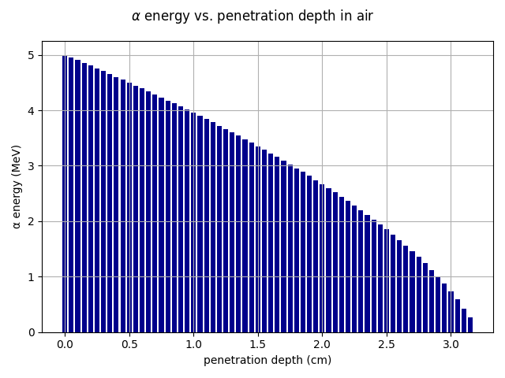
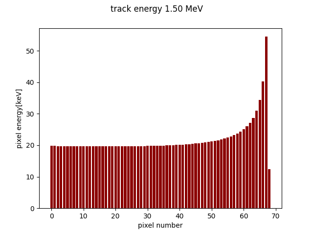

---
title: Educators Guide for the Advacam miniPIX (EDU) silicon pixel detector with mPIXdaq  
author: Günter Quast, February 2026
...

<head>
  
</head>

<!-- ------------------------------------------------------------------ -->

# Educators Guide for *mPIXdaq* 
## using the Advacam miniPIX (EDU) silicon pixel detector  
                                                                    Vers. 1.0.1, February 2026  

This document is meant as a guide for educators who want to explore the possibilities
af a modern radiation detection sensor and its implications on new ways to teach
the subject of radioactivity at secondary and high-school level. 

While installation and use of the *mPIXdaq* software as well as the options for data 
acquisition, data analysis and visualization are described in the *README* 
document of the *mPIXdaq* package, this guides concentrates on practical 
applications in laboratory courses.

## The miniPIX (EDU) and its educational potential  

The miniPIX (EDU) device is a modern silicon pixel detector that precisely measures 
the spacial distribution and magnitude of energy depositions caused by ionizing
particles traversing the sensitive volume.     
Segmented silicon detectors like the *miniPIX* were originally developed for tracking
of charged particles in high-energy physics. They are now also widely used in diverse
fields for particle detection, radiation dose measurements and imaging in material 
sciences and for medical applications.  

The affordable miniPIX (EDU) variant from [Advacam](https://advacam.com/camera/minipix-edu/) 
is based on the [*Timepix*](https://home.cern/tags/timepix) hybrid silicon pixel 
device developed at CERN. 
Thanks to the USB interface and the availability of a user program and drivers for
various platforms, the detector is easy  to use and allows data analysis in real-time. 
It is particularly useful to interactively investigate the properties and interactions 
with matter of α, β and γ radiation in educational contexts, opening new ways 
of teaching nuclear physics.  
The visual impression of recorded energy depositions in the pixel sensor resembles 
images produced by cloud chambers, but the *miniPIX* is much easier to set-up and use
and offers the additional advantage that quantitative, digital information with accurate 
spatial resolution of the deposited energy is also available. Besides visual inspection, 
recorded data sets can thus be analyzed to explore in detail the properties of radiation
emitted by radioactive probes.  

The size of the sensitive area of the pixel sensor is 14.1 x 14.1 x 0.3 mm³, segmented 
into 256 x 256 square pixels with 0.300 mm depth, each covering an area of 55 µm². 
Bump-bonded to the sensor is a readout chip connecting each element of the pixel matrix 
to its own preamplifier, discriminator and digital counter integrated on the readout chip. 

The deposited energy in each pixel is displayed as color-coded pixel in a two-dimensional 
image. Such images of different types of radiation give a direct impression of the ways 
how radiation interacts with matter: strongly localized energy deposits for α particles, 
long traces from β particles, and - typically small - energy deposits from γ rays, which
also stem from electrons (i.e. β particles) produced via the Compton process or the
photo effect. 

A schematic view of a charged-particle track in the sensitive detector material and the
projection of the energy deposits on the pixels readout plane is shown in the figure below.

> 

Compared to other detection techniques, which simply count the occurrences of 
a single particle interactions in a large volume, the *miniPIX* is special because 
it integrates over all signals that occurred within a freely chosen exposure time
and records energy deposits with high spatial resolution. 

The basic operating principle of the detector depends on the p-n junction of p- and n-type
silicon semiconductors and and should be well-known to students. It is analogous to other 
typical sensors for visible or infrared light, i.e. photo-diodes, solar cells or pixels in digital cameras.

The *miniPIX* is a cutting-edge technological masterpiece combining 65536 individual, 
radiation-sensitive pixels, arranged in an array of shape 256x256. 
Each pixel is connected to a pre-amplifier, a discriminator and counting logic. 
During the freely selectable exposure time, signals from each pixel are integrated 
and read out as a single frame, very much resembling an image produced by a 
digital camera. In a digital photo-camera, the number of produced electron-hole pairs 
is proportional to the intensity of the incoming light. Here, instead, the electron-hole 
pairs are produced by charged particles, and their number and hence the collected charge
is proportional to the energy deposited by the traversing particle in the sensitive 
volume of the pixel.
A schematic of the detector is shown below.

> 

The chip is operated in the so-called "frame mode", i.e. all pixels are read 
out at the same time, providing one frame consisting of the deposited energies 
per pixel collected during the acquisition time. 
If operated in time-over-threshold (ToT) mode, returned pixel readings represent the 
time the signal is over a given threshold in counts of the chip clock (appr. 10 MHz). 
*ToT* is linearly related to the energy deposition for large deposits exceeding
 50 keV. The functional dependence on the deposited energy $E$, including threshold 
 effects, is approximated by the following function

   $ToT\,=\;a\,E +b - {c}/{(E-t)}$

Approximate values of the calibrations constants are  
$a$ = 1.6, $b$=23, $c$=23 and $t$=4.3. 
Each pixel has its individual calibration stored on the chip, 
which is optionally applied to obtain pixel readings in units of keV.
The calibration is reliable up to pixel energies of one MeV. 
Higher pixel energies may result when frames with short acquisition 
time are summed up. For details, see the article by J. Jakubek, 
*Precise energy calibration of pixel detector working in 
time-over-threshold mode*, NIM A 633 (2011), 5262-5265.

If particle rates are sufficiently low to avoid overlaps of signatures, all 
particle interactions are individually distinguishable and recorded and
collected in one frame. The deposited energy in the pixels is encoded as a 
color value, resulting in a very intuitive representation of the energy deposits 
produced by particles in the sensitive volume. 

Its high sensitivity and spatial mapping of energy deposits as well as the digitally
recorded data make the *miniPIX* superior to other, classical detectors. While it 
allows the same typical text-book measurements to be taken, like measurements of rates 
or penetration depths of different types of radiation, more extensive possibilities 
open up:

- direct observation of how radiation interacts with materials, 
- discrimination of radiation types based on the pixel patterns, 
- demonstration of Poisson statistics by counting objects in the recorded frames, 
- dependence of the measured rates from the distance to the source,
- energy measurements of α particles and of their energy loss in matter,
- mean energy loss of β particles in matter,
- studies of photon interactions in matter (dominated by the Compton process).

There are even more benefits related to the practical application in laboratory 
courses or school experiments:

- use of low-activity radioactive samples to study natural radioactivity in
  hands-on experiments by students, 
- freely adjustable exposure time to adapt to different radiation intensities,
- negligible noise rates, efficient suppression of backgrounds and well-defined 
  detector live-time,
- digital overlay of many recorded frames to obtain feature-rich images even 
  from low-activity sources,
- storage of data to disk for later, in-depth analysis of particle signatures,
- different levels of pre-processing of recorded frames to adjust to the students'
  level of knowledge,
- usage of the very same detector for many different types of measurements, bringing 
  into focus the properties of radiation rather than the classical arsenal of detection
  techniques like electrometer, ionization chamber, Geiger counter or mono-crystal
  silicon detectors.  

As an example, the graphical display of *mPIXdaq* is shown below with an 
overlay of 10 frames, each recorded with an exposure time of 1 s. Clustering 
of connected pixels and classification of the patterns are performed in real time 
during data acquisition and results are shown as histograms. The history over
the last 300 frames of the numbers of observed objects per frame is also displayed 
and demonstrates the Poisson nature of the underlying processes of production and
detection of radioactive particles.
More details on the analysis method will be given below.

Energy spectra of γ rays cannot be measured with the *miniPIX* owing to the small 
overall sensor volume. Therefore a gamma spectrometer with a scintillating crystal 
is recommended for γ spectroscopy, e.g. one of the very cost-effective and
sufficiently precise devices made by [RadiaCode](https://radiacode.com/).

Examples of successfully conducted measurements in the student and teacher's
labs at the Faculty of Physics at Karlsruhe Institute of Physics are presented 
and discussed below. 

## Analysis of radiation from natural samples

A small sample of natural Pitchblende (Uraninit, Uranium Dioxide) is chosen here
as the entry point for studies of radioactive phenomena.
A typical *miniPIX* frame image recorded with *mPIXdaq* is shown in the figure below.
Pixel energies are shown as colors on a logarithmic scale, as indicted by the legend
on the right-hand side of the image. 

> 

Three types of signatures are clearly distinguishable: circular "blobs" from α particles, 
long "worms" from β particles and typically small objects from energy transfers of γ rays 
to electrons in the silicon. 

Enlarged views of typical α, β and γ signatures show this clearly. Note that 
the lengths of β traces depend on their energies and incident angles; usually, they
are not fully contained within the sensitive volume of the *miniPIX* sensor. 
γ rays typically transfer only a fraction of their energy to electrons via the 
Compton process and therefore lead to signatures with only one or very view active 
sensor pixels. Note that lager energy transfers and the full transfer of the γ energy
to electrons via photo-effect are also possible in rare cases.

> 

A **thin plastic foil as absorber** leads to complete suppression of all α 
and of low-energy β signatures. As becomes clear from the image shown below, 
the rate of recorded objects is significantly reduced, and the typical 
signatures from α particles are completely missing. 

> 

A **3 mm aluminum absorber** is sufficient to completely suppress all α and β 
particles such that only γ rays reach the sensor. A typical image is shown below.
All traces are produced by γ interactions in or near the sensitive volume of
the detector; many involve only one or very few pixels. Longer traces occur
when a significant amount of energy is transferred to electrons. 

> 

This sequence of images nicely demonstrates many features of radioactivity:  

- there are three types of very distinct signatures of radioactivity from natural sources:  
  very intensive circular patterns (α), long traces (β) and low energy deposits with
  only very few active pixels (γ),
- α and β particles can easily be shielded,
- γ rays are much more penetrating and more difficult to shield,
- signatures from γ rays look very similar to those of low-energy electrons, 
  leading to the conclusion that photons interact with matter by transferring 
  their energy to electrons that finally produce free charges (or electron-hole 
  pairs in a semi-conductor). 

Appropriate radioactive samples with activities of some 10 Bq are freely 
available and can be bought from educational supply stores, e.g. 
[NTL](https://ntl.de/radioaktivitaet/4006-dr201-1c-columbit.html).

### Pedagogical considerations

From a pedagogical point of view, it is very appealing to start a course on
radioactivity from experimental observations of a natural phenomenon and let 
pupils or students discover the properties of radiation by themselves.  
In such an approach, the historical context becomes less important, as 
well as the sequence of developments of technological methods for radiation 
detection.  Utilizing modern detection techniques right at the beginning puts 
emphasis on the phenomenon of radioactivity itself and its interaction with 
materials.  
Furthermore, the high sensitivity of the miniPIX detector and its ability to 
clearly discriminate different types of radiation avoids the use of artificial, 
high-activity radioactive sources. With the *miniPIX* device, it is possible 
to perform background-free counting and energy determination of α particles,
or counting of β particles and γ rays with low-activity sources.   
This approach permits studies with sources of much lower activities than needed 
in classical experiments e.g. to study the absorption of α particles in air.  
In contrast, with a classical radiation detector, e.g. a Geiger-Müller counter, 
only a reduction in counting rate is observed when adding absorbers,
but no distinction of the origin of the "clicks". Therefore, a high-rate 
α-source is needed to demonstrate complete absorption, with the caveat that
unavoidable background counts from γ rays are still present. 

Images like the ones shown above may be produced using the *mPIXdaq* program, 
or also with the *Pixet* (basic) program the vendor provides together with 
the *minPIX* detector. 
*mPIXdaq*, however, provides a simple, transparent algorithm for clustering 
of pixels and for the characterization of cluster properties that rely solely 
on basic methods of data analysis, which are mastered already by undergraduate 
students. The *miniPIX* images may also serve as a motivation for younger 
high-school students to learn such techniques and gain experience in more
complex methods of digital data processing and analysis.

The algorithms are fast enough to be deployed on-line in low-rate scenarios,
thus providing quantitative results on particle rates and energy spectra. 
An example of the energy spectra of linear and circular clusters and of 
single pixels is shown below. 

  >  

*mPIXdaq* allows highly selective recording of special cluster types, thus
strongly discriminating the desired signatures against backgrounds. 

## Digital analysis of recorded data  

Raw or clustered frame data as well as cluster properties in simple 
*.csv* format can be created wit *mPIXdaq* and stored on disk for 
subsequent analysis. In addition to the very beneficial visual impression 
it thus becomes possible to learn about and use computer-based methods 
to study in detail the properties of energy depositions by different
types of particles. 

As a starting point, the *mPIXdaq* package offers a *Jupyter Notebook*,
*analyze_mPIXclusters.ipynb* for use with a local or remote jupyter service.
In standard *Python* environments, such a server can easily be set-up, as is
documented on the project homepage [jupyter .org](https://jupyter.org/).

The analysis example shows how to read the different file formats and 
also provides examples of simple analyses. The code relies on the
[pandas](https://pandas.pydata.org/) package which has become a 
well-established standard in data science for the analysis of large datasets. 

??? more on the jupyter notebook ???

## Advanced topics for university lab courses

Typical (classical) experiments in nuclear physics, like energy spectra
and energy loss in air of α particles or the penetration power and absorption 
of β radiation can comfortably be performed with the *miniPX* detector. 
Its granular spatial resolution allows further insights to be gained that 
are not achievable otherwise. Possible are the background-free counting
and energy determination of α particles, or detailed studies of the
energy deposition in silicon of electrons in each pixel along a trace.
The results of photon interactions in the sensitive detector volume can
also be studied.

To support quantitative experiments, a simple script `calculate_dEdx.py` 
for the determination of the specific energy losses (dE/dx) of electrons 
and alpha-particles in air and silicon is provided with this package.
The presently most authoritative information source are the tabulated data 
by NIST on energy losses of electrons, photons and Helium nuclei (ESTAR,
ASTAR and PStar), see [NIST Standard Reference Database](
https://www.nist.gov/pml/stopping-power-range-tables-electrons-protons-and-helium-ions).
  
 
 A selection of (tested) experiments is shown in the following sub-chapters.

### Penetration depth of α particles in air  

The **penetration depth** of α particles in air and the determination of the 
energy loss can be directly determined with the *miniPIX* by replacing any existing
detector. Using *mPIXdaq*, signatures of α particles can be detected without
any backgrounds and their energies can be measured, which is a clear advantage
of the *miniPIX*. 

The expected behavior of the measured  α energies as a function of the depth of
penetrated air, as determined with *calculate_dEdx.py*, is shown in the figure below.

  > 

 The loss rises at the end of the α reach when the particles become very slower. 
 This behavior illustrates the Bragg peak of the deposited energy, which is relevant 
 for radiation therapy. 

### Measurement the energy loss of β radiation.  

The energy loss of β radiation in matter can be directly studied with the *mimniPIX*
by considering the silicon of the pixels as the absorbing material. 
The energy deposited in the pixels along a β track thus directly shows the energy 
loss of  electrons (dE/dx) along the track. Because the energy decreases, this can
be reinterpreted as a measurement of the energy dependence of the specific ionization
loss in silicon. 

The energy loss per pixel shows a strong increase at the end of the tracks where 
the electrons become slow. Expected is an average energy deposition of of about 
20 keV for electrons with energies between  0.1 and 1.5 MeV, rising to 
some ten keV for electrons with kinetic energies below 100 keV, as shown in the
following figure (calculated with *calculate_dEdx.py* using the Behte-Heitler 
Formula).

  >  

In this experiment, the silicon is the recording medium and the absorber at 
the same time, and therefore no additional absorbers are needed. If studies of 
the absorption properties of different materials are desired, absorbers may
be placed in front of the detector - which then only counts the arriving electrons
and measures their energies in case the track is fully contained in the 
sensitive volume. Such signatures are possible when the electron tracks are
scattered such that they remain within the 300µm tick sensitive volume. Signatures
of this kind may be selected by detecting the rise of the deposited energy per
pixel at the end of the track. 

#### collection of further ideas

- change **β incidence angle** to demonstrate the effect of the track length
  in the sensitive volume on the deposited energy. 

- detailed investigation of traces produced by photons, Compton spectrum?

- ???