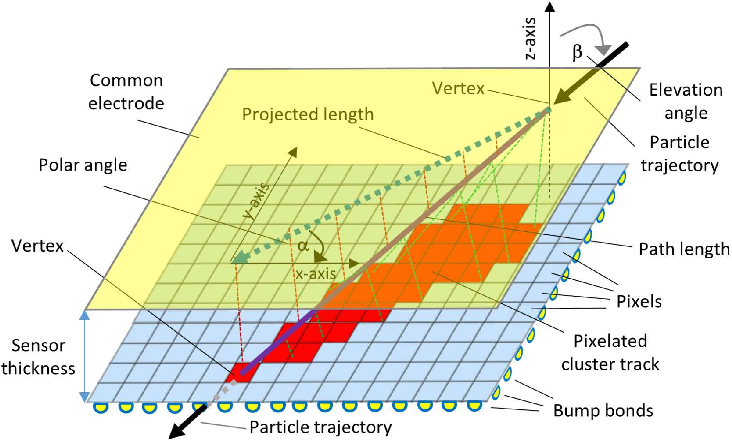
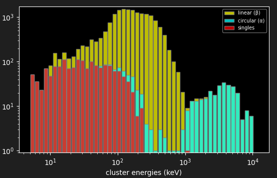
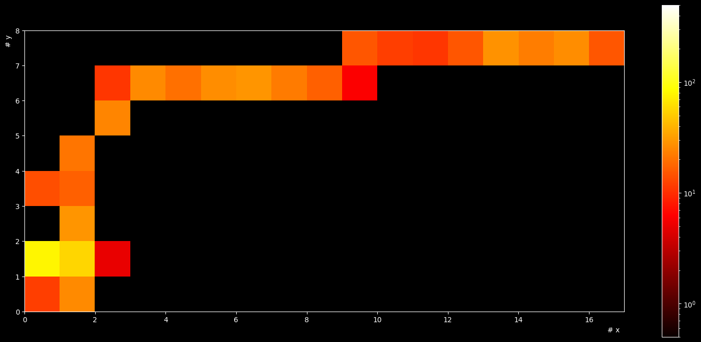
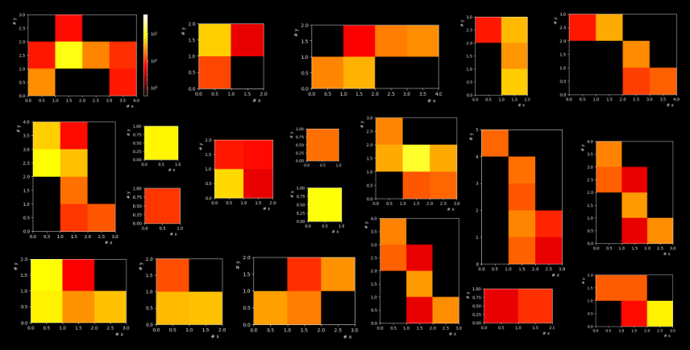

---

This document is meant to be a guide for educators who want to explore the possibilities
of a modern radiation detection sensor and its implications on new ways to teach the 
subject of radioactivity at secondary and high-school level. 

While installation, general purpose and use of the *mPIXdaq* software as well as the 
options for data acquisition, data analysis and visualization are described in the 
*README* document of the *mPIXdaq* package, this guide focuses on practical 
applications in laboratory courses.

## The miniPIX (EDU) and its educational potential  

The miniPIX (EDU) device is a modern silicon pixel detector that precisely measures 
the spacial distribution and magnitude of energy depositions caused by ionizing 
particles traversing the sensitive volume consisting of 256x256 pixels 
of 55x55x300µm³ volume each.       
Segmented silicon detectors like the *miniPIX* were originally developed for tracking
of charged particles in high-energy physics. They are now also widely used in diverse
fields for particle detection, radiation dose measurements and imaging in material 
sciences and medical applications.  

The affordable miniPIX (EDU) variant from 
[_Advacam_](https://advacam.com/camera/minipix-edu/) 
is based on the [_Timepix_](https://home.cern/tags/timepix) hybrid silicon pixel 
device developed at CERN by the Medipix collaboration. More details on the detector
and its diverse applications may be found in the [_Medipix CERN brochure_](
https://cds.cern.ch/record/2730889/files/CERN-Brochure-2015-007-Eng.pdf).

Thanks to the USB interface and the availability of a user program and drivers for
various platforms, the detector is easy  to use and allows data visualization in real-time. 
It is particularly useful to interactively investigate the properties and interactions 
with matter of α, β and γ radiation and of muons from cosmic rays in educational contexts,
opening new and very intuitive ways of teaching nuclear and particle physics.  
The visual impression of recorded energy depositions in the pixel sensor resembles 
images produced by cloud chambers, but the *miniPIX* is much easier to set-up and use
and offers the additional advantage that quantitative, digital information with accurate 
spatial resolution of the deposited energy is also available. Besides visual inspection, 
recorded data sets can thus be analyzed in detail to quantitatively explore the properties 
of radiation. 

The size of the sensitive volume of the pixel sensor is 14.1 x 14.1 x 0.3 mm³, segmented 
into 256 x 256 square pixels covering an area of 55 µm² each.
The chip is covered by a very thin aluminum foil of 0.5µm thickness, and, in addition, 
there is a dead silicon layer thinner than 1µm in front of the sensitive volume.  
Bump-bonded to the sensor is a readout chip connecting each element of the pixel matrix 
to its own preamplifier, discriminator and digital counter integrated on the readout chip. 

The deposited energy in each pixel is displayed as color-coded pixel in a two-dimensional 
image. Such images of different types of radiation give a direct impression of the ways 
how radiation interacts with matter: strongly localized energy deposits for α particles, 
long, bent traces from β particles, and - typically small - energy deposits from γ rays,
which also stem from electrons (i.e. β particles) produced via the Compton process or 
the photo effect. At rather low rates, also muons from cosmic rays are observed, which
are characterized by straight tracks with constant mean ionization along the trace.

A schematic view of a charged-particle track in the sensitive detector material and the
projection of the energy deposits on the pixel readout-plane is shown in the figure below.

> 

Compared to other detection techniques, which simply count the occurrences of 
single particle interactions in a large volume, the *miniPIX* is special because 
it integrates over all signals that occurred within a freely chosen exposure time
and records all energy deposits with high spatial resolution. 

The basic operating principle of the detector depends on the p-n junction of p- and n-type
silicon semiconductors and should be well-known to students. It is analogous to other 
typical sensors for visible or infrared light, i.e. photo-diodes, solar cells or pixels 
in digital cameras.

The *miniPIX* is a cutting-edge technological masterpiece combining 65536 individual, 
radiation-sensitive pixels, arranged in an array of shape 256x256. 
Each pixel is connected to a pre-amplifier, a discriminator and counting logic. 
During the freely selectable exposure time, signals from each pixel are integrated 
and read out as a single frame, very much resembling an image produced by a 
digital camera. In a digital photo-camera, the number of produced electron-hole pairs 
is proportional to the intensity of the incoming light. Here, instead, the electron-hole 
pairs are produced by charged particles, and their number and hence the collected charge
is proportional to the energy deposited by the traversing particle in the sensitive 
volume of the pixel.
A schematic of the detector is shown below.

> 

The chip is operated in the so-called "frame mode", i.e. all pixels are read 
out at the same time, providing one frame consisting of the deposited energies 
per pixel collected during the acquisition time. 
If operated in time-over-threshold ("*ToT*") mode, returned pixel readings represent 
the time the signal is over a given threshold in counts of the chip clock running at 
a frequency of appr. 10 MHz. 
*ToT* is linearly related to the energy deposition for large deposits exceeding
 50 keV. The functional dependence on the deposited energy $E$, including threshold 
 effects, is approximated by the following function

   $ToT\,=\;a\,E +b - {c}/{(E-t)}$

Typical values of the calibrations constants are $a$ = 1.6, $b$=23, $c$=23 and $t$=4.3. 
Each pixel has its individual calibration stored on the chip, 
which is optionally applied to obtain pixel readings in units of keV.
The calibration is reliable up to pixel energies of about one MeV; beyond this
the response shows a strong nonlinearity, overshooting between about one and
two MeV and saturating beyond two MeV.
For details, see the articles by J. Jakubek, *Precise energy calibration 
of pixel detector working in time-over-threshold mode*, NIM A 633 (2011), 5262-5265
and M. Sommer et al., *High-energy per-pixel calibration of timepix pixel detector 
with laboratory alpha source*, NIM A 1022 (2022) 165957.

If particle rates are sufficiently low to avoid overlaps of signatures, all 
particle interactions occurring during the exposure time of a frame are 
individually distinguishable. The deposited energy in the pixels is encoded as a 
color value, resulting in a very intuitive representation of the energy deposits 
produced by particles in the sensitive volume. 

Its high sensitivity and spatial mapping of energy deposits as well as the digitally
recorded data make the *miniPIX* superior to other, classical detectors. While it 
allows the same typical text-book measurements to be made, like measurements of rates 
or penetration depths of different types of radiation, more extensive possibilities 
open up:

- direct observation of how radiation interacts with the silicon, 
- discrimination of radiation types based on the pixel patterns, 
- demonstration of Poisson statistics by counting objects in the recorded frames, 
- dependence of the measured rates from the distance to the source,
- energy measurements of α particles and of their energy loss in matter,
- energy loss of β particles in matter,
- studies of photon interactions in matter (dominated by the Compton process),
- energy loss of muons and its fluctuations along the trace.

There are even more benefits related to the practical application in laboratory 
courses or school experiments:

- use of low-activity radioactive samples to study natural radioactivity in
  hands-on experiments by students, 
- freely adjustable exposure time to adapt to different radiation intensities,
- negligible noise rates, efficient suppression of backgrounds and well-defined 
  detection lifetime,
- digital overlay of many recorded frames to obtain feature-rich images even 
  from low-activity sources,
- storage of data to disk for later, in-depth analysis of particle signatures,
- different levels of pre-processing of recorded frames to adjust to the students'
  level of knowledge,
- usage of the very same detector for many different types of measurements.

In particular the last item is important, as, with the *miniPIX*, the properties 
of radiation itself are brought into focus rather than the peculiarities 
of the classical arsenal of detection techniques like electrometer, ionization 
chamber, Geiger counter, scintillation counter or mono-crystal silicon detectors.  

As an example, the graphical display of a data collection run with *mPIXdaq* is 
shown below with an overlay of 10 frames, each recorded with an exposure time of
1 s. Clustering of connected pixels and classification of the patterns are performed 
in real time during data acquisition and results are shown as histograms. The history 
over the last 300 frames of the numbers of observed objects per frame is also displayed 
and demonstrates the Poisson nature of the underlying processes of production and
detection of radioactive particles.
More details on the real-time analysis method will be given below.

Energy spectra of γ rays cannot be measured with the *miniPIX* owing to the small 
overall sensor volume which is to small to contain all energy deposits.
Therefore a gamma spectrometer with a scintillating crystal is recommended 
for γ spectroscopy, e.g. one of the very cost-effective and sufficiently 
precise devices made by [RadiaCode](https://radiacode.com/).

Examples of successfully conducted measurements in the student labs at the 
Faculty of Physics at Karlsruhe Institute of Physics are presented and 
discussed below. 

## Analysis of radiation from natural samples

The high sensitivity, combined with the ability to clearly distinguish different
types of radiation, offers a completely new approach to introduce and teach the
topic of radioactivity. Radiation from low-activity, natural sources is sufficient
to identify typical signatures and relate them to the different properties 
concerning their interaction with matter. 

Here, a small sample of natural Pitchblende (Uraninit, Uranium Dioxide) is chosen 
as the entry point for studies of radioactive phenomena.
A typical *miniPIX* frame image recorded with *mPIXdaq* is shown in the figure below.
Pixel energies are encoded as colors on a logarithmic scale, as indicated by the legend
on the right-hand side of the image. 

> 

Three types of signatures are clearly distinguishable: circular "blobs" from 
α particles, long "worms" from β particles, and typically small objects with 
only very few pixels from energy transfers of γ rays to electrons in the silicon. 

Enlarged views of typical α, β and γ signatures show this clearly. Note that 
the lengths of β traces depend on their energies and incident angles; usually, they
are not fully contained within the sensitive volume of the *miniPIX* sensor. 
γ rays typically transfer only a fraction of their energy to electrons via the 
Compton process and therefore lead to signatures with only one or very view active 
sensor pixels. Note that lager energy transfers and the full transfer of the γ energy
to electrons via photo-effect are also possible in rare cases.

> 

A **thin plastic foil** as absorber leads to complete suppression of all α 
and of low-energy β signatures. As becomes clear from the image shown below, 
the rate of recorded objects is significantly reduced, and the typical 
signatures from α particles are completely missing. 

> 

A **3 mm aluminum absorber** is sufficient to completely suppress all α and β 
particles such that only γ rays reach the sensor. A typical image is shown below.
All traces are produced by γ interactions in or near the sensitive volume of
the detector; many involve only one or very few pixels. Longer traces occur
when a significant amount of energy is transferred to electrons. 

> 

This sequence of images nicely demonstrates many features of radioactivity:  

- there are three types of very distinct signatures of radioactivity from natural
  sources: very intensive circular patterns (α), long traces (β) and low energy 
  deposits with only very few active pixels (γ),
- α and β particles can easily be shielded,
- γ rays are much more penetrating and more difficult to shield,
- signatures from γ rays look very similar to those of low-energy electrons, 
  leading to the conclusion that photons interact with matter by transferring 
  their energy to electrons that finally produce free charges (or electron-hole 
  pairs in a semi-conductor). 

Appropriate radioactive samples with activities of some 10 Bq are freely 
available and can be bought from educational supply stores, e.g. 
[NTL](https://ntl.de/radioaktivitaet/4006-dr201-1c-columbit.html).

### Pedagogical considerations

From a pedagogical point of view, it is very appealing to start a course on
radioactivity from experimental observations of a natural phenomenon and let 
pupils or students discover the properties of radiation by themselves.  
In such an approach, the historical context becomes less important, as 
well as the sequence of developments of technological methods for radiation 
detection. Utilizing modern detection techniques right at the beginning puts 
emphasis on the phenomenon of radioactivity itself and its interaction with 
materials.  
Furthermore, the high sensitivity of the miniPIX detector and its ability to 
clearly discriminate different types of radiation avoids the use of artificial, 
high-activity radioactive sources to produce signals exceeding background counts.
With the *miniPIX* device, it is possible to perform background-free counting and 
energy determination of α particles, or counting of β particles and γ rays with 
low-activity sources.   
This approach permits studies with sources of much lower activities than needed 
in classical experiments e.g. to study the absorption of α particles in air.  
In contrast, with a classical radiation detector, e.g. a Geiger-Müller counter, 
only a reduction in counting rate is observed when adding absorbers,
but no distinction of the origin of the "clicks". Therefore, a high-rate 
α-source is needed to demonstrate complete absorption, with the caveat that
unavoidable background counts from γ rays are still present. 

Images like the ones shown above may be produced using the *mPIXdaq* program, 
or also with the *Pixet* (basic) program the vendor provides together with 
the *minPIX* detector. 
*mPIXdaq*, however, provides a transparent algorithm for clustering 
of pixels and for the characterization of cluster properties that rely 
solely on basic methods that are mastered already by  undergraduate students. 
The *miniPIX* data may also serve as a motivation for younger high-school 
students to learn such techniques and gain experience in more complex 
methods of digital data processing and analysis.

The algorithms are fast enough to be deployed on-line in low-rate scenarios,
thus providing quantitative results on particle rates and energy spectra. 
An example of the energy spectra of linear and circular clusters and of 
single pixels is shown below. 

  >  

*mPIXdaq* allows highly selective recording of special cluster types, thus
strongly discriminating the desired signatures against backgrounds. 

## Real-time analysis of recorded data  

*mPIXdaq* performs an online analysis of recorded data frames and presents the
results as animated histograms which are updated as data collection proceeds.
Raw or clustered frame data as well as cluster properties in *.csv* format 
can be created with *mPIXdaq* and stored on disk for subsequent analysis. 
In addition to the very beneficial visual impression it thus becomes 
possible to use computer-based methods to study in detail the properties 
of energy depositions by different types of particles. 

In a first step, connected areas of pixels, called clusters, are determined 
in each recorded frame using the *label()* method of the image-processing 
library *scipy.ndimage*. 

The main features of each cluster are the mean position in pixel coordinates, 
the number of pixels and the sum of all pixel energies. 

Further interesting features are the geometrical shape of the cluster area 
and the shape of the energy distribution over the pixels.
To characterize the geometrical shape, the covariance matrix of the pixel 
coordinates, ${\rm cov}(x_i, y_i)$ is used. Stored are the half-lengths of 
the principal axes (or the semi-major and semi-minor axes) and the angular 
orientation of the principal axis of the covariance ellipses of the clusters. 
Almost identical values of the half-lengths classify a circular geometry, 
while largely different values are characteristic of liner topologies. 
The ratio of the two half-length it therefore used as a measure of  
the "circularity" of the cluster, which already provides a good separation 
of α and β particles.

A further, very sensitive variable is the covariance matrix of the energy 
distribution in the clusters, ${\rm cov}(E(x_i, y_i))$. For α particles, this 
distribution peaks at the centre and steeply falls off towards the boundaries, 
leading to a small variance. The properties of the covariance ellipses of the 
energy distribution are stored analogous to those of the geometrical ellipses.  
A small ratio of the lengths of the semi-major axes of the two ellipses, 
called "flatness", is a very prominent signature of α particles.

Optionally, in addition to the cluster properties, a list of pixels contributing
to each cluster can be stored for more sophisticated off-line analysis. 

As a starting point for own analyses, the *mPIXdaq* package offers a 
*Jupyter Notebook*, *analyze_mPIXclusters.ipynb*, for use with a local or 
remote *Jupyter* service. In standard *Python* environments, such a server
can easily be set-up, as is documented on the project homepage 
[_jupyter .org_](https://jupyter.org/).
The analysis example provided as part of the *mPIXdaq* package shows how to 
read the output files and also provides a sample analysis. The code relies
on the [_pandas_](https://pandas.pydata.org/) package which has become a 
well-established standard in data science for the analysis of large datasets. 

The following variables are derived for each pixel cluster during online-processing:

['time', 'x_mean', 'y_mean', 'n_pix', 'energy', 'var_mx', 'var_mn', 'angle', 'xE_mean', 'yE_mean', 'varE_mx', 'varE_mn']

    time    : time since start of daq when frame was recorded
    x_mean  : mean x-position of cluster (in pixel numbers)
    y_mean  : mean y-position of cluster (in pixel numbers)
    n_pix   : number of pixels in cluster
    energy  : energy of cluster (= sum of pixel energies) in keV
    var_mx  : maximum variance of geometrical cluster shape (in pixels)
    var_mn  : minimum variance of geometrical cluster shape (in pixels)
    angle   : orientation of cluster (0 = along x-axis, pi/2 = along y-axis)
    xE_mean : mean x of energy distribution  (in pixel numbers)
    yE_mean : mean y of energy distribution  (in pixel numbers)
    varE_mx : maximum variance of energy distribution  
    varE_mn : minimum variance of energy distribution 

This set of variables permits very detailed studies of the properties of 
energy deposits in the *miniPIX* , providing deeper insights into the underlying
physics. An almost perfect separation of the different types of radiation 
becomes possible and permits background-free selections of α and β traces, 
counting their rates and determining energy spectra of α particles.

As a further option, a file with cluster data stored in *.yaml* format 
contains the positions and energies of all contributing pixels. More 
sophisticated analysis strategies can thus be explored. As an example, 
it is possible to identify β tracks that are stopped in the active 
volume of the detector by using the large enhancement of the deposited 
energy when the electrons come to rest in the material. 
Explicitly selecting such tracks opens up some limited possibilities 
for β spectroscopy.

## Advanced topics for university lab courses

Typical (classical) experiments in nuclear physics, like energy spectra
and energy loss in air of α particles or the penetration power and absorption 
of β radiation can comfortably be performed with the *miniPX* detector. 
Its granular spatial resolution allows further insights to be gained that 
are not achievable otherwise. 

To support quantitative experiments, the *Python* script `calculate_dEdx.py` 
for the determination of the (mean) specific energy losses (dE/dx) of 
electrons and alpha-particles in air and silicon is provided with this 
package. The calculated energy loss of particles (or, resp. the deposited 
energy in the absorbing material) are important to relate the measured 
signals to theoretical expectations.     
The calculated energy deposits are based on modified versions of the Bethe-Bloch
relation for the energy loss of charged particles in matter and represent
reasonable approximations. The presently most authoritative information source 
on energy losses of electrons, photons and Helium nuclei are the tabulated data
by NIST (ESTAR, ASTAR and PStar), see [_NIST Standard Reference Database_](
https://www.nist.gov/pml/stopping-power-range-tables-electrons-protons-and-helium-ions).

 A selection of (proposed and to be tested) experiments with the *miniPIX* detector 
 and the *mPIXdaq* package is described in the sub-chapters below.

### Penetration depth of α particles in air  

The **penetration depth** of α particles and the energy loss in air can be directly 
determined with the *miniPIX* by replacing any other detector in an existing setup. 
With the *mPIXdaq* package, signatures of α particles are identified without any 
backgrounds and their energies are measured with sufficient precision to observe
the shift in energies as a function of the distance between the source and the detector.  

The expected behavior of the measured α energies as a function of the depth of
penetrated air, as determined with *calculate_dEdx.py*, is shown in the figure below.

The energy loss per 0.5 mm traversed length of air, equivalent to the deposited energy, 
is shown in red; it rises by almost a factor of four at the end of the α reach when the
particles become very slow. This behavior illustrates the Bragg peak of the deposited
energy, which is relevant for radiation therapy. 

!!! Overlay *miniPIX* measurements !!!

### Measurement of the energy loss of β radiation.  

Absorption curves are determined by measuring the rate of β traces as a 
function of the thicknesses of absorber material placed between a β source 
(typically Sr-29/Yr-90) and the *miniPIX* detector. As in experiments with 
classical detectors, these are pure rate measurements, because β traces are 
not fully absorbed in the sensitive volume of the *miniPIX* and a measurement
of their energy is only possible if the traces are fully contained, i.e. for
energies below 200 keV.  

The quantity of interest in such measurements ist the mass absorption 
(or attenuation) coefficient, $\mu / \rho$ in units of cm²/g. It is 
obtained from the dependence of the count rate on the traversed material 
thickness. Typically, the absorber material consists of very thin aluminum 
foils of some ten µm thickness.

In this experiment, the measured rates depend on the energy spectrum of β 
radiation emitted by the source, which is folded with the absorption properties 
of the material. 

Fortunately, these two effects can be disentangled with the *miniPIX* device, 
as will be shown next. 

#### Absorption in Silicon  

The energy loss of β radiation in Silicon can be directly studied with the 
*miniPIX*, because the pixels act as detection and absorber material at the 
same time. The energies deposited in the pixels along a β track directly 
show the energy loss (dE/dx) along the trace. Because the β energy decreases 
while traversing the silicon by exactly the measured energy in the pixels, 
the recorded energy in each pixel represents a measurement of the energy 
dependence of the specific ionization loss in silicon. 

The expected mean energy loss per pixel, as calculated with *calculate_dEdx.py*
using a modified Bethe Formula, shows a strong increase at the end of the tracks 
where the electrons become slow. Predicted is an average energy deposition of 
about 20 keV for electrons with energies between 0.2 and 1.5 MeV, rising to some 
ten keV for electrons with kinetic energies below 200 keV.

  >  

An example of such a long trace of a β particle is shown in the pixel energy 
map below. Note that fluctuations of the energy deposits around the mean are 
large for thin layers of absorbing material. The energy deposits in each pixel
are very close to the theoretical expectations. 

  >  

The image was produced with the *Jupyter* notebook *analyze_mPIXclusters* and 
the function *plot_cluster()* from *mpixdaq.mpixhelpers* by selecting non-α 
tracks with a large number of pixels. The particle enters the detector from 
the top-left and then loses energy in each pixel as it traverses the sensitive 
silicon volume. It finally stops in the lower-left corner, where the energy 
deposit per pixel shows the expected increase. 

In a more comprehensive analysis, the electron energy in a given pixel is obtained
by adding up all energy losses starting from the stopping-point. If many such
tracks are sampled, it becomes possible to determine the energy loss per pixel
as a function of the electron energy. 

!!! to be done: Overlay measurements with *miniPIX* !!!

Note that the path of a track in a pixel is not known, because it may cross the
sensitive area at an unknown elevation angle w.r.t the pixel plane. Also,  
traces traversing the pixels not in the x- or y-directions have a longer
path length by up to a factor of $\sqrt{2}$. Furthermore, the energy of tracks 
passing at the pixel edges my be shared between adjacent pixels. Nonetheless, 
despite these obstacles, it should be possible to obtain a meaningful distribution 
of the energy loss per Silicon pixel as a function of the electron energy.

!!! interesting to see an implementation of an algorithm !!!

### Interactions of γ rays with silicon 

Wit sufficient shielding, only γ rays reach the sensitive layer of the
*miniPIX*. A collection of signatures produced by gamma interactions is 
shown below. The radioactive source was a low-activity stone from the
Black Forest shielded with 3 mm of Aluminum. All signatures look like 
electrons at the end of their reach. 

 >  

The energy spectrum ist typically very steeply falling, and any modelling strongly
depends on the properties of ambient radiation under the given environmental conditions.
With a high-rate γ source, special features may become visible in the energy spectrum
on top of the background from ambient radiation.

!!! should try 50keV gammas from Am-241 !!!

### Ambient radiation 

Ambient radiation at a normal level of 0.1µSv/h leads to an interaction rate 
of about 25 photon signals per minute in the active *miniPIX* volume of 0.059 cm³. 
This represents a respectable detection efficiency outperforming small Geiger
counter by a factor of two to three, and shows that the *miniPIX* can also be 
used for precision dosimetry. Still, this rate is low compared to typical 
count rates of 180 per minute observed in a CsI(Tl) crystal of one cm³ volume
in a RadiaCode 102 device.

An overlay of 300 *miniPIX* frames with an exposure time of 1s each is shown in 
the figure below. This very feature-rich image shows clear signatures of photons. 
The rate of single pixels is about 0.5Hz - other signatures with a small number of pixels also originate from γ interactions, which dominate the rate. 
Other then the above-mentioned scintillation counters, clear signatures of
α, β particles are also visible.  

 

The α signatures stem from decays of the noble gas Radon (Rn-222 and Ra-224) 
from the Uranium and Thorium decay chains. Radon is produced from radioactive 
decays in the inner of the Earth and reaches the atmosphere through cracks in 
the Earth's crust. Radon and its daughter-nuclei (Po, Tl, Bi, Pb) produce 
α particles with typical energies around 5 - 7 MeV. As they rapidly loose 
energy through collisions with air molecules the energies observed in the *miniPIX*observed are typically smaller. Seven clear α signatures are 
identified in the overlay frame below covering 300s of data acquisition time.

The long, straight track near the centre at the right-hand side of the image
is a clear example of a muon from cosmic radiation traversing the detector
under a flat angle of about 10°. The sensor was oriented such that the *x*-axis
pointed vertically. 
Muons are heavy, and therefore they do not scatter much in the silicon, leading
to very straight tracks. In addition, they are high-energetic and minimum-ionizing, and therefore their ionization loss along the track is constant. This is in
contrast to electrons, which show a rise in ionization when they are slowed down
in the material and lose a large fraction of their initial energy.  
Tracks from muons can only be distinguished from electron signatures if the
tracks are long enough, i.e. if they traverse the sensitive area under a 
rather flat angle so that many pixels respond. Note that a muon under 45° 
will fire only 5 pixels, and a muon under 30° 10 pixels. 
Most muons arrive under 90° from the top, and if the sensor is properly 
oriented, a noticeable fraction of the total muon flux is observable in 
the *miniPIX*.  
With a proper sequence of measurements with different detector orientations 
studies of both the rate and direction of muons become possible. This will, 
however, require long measurement times because the expected rate of muons 
at sea level, integrated over all angles of incidence, is only about 1/cm²/min. 
Two clear muon tracks found in a data set recorded with a total acquisition 
time of 1000s are shown below.

>  

This example illustrate the usefulness of the *miniPIX* as a dosimeter 
to monitor radioactive environments. Different conditions outdoors, in
a well-ventilated room or in the typically badly ventilated basements
of buildings interesting locations to study. 

### Absorption of γ rays in materials

Studies of the absorption of γ rays in different materials as a function of the
depth of traversed material and the initial γ energy are also straight-forward
with the *miniPIX* detector. With a set of gamma sources, like shielded Am-241,
Cs-137, Na-22 or Co-60, a sufficiently large variation of initial 
energies ranging from 60 to 1330 keV is available for such measurements. 
Absorber plates made of lead with thickness in the range from 1 - 25 mm or 
aluminum blocks of 15 - 25 mm thickness are also useful assets for this experiment.

γ rays only interact very rarely in matter, and typically only one interaction 
is seen in thin layers of absorber. As the radiation penetrates a depth $l$ of 
material, the number of remaining photons $N(l)$ decreases by $dN$, while the 
interaction probability is proportional $N(l)$. This leads to an exponential 
dependence of the remaining number of photons,  
$N(l) = N_0 \cdot \exp{(-\mu  l)}$.
$\mu$ is the mass absorption (or attenuation) coefficient of the material, 
which can be determined in a sequence of measurements varying absorber 
thickness and incident γ energy.  

!!! show measurements !!!

### Collection of further ideas

- change **β incidence angle** to demonstrate the effect of the track length
  in the sensitive volume on the deposited energy. 

- detailed investigation of traces produced by photons, Compton spectrum?

- ???