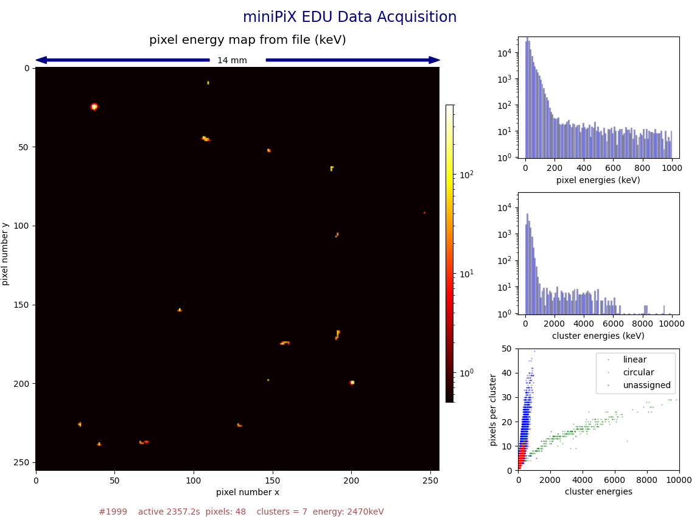

## mPIXdaq: Data acquisition for *miniPIX (EDU)* pixel detector 
----------------------------------------------------------------  

                                            Vers. 0.9.4, November 2025

The [miniPIX EDU](https://advacam.com/camera/minipix-edu) is a camera
for radiation based on the [Timepix](https://home.cern/tags/timepix) 
pixel read-out chip with 256x256 radiation-sensitive pixels of 55x55µm² 
area and 300µm depth each. The chip is covered by a very thin foil to 
permit α and β radiation to reach  the pixels. The device is enclosed 
in an aluminum housing with a USB 2.0 interface. The sensor chip
is covered by a thin foil and is very fragile; this area should be 
covered with a protective material if not measuring α radiation. 

Other than single semi-conductor chips or simple Geiger counters, 
this device provides two-dimensional images of particle traces in 
the sensitive detector material. The high spatial resolution compared 
to the typical range of particles in silicon is useful to distinguish 
the different types of radiation and measure their deposited energies. 
α-particles are completely absorbed and deposit all of their energy in 
the sensitive area, allowing usage of the device as an energy spectrometer.  

The vendor provides a ready-to-use program for different computer
platforms as well as a software-development kit for own applications. 

The code provided here is a minimalist example to read out single
frames, i.e. a full set of 256x256 measurements accumulated over a 
given, fixed time interval. Each frame is displayed as an image with
a logarithmic color scale representing the deposited energy. 
The analysis of the recorded signals, i.e. clustering of pixels, energy
determination and visualization, is achieved with standard open-source
tools for data analysis. It is therefore well-suited to give high-school
or university students detailed insights and to enable them to carry out
their own studies.


## Getting ready for data taking

This code has been tested on *Ubuntu*, *openSuse*, *Fedora*, on
Windows 64bit with *Python3.7.9* and on *Raspberry Pi* for the 
32- and 64-bit versions of *OS12*. Other Linux distribution should
not pose any unsurmountable problems.  
On MS Windows, the libraries provided by the vendor only support
*Python* vers. 3.7.9; such a rather historic version can be set up
using e.g. the *miniconda* framework. 

The code also supports devices other than the miniPIX EDU if the 
configuration files are available and copied to the *factory/*
directory in the *pypixet* *Python* interface. 

To get started, follow the steps below: 

 - Get the code from gitlab @ KIT or from github  
   ``git clone https://gitlab.kit.edu/Guenter.Quast/mPIXdaq`` or    
   ``git clone https://github.com/GuenterQuast/mPIXdaq``.

   This repository includes the *Python* code and a minimalistic set
   of libraries provided by ADVACAM. `cd` to the `mPIXdaq` directory
   you just downloaded.

 - Set up the USB interface of your computer to recognize the miniPIX EDU:  
   ``sudo install_driver_rules.sh`` (to be done only once),
   then connect the *miniPIX EDU* device to your computer.  

The package may also be installed in your virtual python environment:

  - `python -m pip install .`


Now everything is set up to enjoy your miniPIX EDU. Just run the *Python* 
program from any working directory by typing   

   > ``run_mPIXdaq.py``.

If you plan to record data, note that the path to the output file
is relative to the current working directory. 

*Note* that the *pypixet* initialization is set up to write log-files
and configuration data to the directory */tmp/mPIX/*.

It is also worth mentioning that on some systems the current directory,
".", needs to be contained in the `LD_LIBRARY_PATH` so that the ADVACAM 
*Python* interface *pypixet* finds all its *C* libraries. This is also 
done in the *Python* script ``run_mPIXdaq.py`` by temporarily modifying 
the environment variable `LD_LIBRARY_PATH` if necessary and then restarting 
to execute the *Python* code in the new environment.  
Starting the *Python* code by a different mechanism may not work without 
adjusting the environment variable `LD_LIBRARY_PATH`. In the *bash* shell, 
this is achieved by `export LD_LIBRARY_PATH='.'` on the command line. 
Note, however, that such a permanent change opens up a security gap on 
your computer!
 

## Running the example script

Available options of the *Python* example to steer data taking and 
data archival to disk are shown by typing 

  ``run_mPIXdaq.py --help``, resulting in the following output:

```
usage: run_mPIXdaq.py [-h] [-v VERBOSITY] [-o OVERLAY] [-a ACQ_TIME] [-c ACQ_COUNT] [-f FILE] [-w WRITEFILE] [-t TIME]
                      [--circularity_cut CIRCULARITY_CUT] [-r READFILE]

read, analyze and display data from miniPIX device

options:
  -h, --help            show this help message and exit
  -v VERBOSITY, --verbosity VERBOSITY
                        verbosity level (1)
  -o OVERLAY, --overlay OVERLAY
                        number of frames to overlay in graph (10)
  -a ACQ_TIME, --acq_time ACQ_TIME
                        acquisition time/frame (0.1)
  -c ACQ_COUNT, --acq_count ACQ_COUNT
                        number of frames to add (5)
  -f FILE, --file FILE  file to store frame data
  -w WRITEFILE, --writefile WRITEFILE
                        csv file to write cluster data
  -t TIME, --time TIME  run time in seconds
  --circularity_cut CIRCULARITY_CUT
                        cut on cicrularity for alpha detection
  --flatness_cut FLATNESS_CUT
                        cut on flatness for alpha detection
  -r READFILE, --readfile READFILE
                        file to read frame data
  -b BADPIXELS, --badpixels BADPIXELS
                        file with bad pixels
```

The default values are adjusted to situations with low rates, where
frames from the *miniPIX* with an integration time of `acq_time = 0.5` s
are read. For the graphics display, `overlay = 10` recent frames are 
overlaid, leading to a total integration time of 5 s. 
These images represent a two-dimensional pixel map with a color code 
indicating the energy measured in each pixel. 

The miniPIX EDU version, in particular, may suffer from a large number of
dead or noisy pixels, and therefore they should be masked by providing a file
with the pixel indices to be ignored. The default file name is *badpixels.txt*
in the working directory; alternatively a file name may be specified using
the `-b` or `--badpixels` option. 

Data analysis consists of clustering of pixels in each overlay-frame and
determination of cluster parameters, like the number of pixels, energy
and circularity. The threshold on circularity is controlled by the
parameter `circularity_cut` ranging from 0. for perfectly linear 
to 1. for perfectly circular clusters. Technically, the covariance
matrix of the clusters is calculated, and the circularity is defined 
as the ratio of the smaller and the larger of the two eigenvalues of the
covariance matrix. This simple procedure already provides a good
separation of α and β particles and of isolated pixels not assigned
to clusters. The latter ones have a high probability of being produced in
interactions of photons, while electrons from β radiation or from 
photon interactions produce long traces, and α particles produce large,
circular clusters due to their very high ionization loss in the
detector material.  

A further, very sensitive variable is the variance of the energy distribution
in the clusters. For α particles, this distribution peaks at the centre and
steeply falls off towards the boundary, leading to a very small variance.
A small ratio of the variances of the energy distribution and of the area
covered by pixels is therefore a very prominent signature of α particles.

Properties of clusters are optionally written to a file in *.csv* format
for later off-line analysis. A *Jupyter* notebook, 
*analyze_mPIXclusters.ipynb*, is provided which illustrates an example 
analysis. 

To test the software without access to a miniPIX device or without
a radioactive source, a file with recorded data is provided. Use the
option `--readfile data/BlackForestStone.npy.gz` to start a demonstration.
Note that the analysis of the recorded pixel frames is done in real
time and may take some time on slow computers. 


## Implementation Details

The default data acquisition is based on the function 
*doSimpleIntegralAcquisition()* from  the *ADVACAM* *Python* API.
A fixed number of frames (*acq_counts*) with an adjustable accumulation
time (*acq_time*) are read from the miniPIX device and added up. 

The chosen readout mode is *PX_TPXMODE_TOT*, where "ToT" means 
"time over threshold". This quantity shows good proportionality to
the deposited energy at high signal values, but exhibits a strong 
non-linear behavior for small signals near the detection threshold 
of the miniPIX. Calibration constants are stored on the miniPIX
device for each pixel, which are used to provide deposited energies
per pixel in units of keV. 

The relevant libraries for device control are provided in directories
`advacam_<arch>` for `x86_64` Linux, `arm32` and `arm64` and for 
Macintosh arm64 amd MS Windows architectures. The contents of a 
typical directory is: 

```
  __init__.py   # package initialization
  pypixet.so    # the Pixet Python interface
  minipix.so    # C library for pypixet
  pxcore.so     # C library for pypixet
  pixet.ini     # initialization file, in same directory as pypixet
  factory/      # initialization constants 
```

Note that the copyright of these libraries belongs to ADVACAM. 
The libraries may be downloaded from their web page, 
[ADVACAM DWONLOADS](https://advacam.com/downloads/). 
They are provided here as *Python* packages for some platforms
for convenience. 


## Data Analysis

The analysis shown in this example is intentionally very simple and based 
on standard libraries and functions. clustering of pixels is performed by
finding connected regions in the pixel image with *scipy.ndimage.label()*.
The shape of the clusters is determined from the ratio of the smaller 
and the larger one of the two eigenvalues of the covariance matrix 
calculated from the *x* and *y* coordinates of the pixels in a cluster. 
For circular clusters, as typically produced by α radiation, this ratio 
is close to one, while it is almost zero for the longer traces from
β radiation. In addition, she shape of the energy distribution is 
considered, which shows a sharp maximum at the center for α particles but
is flat otherwise.

The figure below shows the graphical display with a pixel image and 
the typical distributions of the pixel and cluster energies and the 
number of pixels per cluster. The source used was a weakly radioactive
stone from the Black Forest containing a small amount of Uranium and 
its decay products. The pixel map shown in the figure was sampled 
over a time of five seconds. The histogram in the lower-right
corner shows how well the cluster types discriminate different types
of radiation: α rays in the green band with relatively low numbers 
of pixels per cluster, electrons (β) as long tracks with large numbers
of pixels per cluster and rather low energies. Single pixels not 
associated to clusters originate from 𝛾 rays. Some of the electron 
tracks  with typically low energies also stem from photon interactions 
in the detector material (via the Compton process).



The analysis shown here is suitable for low-rate scenarios, e.g.
the analysis of natural radiation as emitted by minerals like
Pitchblend (=Uraninit),  Columbit, Thorianit and others. Radon
accumulated from the air in basement rooms on the surface
of an electrostatically charged ballon also work fine. Therefore,
the frame collection is chosen to be on the order of seconds, 
so that analysis results can be displayed in real-time on 
a sufficiently fast computer including the Raspberry Pi 5.

For applications at higher rates, the analysis may have to
be done off-line by reading data from recorded files, or 
multiple cores must be used for the analysis task.  


## Sensor Details

The miniPIX (EDU) is based on the [*Timepix*](https://home.cern/tags/timepix)
hybrid silicon pixel device, consisting of a semiconductor detector chip
segmented into 256 x 256 square pixels with a pitch of 55 mm that is 
bump-bonded to the readout chip. Each element of the pixel matrix is
connected to its own preamplifier, discriminator and digital counter
integrated on the readout chip. 

The built-in *Medipix2* variant of the chip is operated in the so-called
"frame mode", i.e. all pixels are read out at the same time, providing
one frame consisting of the deposited energies per pixel collected during
the acquisition time. If operated in time-over-threshold (ToT) mode,
returned pixel readings represent the time the signal is over 
a given threshold in counts of the chip clock (appr. 10 MHz). 
*ToT* is linearly related to the energy deposition for large deposits 
exceeding 50 keV. The functional dependence on the deposited energy $E$, 
including threshold effects, is approximated by the following function

   $ToT\,=\;a\,E +b - {c}/{(E-t)}$

Approximate values of the calibrations constants are 
$a$ = 1.6, $b$=23, $c$=23 and $t$=4.3. 
Each pixel has its individual calibration stored on the chip, 
which is optionally applied to obtain pixel readings in units of keV.
The calibration is reliable up to pixel energies of one MeV. 
Higher pixel  energies may result when frames with short acquisition 
time are summed up. For details, see the article by J. Jakubek, 
*Precise energy calibration of pixel detector working in time-over-threshold mode*, 
NIM A 633 (2011), 5262-5265*.


## Package Structure

This package consists of one *Python* file with several classes providing 
the base functionality. As mentioned above, it relies on 
[ADVACAM libraries](https://wiki.advacam.cz/wiki/Python_API)
for setting-up and reading the sensor. 
Other dependencies are well-known libraries from the "Python" eco-system 
for data analysis:

  - `numpy`
  - `matplotlib`,
  - `scipy.ndimage.label`
  - `numpy.cov`
  - `numpy.linalg.eig`

The classes and scripts of the package are

  - class `miniPIXdaq`
  - class `frameAnalyzer`
  - class `miniPIXana` 
  - class `runDAQ`
  - class `bhist`
  - class `scatterplot`
  - package script `run_mPIXdaq.py`

Details on the interfaces are given below.

```
class miniPIXdaq:
    """Initialize, readout miniPIX device and store data

    After initialization, data from the device is stored in a
    ring buffer and the current buffer index is sent to the
    calling process via a Queue in an infinite loop, which
    ends when data is entered in a command Queue.

    Args:

      - ac_count: number of frames to overlay
      - ac_time: acquisition time

    Queues for communication and synchronization

      - dataQ:  Queue to transfer data
      - cmsQ: command Queue

    Data structure:

       - fBuffer: ring buffer with recent frame data

    """
```

```
class frameAnalyzer:
  """Analyze frame data
    - find clusters
    - compute cluster energies
    - compute position and covariance matrix of x- and y-coordinates
    - analyze cluster shape (using eigenvalues of covariance matrix)
    - construct a tuple with cluster properties
    - optionally write cluster data to a file in csv format 

    Note: this algorithm only works if clusters do not overlap!

    Args of __call__() method:  a 2d-frame from the miniPIX

    Returns:

    - n_pixels: number of pixels with energy > 0
    - n_clusters: number of clusters
    - n_cpixels: number of pixels per cluster
    - circularity: circularity per cluster (0. for linear, 1. for circular)
    - cluster_energies: energy per cluster
    - single_energies: energies in single pixels

    - self.clusters is a tuple with properties per cluster with mean of x and y coordinates,
      number of pixels, energy, eigenvalues of covariance matrix and orientation ([-pi/2, pi/2])
      and the minimal and maximal eigenvalues of the covariance matrix of the energy distribution:
        
        format of the tuple:  
            
            ( (x, y), n_pix, energy, (var_mx, var_mn), angle, (xEm, yEm), (varE_mx, varE_mn) )
  """
```

``` 
class miniPIXana:
  """Analysis of miniPIX frames for low-rate scenarios,
  where on-line analysis is possible and animated graphs are meaningful

    Animated graph of (overlayed) pixel images and cluster properties
    """
    Args:
    - npix: number of pixels per axis (256)
    - nover: number of frames to overlay
    - unit: unit of energy measurement ("keV" or "µs ToT")
    - circ: circularity of "round" clusters (0. - 1.)
    - acq_time: accumulation time per read-out frame
  """

``` 

Objects of these classes are instantiated by the class `runDAQ`. 
This class also accepts the command-line arguments to set various options, 
as already described above. 


```
  class runDAQ:
    """run miniPIX data acquisition and analysis

    class to handle:

        - command-line arguments
        - event loop controlling data acquisition and data output to file
        - instantiates classes and calls corresponding methods for
          - initialization of miniPIX device
          - real-time analysis of data frames
          - animated figures to show a live view of incoming data
    """
```

Two helper classes implement 1d and 2d histogramming functionality for
efficient and fast animation using methods from `matplotlib.pyplot`.

```
class bhist:
    """one-dimensional histogram for animation, based on bar graph
    supports multiple classes as stacked histogram

    Args:
        * data: tuple of arrays to be histogrammed
        * bindeges: array of bin edges
        * xlabel: label for x-axis
        * ylabel: label for y axis
        * yscale: "lin" or "log" scale
        * labels: labels for classes
        * colors: colors corresponding to labels
    """
```

```
class scatterplot:
    """two-dimensional scatter plot for animation, based on numpy.histogram2d
    supports multiple classes of data, plots a '.' in the corresponding color
    in every non-zero bin of a 2d-histogram

    Args:
        * data: tuple of pairs of cordinates  (([x], [y]), ([], []), ...)
          per class to be shown
        * binedges: 2 arrays of bin edges ([bex], [bey])
        * xlabel: label for x-axis
        * ylabel: label for y axis
        * labels: labels for classes
        * colors: colors corresponding to labels
    """
```

A package script `run_mPIXdaq` is provided as an example to tie 
everything together in a running program. 
Because the ADVACAM *Python* interface (`pypixet.so`) expects 
C-libraries and configuration files in the very same directory 
as *pypixet.so* itself, some tricky manipulation of the environment 
variable `LD_LIBRAREY_PATH` is needed to ensure that all libraries
are loaded and the *miniPIX* is correctly initialized. 

```
#!/usr/bin/env python3
import os, sys

# pypixet requires '.' in LD_LIBRARY_PATH so that al neccessary C-libratreis are found
#  - add current directory to LD-LIBRARY_PATH
#  - and restart python script for changes to take effect

path_modified = False

if 'LD_LIBRARY_PATH' not in os.environ:
    os.environ['LD_LIBRARY_PATH'] = '.'
    path_modified = True
elif not '.' in os.environ['LD_LIBRARY_PATH']:
    os.environ['LD_LIBRARY_PATH'] += ':.'
    path_modified = True

if path_modified:
    print(" ! added '.' to LD_LIBRARY_PATH")
    try:
        os.execv(sys.argv[0], sys.argv)
    except Exception as e:
        sys.exit('EXCEPTION: Failed to Execute under modified environment, ' + e)
else:  # restart python script for setting to take effect
    # get current working directory before importing minipix libraries
    wd = os.getcwd()
    from mpixdaq import mpixdaq  # this changes the working directory!

    rD = mpixdaq.runDAQ(wd)  # start daq in working directory
    rD()
```

Note that *Python* 3.7.9 is required to run under Microsoft Windows.
Changing the environment does not work either under Windows, and therefore
a simplified version of the run-script must be used:

```
from mpixdaq import mpixdaq 
rD = mpixdaq.runDAQ() 
rD()
```
It is also possible to start the script as a *Python* module:

```
python -m mpixdaq
```
