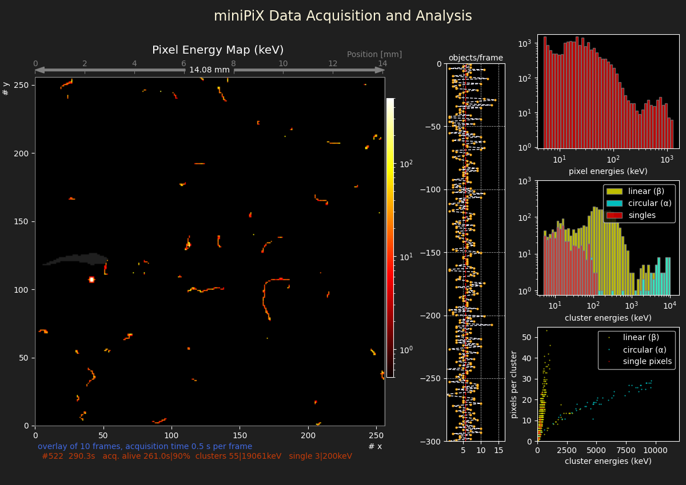

---
title: Recording, analysis and visualization of data 
       from Advacam miniPIX (EDU) silicon pixel detector  
author: Günter Quast, March 2026
...

<head>
  <style>
     p {
          margin-left:20px;
          text-align:justify;          
          max-width:54em;
          font-family:Helvetica, Sans-Serif;
          <!-- color:black; -->
          <!-- background-color:White; -->
     }
  </style>
</head>

<!-- ------------------------------------------------------------------ -->

## mPIXdaq Data acquisition and analysis for *miniPIX (EDU)* pixel detector 

&nbsp; &nbsp; &nbsp; &nbsp; &nbsp; &nbsp; &nbsp; &nbsp; &nbsp; &nbsp; &nbsp; &nbsp;
&nbsp; &nbsp; &nbsp; &nbsp; &nbsp; &nbsp; &nbsp; &nbsp; Vers. 1.1, April 2026
&nbsp; &nbsp; &nbsp; &nbsp; &nbsp; &nbsp; &nbsp; &nbsp; &nbsp; &nbsp; &nbsp; &nbsp; 
[](https://doi.org/10.5281/zenodo.19280859)

The [miniPIX EDU](https://advacam.com/camera/minipix-edu) is a camera
for radiation based on the [Timepix](https://home.cern/tags/timepix) 
pixel read-out chip with 256x256 radiation-sensitive pixels of 55x55µm² 
area and 300µm depth each. The chip is covered by a very thin foil to 
permit α and β radiation to reach  the pixels. The device is enclosed 
in an aluminum housing with a USB 2.0 interface. The sensor chip
is covered with a thin foil and is very fragile; this area should be 
protected with a cover if not measuring α radiation. 

The device provides two-dimensional images of particle traces in 
the sensitive detector material. The high spatial resolution compared 
to the typical range of particles in silicon is useful to distinguish 
the different types of radiation and to measure their deposited energies. 
α-particles are completely absorbed and deposit all of their energy in 
the sensitive area, allowing usage of the device as an energy spectrometer.  

The vendor provides a ready-to-use program for different computer
platforms as well as a software-development kit for own applications. 

The code provided here serves for acquisition and real-time visualization
of data provided by a *miniPIX* or *miniPIX* *EDU* device in frame mode,
i.e. read-out of successive single frames consisting of a full set of 
256x256 pixel energies accumulated over a given, fixed exposure time.
Collected frames are displayed as images with a logarithmic color scale 
representing the deposited energy in each pixel. Real-time clustering of 
pixels and fast analysis of the cluster properties by means of standard 
open-source tools for data analysis are also performed. Raw data and
analysis results can be exported to files. A sample analysis based on
these output data is provided in the form of a Jupyter notebook. 

The *mPIXdaq* package is therefore well-suited for high-school or 
university students to gain detailed insights into the principles 
of the interaction of different types of radiation with matter and 
to carry out their own studies by analyzing data recorded during lab 
courses.


## Getting ready for data taking - package installation

This code has been tested on *Ubuntu*, *openSuse*, *Fedora*, on
Windows 64bit with *Python3.12.x and on *Raspberry Pi* for the 
64-bit versions of *OS12* and *OS13*. Other Linux distributions 
should not pose any unsurmountable problems.  

On MS Windows, the libraries provided by the vendor support *Python* 
vers. 3.12, which is easiest to set up with the *miniconda* framework. 

The code also supports devices other than the miniPIX EDU if the 
configuration files are available and copied to the *factory/*
directory in the *pypixet* *Python* interface. 

To get started, follow the steps below: 

 - Get the code from github  
    ``git clone https://github.com/GuenterQuast/mPIXdaq`` or  
    ``git clone https://gitlab.kit.edu/Guenter.Quast/mPIXdaq``

   This repository includes the *Python* code and a minimalistic set
   of libraries provided by Advacam.

 - Next, `cd` to the `mPIXdaq` directory you just downloaded.

 - On Linux systems, set up the USB interface of your computer to 
   recognize the miniPIX detector:  
   ``sudo install_driver_rules.sh`` (to be done only once),
   then connect the *miniPIX* to your computer.  

The package may also be installed in your virtual python environment:

  - `python -m pip install -r requirements.txt`
  - `python -m pip install .`

*Note* that the *pypixet* initialization is set up use the directory 
`/var/tmp/mPIX/` resp. `C:\tmp\mPIX\` on MS Windows systems for log-files 
and configuration. Make sure this directory exist and that you have write 
access. Put the hardware configuration *xml*-file that came with your device
(`MiniPIX-xxx-Wyyyy.xml`) in the `configs/` subdirectory of that location. 
You may also want to create a subdirectory `factory/` containing the
hardware configuration files of all your devices.  


Now everything is set up to enjoy your *miniPIX*. Just run the *Python* 
program from any working directory by typing   

   > ``python run_mPIXdaq.py``.

If you plan to record data, note that the path to the output file
is relative to the current working directory. 

It is also worth mentioning that on some systems the current directory,
".", needs to be contained in the `LD_LIBRARY_PATH` so that the *Advacam* 
*Python* interface *pypixet* finds all its *C* libraries and configuration 
files. This is also done in the *Python* script ``run_mPIXdaq.py`` by 
temporarily modifying the environment variable `LD_LIBRARY_PATH` if necessary
and then restarting to execute the *Python* code in the new environment.  
 

## Running the example script

Available options of the *Python* example to steer data taking and 
data archival to disk are shown by typing 

  ``run_mPIXdaq.py --help``, resulting in the following output:

```
usage: run_mPIXdaq.py [-h] [-v VERBOSITY] [-o OVERLAY] [-a ACQ_TIME]
                      [-c ACQ_COUNT] [-f FILE]  [-w WRITEFILE] [-t TIME] 
                      [--circularity_cut CIRCULARITY_CUT] 
                      [--flatness_cut FLATNESS_CUT] [-r READFILE]

read, analyze and display data from miniPIX device

options:
  -h, --help            show this help message and exit
  -v VERBOSITY, --verbosity VERBOSITY
                        verbosity level (1)
  -o OVERLAY, --overlay OVERLAY
                        number of frames to overlay in graph (10)
  -a ACQ_TIME, --acq_time ACQ_TIME
                        acquisition time/frame in seconds (0.5)
  -c ACQ_COUNT, --acq_count ACQ_COUNT
                        frame count for readout via callback (20)
  -f FILE, --file FILE  file to store frame data
  -w WRITEFILE, --writefile WRITEFILE
                        file to write cluster data
  -t TIME, --time TIME  run time in seconds (36000)
  --circularity_cut CIRCULARITY_CUT
                        cut on circularity for alpha detection (0.5)
  --flatness_cut FLATNESS_CUT
                        cut on flatness for alpha detection (0.6)
  -p PRESCALE, --prescale PRESCALE
                        prescaling factor for frame analysis
  -r READFILE, --readfile READFILE
                        file to read frame data
  -b BADPIXELS, --badpixels BADPIXELS
                        file with bad pixels to mask
```

The default values are adjusted to situations with low rates, where
frames from the *miniPIX* with an exposure time of `acq_time = 0.5` s
are read. For the graphics display, `overlay = 4` recent frames are 
overlaid, leading to a total integration time of 2 s. 
These images represent a two-dimensional pixel map with a color code 
indicating the energy measured in each pixel. 

The *miniPIX* *EDU* version, in particular, may suffer from a large number
of dead or noisy pixels, and therefore they should be masked by providing a 
file with the pixel indices to be ignored. The default file name is 
*Xnn-Wnnnn_badpixels.txt* in the working directory, where Xnn-Wnnnn is 
unique chip-id the miniPIX sensor. Alternatively a file name may be 
specified using the `-b` or `--badpixels` option. 

Collected frame data may be directly written to disk, if a filename is
given using the `-f` or `--file` option. Two formats are foreseen at present,
storage of the two-dimensional frames as *numpy*-arrays (file extension `.npy`) 
or as lists of pixel indices and energy values in *yaml*-format (file extension
`.yml`). If no suffix for the filename is given, the default behavior is writing 
a *.yml* file. The `.yml` format also permits storing meta data like parameters 
of the data acquisition, the properties of the sensor and the list of bad pixels.
To save space, the output files may be compressed with *zip' or *gzip*. 

The same formats are recognized when reading back files using the `-r` 
resp. `--readfile` options.  
In addition, files written with the *Pixet* program of Advacam in *.clog*
format can be used as an input to this software package. 

Data analysis consists of clustering of pixels in each frame and
determination of cluster parameters, like the number of pixels, energy
of clusters, and the shapes of the cluster areas and of the energy 
distribution over the pixels in the clusters. Details about the parameters,
used, "circularity" and "flatness", and the algorithms to determine them 
are given in the *EducatorsGuide* that is part of this package. 

Properties of clusters, including a list of contributing pixels and
their energy values,  are optionally written to a file in *yaml* format
(file extension *.yml*) for later off-line analysis. A more compact version 
in *.csv* format, containing just the cluster properties, is also available.  
A *Jupyter* notebook, *analyze_mPIXclusters.ipynb*, illustrates an example 
analysis based on these file formats. Cluster data in *yml* format may
also be used with the `-r` resp. `--readfile` option for play-back of 
recorded data. 

To test the software without access to a *miniPIX* device or without
a radioactive source, a file with recorded data is provided. Use the
option `--readfile data/BlackForestStone.yml.gz` to start a demonstration.
Note that the analysis of the recorded pixel frames is done in real
time and may take some time on slow computers.

### Parameter settings  for data acquisition
The optimal choice of parameters, in particular the values of exposure time
and number of overlaid frames for the graphical display, depend very much on 
the use case.

In scenarios with low rates aiming at a demonstration of the capabilities
of a modern particle detector like the *miniPIX* for outreach purposes, it
is most useful to mimic the behavior of a cloud chamber, i.e. particle traces
appear, remain visible for some time anf then disappear again. This can
be achieved by setting an acquisition time of 0.2 s and an overlay of 
10 frames. Particles tracks then remain visible on screen for 2 s. 
The command to run in this mode is:

   > `run_mPIXdaq -a0.2 -o10`

If the goal is to efficiently record particle tracks with low read-out dead-time,
it is not necessary to optimize the visual impression, because the graphical 
display is only used to ensure the quality of the recorded data. To reduce
processing overheads, the fraction of events being analyzed and displayed
may be pre-scaled. In the example below, only every fourth frame is analyzed
and displayed: 

   > `run_mPIXdaq -a0.2 -p4 -o1`

In high-rate scenarios exceeding 100 particles/s the read-out efficiency
for the miniPIX becomes a concern. The USB 2 transfer and initialization 
overheads take about 25 ms per frame. In practice, this means that about 
20 frames/s of 25 ms exposure time each can be transferred at a read-out 
dead-time of 50%. The number of objects per frame should not exceed about 
100 in oder to avoid overlapping clusters. So, in practice, signatures
of 2000 particles/s can be handled, which is clearly sufficient for most 
laboratory experiments with rather weak radioactive sources that comply 
with radiation protection regulations. 

Read-out of the miniPIX is fastest in callback mode, when the driver 
is initialized to call a function for data retrieval whenever a new 
frame is ready to be transferred. To receive *acq_count* frames, only
one initialization step is necessary. The exposure time of each frame 
is given by the value of *acq_time*. To achieve maximum read-out speed 
for such high-rate scenarios, start data-acquisition with the command: 

> `run_mPIXdaq -a 0.025 -c50 -p10 -o1`

With these settings, only one tenth of the frames is analyzed and displayed;
the recorded frame rate is 20 Hz, while the read-out dead-time indeed turns 
out to be 50% (measured on a Raspberry Pi 5).

If higher read-out rates up to the nominal 40 frames/sec are needed,
data can be recorded using the *Pixet* (basic) program delivered by Advacam 
together with the device. Select tracking mode, the required exposure-time
per frame and the number of frames from the graphical interface, then press
the record button, and after completion save the acquired frames using 
the *save* button selecting *.clog* as the file format. This format is 
understood by *mPIXdaq* and can be read in via the *--readfile* option,  
thus allowing you to perform cluster analysis and writing files in the 
same formats as implemented in *mPIXdaq*. In case your miniPIX device
suffers from noisy pixels, a bad-pixel map can be specified using
the *--badpixel* option.


## Implementation Details

The default data acquisition is based on the function *doSimpleAcquisition()* 
from  the *Advacam* *Python* API in callback mode, i.e. *acq_counts* frames 
with an adjustable accumulation time *acq_time* are read from the miniPIX 
device successively.  

The chosen readout mode is "ToT" ("time over threshold", *PX_TPXMODE_TOT*).
This quantity shows good proportionality to the deposited energy at high 
signal values, but exhibits a non-linear behavior for very small signals 
near the detection threshold  of the *miniPIX*. There are individual calibration constants for each pixel, which are are provided for each device by the vendor
and serve to provide the deposited energies per pixel in units of keV. 

The relevant libraries for device control are provided in directories
`advacam_<arch>` for `x86_64` Linux, `arm32` and `arm64` and for 
Macintosh arm64 and MS Windows architectures. The contents of a 
typical directory is: 

```
  __init__.py      # package initialization
  pypixet.so       # the Pixet Python interface
  minipix.so       # C library for pypixet
  pxcore.so        # C library for pypixet
  pixet.ini        # initialization file, in same directory as pypixet
  pixetVersion.py  # version number of the pypixet library
```
Note that the device-dependent *xml*-file for the hardware configuration must
also be supplied. The *mPIX* package expects it to be found in the
directory `\var\tmp\mPIX\factory` (or `C:\tmp\mPIX\factory` on windows systems).
If more than one device is in use, the hardware configuration files for
all devices may be stored in this directory and will be automatically detected.
Without such an individual hardware configuration file the *miniPIX* will not
function properly. 

The copyright of these libraries is held by Advacam. 
The libraries may also be downloaded from their web page, 
[ADVACAM DWONLOADS](https://advacam.com/downloads/). 
They are provided here for convenience as *Python* packages.


## Data Analysis

The on-line analysis is intentionally very straight-forward and based on 
standard libraries and functions. Clustering of pixels is performed by
finding connected regions in the pixel image with *scipy.ndimage.label()*.
The shape of the clusters is determined from the ratio of the smaller 
and the larger one of the two eigenvalues of the covariance matrix 
calculated from the *x* and *y* coordinates of the pixels in a cluster 
using *numpy.cov()*. For circular clusters, as typically produced by 
α radiation, this ratio  is close to one, while it is almost zero for 
the longer traces from β radiation. In a similar way, also she shape 
of the energy distribution is considered, which shows a sharp maximum
at the center for α particles but is rather flat otherwise.

The figure below shows the graphical display with a pixel image and 
the typical distributions of the pixel and cluster energies and the 
number of pixels per cluster. The source used was a weakly radioactive
stone from the Black Forest containing a small amount of Uranium and 
its decay products. The pixel map shown in the figure was sampled over 
a time of five seconds. The histogram in the lower-right corner 
demonstrates that the cluster types of different kinds of radiation
are well separated: α rays in the green band with relatively low numbers 
of pixels per cluster, electrons (β) as long tracks with large numbers
of pixels per cluster and rather low energies. Single pixels not 
associated to clusters mostly originate from γ rays. Some of the electron 
tracks  with typically low energies also stem from photon interactions 
in the detector material (via the Compton process).



The frame collection time is chosen to be on the order of seconds, 
so that analysis results can be displayed in real-time on a 
sufficiently fast computer including the Raspberry Pi 5.
This is suitable for investigations of natural radiation as emitted by 
minerals like Pitchblend (=Uraninit), Columbit, Thorianit and others. 
Radon and its decay products from the air in basement rooms accumulated 
on a paper towel with a vacuum cleaner or on the surface of an electrostatically 
charged ballon also works fine.

For applications at higher rates, the analysis may have to
be done off-line by reading data from recorded files. The option
*--prescale* can be used to limit frame and cluster analysis
to a subset of the recorded frames while still allowing to record 
all data to file with sufficiently low dead time.

In a future version of this program an option to use multiple cores 
for the analysis task may be provided. 

### Output files and formats  

*miniPIXdaq* offers the possibility to write raw or clustered data for 
further off-line analysis, which is a valuable asset for use of the software 
in physics laboratory courses. This feature enables students to develop 
their own strategies for the analysis of data recorded in the student lab. 

The default output-format is *yaml*, offering human readability, clear 
structure and modularity of data blocks. Output files are written 
sequentially as text files while data acquisition is progressing.
Files may be compressed using *gzip* or *zip* to obtain more compact 
representations of the recorded data.

**Frame data** and **cluster data** including some meta data are stored 
in *yaml* structures with the keys 
*meta_data:*, *deviceInfo:*, *bad_pixels:* and *eor_summary:*.
Frame or cluster data are stored as lists of pairs of pixel indices 
and pixel energies for all pixels with non-zero energy under the keys
*frame_data:* or *cluster_data:*, respectively. These files can be loaded 
into a *Python* dictionary using the python code   
  >  `yaml_dict = yaml.load(open('<filename>', 'r'), Loader=yaml.CLoader)`  

and frame or cluster data unpacked into a *Python* list via  
  >   `list_of_framedata = yaml_dict["frame_data"]`  or  
  >   `list_of_clusterdata = yaml_dict["cluster_data"]`, respectively.

Frame data in text form or as *zip*ed or *gzip*ed files can be used as 
input to *mPIXdaq* via the '-r' or '--readfile' options. 

*list_of_clusterdata* is a list of two lists, the first one containing
cluster properties and the second one indices and energies of contributing
pixels, i.e.  
  >   `list_of_clusterproperties[i] = yaml_dict["cluster_data"][i][0]` and   
  >   `list_of_clusterpixels[i] = yaml_dict["cluster_data"][i][1]`

A *Jupyter* notebook *analyze_mPIXclusters.ipynb* is distributed as part of the 
package and illustrates how to read and interpret cluster data.

The keys of the variables in *list_of_clusterproperties* are  
>['time', 'x_mean', 'y_mean', 'n_pix', 'energy',  'e_mx, 'x_mn', 'y_mn' 'w', 'h',  
 'var_mx', 'var_mn', 'angle', 'xE_mean', 'yE_mean', 'varE_mx', 'varE_mn']

    time    : time since start of daq when frame was recorded
    x_mean  : mean x-position of cluster (in pixel numbers)
    y_mean  : mean y-position of cluster (in pixel numbers)
    n_pix   : number of pixels in cluster
    energy  : energy of cluster (= sum of pixel energies) in keV
    e_mx    : maximum pixel energy
    x_mn    : minimum x of bounding box containing the cluster
    y_mn    : minimum y of bounding box
    w       : width of bounding box
    h       : height of bounding box
    var_mx  : maximum variance of geometrical cluster shape (in pixels)
    var_mn  : minimum variance of geometrical cluster shape (in pixels)
    angle   : orientation of cluster (0 = along x-axis, pi/2 = along y-axis)
    xE_mean : mean x of energy distribution  (in pixel numbers)
    yE_mean : mean y of energy distribution  (in pixel numbers)
    varE_mx : maximum variance of energy distribution  
    varE_mn : minimum variance of energy distribution 

Empty frames with no clusters or single pixels are represented by an entry
containing only the time stamp. This is important for scenarios requiring
a detailed analysis of particle rates. 

It is also possible to store the cluster properties in simple *.csv* format by
explicitly specifying the file extension:
  `run_mPIXdaq <options> -w <name>_clusters.csv`. 

**Histograms** displayed in the on-line graphical display may be saved using
the control buttons in the *matplotlib* window. 


## Package Structure

This package consists of several *Python* files with classes providing 
the base functionality. As mentioned above, it relies on
[Advacam libraries](https://wiki.advacam.cz/wiki/Python_API)
for setting-up and reading the sensor. 
Other dependencies are well-known libraries from the *Python*
eco-system for data analysis:  

- `scipy`
  - `.ndimage.label`
- `numpy`
  - `.cov`
  - `.linalg.eig`
- `matplotlib`
  - `.pyplot`

The components, classes and scripts of the package are

- `mpixdaq` main code handling read-out, data analysis, visualization and storage
  - classes: 
    - `mpixControl`
    - `miniPIXdaq`
    - `frameAnalyzer`
    - `mpixGraphs` 
    - `runDAQ`

- `mplhelpers`  graphical interface for mpixdaq control with  matplotlib

      - class `bhist` for animated bar-graph histograms
      - class `scatterplot` for animated scatter-plots
      - class `controlGUI` for mouse-based control of the data-acquisition process

- `m̀pixhelers` for decoding supported file formats and plotting of cluster data
    - class `fileDecoders`
    - function `plot_cluster(pxlist, num=0)`

- `physics_tools` for calculations of radiation properties  

- package script `run_mPIXdaq.py`

- script `calculate_dEdx` for calculating and plotting the energy loss in matter


Details on the classes and their interfaces are given below.

#### mpixdaq.py

```
class mpixControl:
    """Provides global variables containing Device Information 
    as well as Queues, Events and methods to control threads"""
```

```
class miniPIXdaq:
    """Initialize and readout miniPIX device

    After initialization, the __call__() method of this class is executed
    in an infinite loop, storing data from the device in a ring buffer.
    The current buffer index is sent to the calling process via a Queue
    (dataQ, an instance of threading.Queue()). The loop ends when the flag
    endEvent (an instance of threading.Event() in class mpixControl) is set.

    DAQ parameters from class mpixControl:

      - ac_count: number of frames to read successively
      - ac_time: acquisition (=exposure) time per frame

    Queues for communication and synchronization

      - dataQ:  Queue to transfer data
      - cmsQ: command Queue

    Data structure:

       - fBuffer: ring buffer with recent frame data

    """
```

```
class frameAnalyzer:
    """Analyze frame data and produce a list of cluster objects,

    Args:  2d frame data, as obtained from miniPIXdaq.__call__()

    Output:

      pixel_clusters: a list of tuples of format
        (x, y), n_pix, energy, e_mx, (x_mn, y_mn, w, h), (var_mx, var_mn), angle, (xEm, yEm), (varE_mx, varE_mn) 
      with cluster properties

    Helper functions to store analysis results are included as static methods

    Another static method, cluster_summary() is particularly useful for on-line
    monitoring of incoming data and provides a summary of the properties
    of clusters in a pixel frame, returning
      - n_clusters: number of multi-pixel clusters
      - n_cpixels: number of pixels per cluster
      - circularity: circularity per cluster (ranging from 0. for linear, 1. for
        circular)
      - flatness:  ratio of maximum variances of pixel and energy distributions
        in clusters
      - cluster_energies: energy per cluster
      - single_energies: energies in single pixels
```

``` 
 class mpixGraphs:
  """Display of miniPIX frames and histograms for low-rate scenarios,
  where on-line analysis is possible and animated graphs are meaningful

  Animated graph of (overlaid) pixel images, number of clusters per frame
  and histograms of cluster properties
    
    Args:
    - npix: number of pixels per axis (256)
    - nover: number of frames to overlay
    - unit: unit of energy measurement ("keV" or "µs ToT")
    - circ: circularity of "round" clusters (0. - 1.)
    - flat: flatness of energy distribution of pixels in clusters (0. - 1.)
    - acq_time: accumulation time per read-out frame
    - prescale: prescale factor for frame analysis
``` 

Objects of these classes are instantiated by the class `runDAQ`.  
This class also accepts the command-line arguments to set various options, 
as already described above. 

```
  class runDAQ:
     """run miniPIX data acquisition, analysis and real-time graphics and data storage

  class to handle:

    - command-line arguments
    - initialization of miniPIX device of input file
    - real-time analysis of data frames
    - animated figures to show a live view of incoming data
    - event loop controlling data acquisition, data output to file and graphical display
    """
```

#### mpixhelpers.py  

```
class fileDecoders:
    """Collection of decoders for various input file formats
    supports mPIXdaq .npy and .yml and Advacam .txt and .clog
     """
```

```
plot_cluster(pxlist, num=0):
    """Plot energy map of pixel cluster

    Args:
      - pxlist: list of pixels [ ..., [px_idx, px_energy], ...]
      - num: int, for numbering figures

    Returns:
      - matplotlib figure
    """
```

#### mplhelpers.py

```
class bhist:
    """one-dimensional histogram for animation, based on bar graph
    supports multiple data classes as stacked histogram

    Args:
        * data: tuple of arrays to be histogrammed
        * bindeges: array of bin edges
        * xlabel: label for x-axis
        * ylabel: label for y axis
        * yscale: "lin" or "log" scale
        * labels: labels for classes
        * colors: colors corresponding to labels
    """
```

```
class scatterplot:
    """two-dimensional scatter plot for animation, based on numpy.histogram2d.
    The code supports multiple classes of data and plots a '.' in the corresponding color in every non-zero bin of a 2d-histogram

    Args:
        * data: tuple of pairs of coordinates  (([x], [y]), ([], []), ...)
          per class to be shown
        * binedges: 2 arrays of bin edges ([bex], [bey])
        * xlabel: label for x-axis
        * ylabel: label for y axis
        * labels: labels for classes
        * colors: colors corresponding to labels
    """
```

```
class controlGUI:
    """graphical user interface to control apps via multiprocessing Queue

    Args:

      - cmdQ: a multiprocessing Queue to accept commands
      - appName: name of app to be controlled
      - statQ: mp Queue to show status data
      - confdict: a configuration dictionary for buttons, format {name: [position 0-5, command]}
    """
```

A package script `run_mPIXdaq` is provided as an example to tie everything 
together into a running program. Because the ADVACAM *Python* interface 
(`pypixet.so`) expects C-libraries and configuration files in the very same 
directory as the Python interface *pypixet.so* itself, some tricky manipulation
of the environment variable `LD_LIBRAREY_PATH` is needed to ensure that all
libraries are loaded and the *miniPIX* is correctly initialized. 

```
#!/usr/bin/env python
#
# script run_mPIXdaq.py
#  run mpixdaq example with data acquisition, on-line analysis and visualization
#  of pixel frames and histogramming

import os, platform, sys

# on some Linux systems, pypixet requires '.' in LD_LIBRARY_PATH to find C-libraries
#  - add current directory to LD-LIBRARY_PATH
#  - and restart python script for changes to take effect

path_modified = False
if 'LD_LIBRARY_PATH' not in os.environ and platform.system() != 'Windows':
    os.environ['LD_LIBRARY_PATH'] = '.'
    path_modified = True
    print(" ! temporarily added '.' to LD_LIBRARY_PATH !")
    # restart script in modified environment
    try:
        os.execv(sys.argv[0], sys.argv)
    except Exception as e:
        sys.exit('!!! run_mPIXdaq: Failed to Execute under modified environment: ' + str(e))

# get current working directory (before importing minipix libraries)
wd = os.getcwd()

if os.name == 'nt':
    # special hack for windows python 3.7: load pypixet and DLLs
    import mpixdaq.advacam_win64.pypixet as pypixet

from mpixdaq import mpixdaq  # this may change the working directory, depending on system

# start daq in working directory
rD = mpixdaq.runDAQ(wd)
rD()

```
It is also possible to start the script as a *Python* module:

```
python -m mpixdaq
```

#### physics_tool.py  

contains some code to calulate the energy loss of raidation in matter,
based on the Bethe-Bloch formula with corrections for the light electron.
Methods to prduce graphical output are also included.

```
class materials:
    """Collect properties of target materials and projectiles"""
```


```
dEdx(T, material, projectile):
    """calculate energy loss in matter ( or "mass stopping power")
    for heavy projectiles and electrons

    Parameters:
      T: kinetic energy in MeV
      Material dictionary
          Z: effective Z
          A: effective A
          I: mean ionization energy (MeV)
      z: charge of projectile
      m: mass of projectile

    Returns:
      mass stopping power in units of MeV cm²/g
      (to be multiplied by material density to obtain energy loss per unit length )

    Formulae:
    - Bethe-Bloch relation for heavy projectiles (m_alpha, m_p or m_µ >> m_e)
      Notes:
      - only collisions considered, no radiation loss (relevant for energy >>1 MeV)
      - density effect correction (delta) omitted here for simplicity
      - pure Bethe loss decreases below 0.4 MeV and becomes even negative
        below 0.15 MeV for alpha particles in air; this can be fixed by adding
        Barkas corrections, which are, however, not implemented here
      - empirical cut-off to avoid negative values of energy loss at small T

    -  modified Bethe-Bloch equation for electrons, ICRU Report 37 (1984).
    """
```


```
calc_pixel_energies(E0, px_size=0.0055):
    """calculate pixel energies for an electron track with energy E0 in silicon
```


```
calc_E_vs_depth(E0, dx, material, projectile):
    """calculate particle energies after penetrating depth x of material
```


```
plot_dEdx_electron(material, nbins=100, bw=0.05, axis=None):
    """plot dE/dx * rho for electrons as a function of energy
```


```
plot_beta_pixel_energies(E0=1.0, px_size=0.0055, axis=None):
    """energy deposits per pixel
    E0: initial energy
    px_size: pixel size in cm
    axis: figure axis; a new one is created if not given

    returns: matplotlib figure
    """
  
```


```
plot_dEdx_alpha(material, nbins=200, bw=0.025, axis=None):
    """dE/dx for alpha  particles in material vs. energy
    material: target material
    nbins  : number of bins
    bw     : bin width
    axis   : figure axis; a new one is created if not given

    returns: matplotlib figure
    """

```


```
plot_alpha_range(material, E0=6.0, dx=0.050, axis=None):
    """alpha energy after penetration depth in material
    material : target
    E0       : initial energy in MeV
    dx       : step width
    axis     : figure axis; a new one is created if not given

    returns: matplotlib figure
    """
```

A *Python* script `calulate_dEdx.py` illustrates how to use 
these methods and classes.
