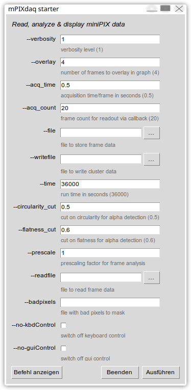

---
title: Aufzeichnung, Analyse und Visualisierung von Daten 
       des Silizium-Pixeldetektors Advacam miniPIX (EDU)  
author: Günter Quast, Aug. 2025, zuletzt aktualisiert Juni 2026
...

<head>
  <style>
     p {
          margin-left:20px;
          text-align:justify;          
          max-width:54em;
          font-family:Helvetica, Sans-Serif;
          <!-- color:black; -->
          <!-- background-color:White; -->
     }
  </style>
</head>

<!-- ------------------------------------------------------------------ -->

## Übersicht

Dieses Dokument beschreibt die Installation, den allgemeinen Zweck und die
Verwendung der *mPIXdaq*-Software sowie die Möglichkeiten der Datenaufnahme,
Datenanalyse und Visualisierung. 

### Was it *mPIXdaq*

#### Zweck: Aufzeichnung, Analyse und Visualisierung von Daten des Advacam miniPIX (EDU) Silizium-Pixeldetektors

* ein Open-Source-Paket unter der GNU-GPLv3-Lizenz

* deckt den gesamten Arbeitsablauf rund um das Advacam miniPIX (EDU) Gerät ab
  - Erfassung von Daten vom Detektor,
  - Visualisierung von Pixel-Trefferbildern/Frames,
  - Bestimmung von Cluster-Merkmalen in Echtzeit
  - Speicherung von Rohpixeldaten und Cluster-Merkmalen

* Qualitätskontrolle der aufgezeichneten Daten durch animierte Histogramme in Echt-Zeit

* Möglichkeit zur erneuten Verarbeitung zuvor aufgezeichneter Daten

* unterstützt das TimePix-Format .clog (Cluster Log) zum Einlesen von Daten;
  dies ist nützlich, um mit dem Advacam-Programm __PIXet Basic__ aufgezeichnete Daten
   zu verarbeiten

* stützt sich auf Standardbibliotheken aus dem Python-Ökosystem zur Datenanalyse

* unterstützt Linux, Windows sowie X86/ARM-Architekturen, insbesondere auch
Raspberry-Pi-Einplatinencomputer

* stellt Jupyter-Notebooks für die Analyse gespeicherter Cluster-Merkmale bereit


### Dokumentation 

Eine Anleitung für Lehrkräfte, die die Möglichkeiten eines modernen
Strahlungssensors und dessen Implikationen für neue Wege der Vermittlung des
Themas Radioaktivität in der Sekundarstufe und an Hochschulen erkunden möchten, findet sich im Dokument *Anleitung.md*. 


## mPIXdaq Datenaufnahme und -analyse für den Pixeldetektor *miniPIX (EDU)* 

&nbsp; &nbsp; &nbsp; &nbsp; &nbsp; &nbsp; &nbsp; &nbsp; &nbsp; &nbsp; &nbsp; &nbsp;
&nbsp; &nbsp; &nbsp; &nbsp; &nbsp; &nbsp; &nbsp; &nbsp; Vers. 1.1.1, Juni 2026
&nbsp; &nbsp; &nbsp; &nbsp; &nbsp; &nbsp; &nbsp; &nbsp; &nbsp; &nbsp; &nbsp; &nbsp; 
[](https://doi.org/10.5281/zenodo.19280859)

Der [miniPIX EDU](https://advacam.com/camera/minipix-edu) ist eine Kamera
für Strahlung, die auf dem [Timepix](https://home.cern/tags/timepix)-Chip 
mit 256x256 strahlungsempfindlichen Pixeln von je 55x55µm² Fläche und 300µm 
Tiefe basiert. Der Chip ist mit einer sehr dünnen Folie bedeckt, die α- und 
β-Strahlung durchdringen kann und daher die Pixel erreicht. Sensor und Auslesechip 
sind in einem Aluminiumgehäuse mit USB-2.0-Schnittstelle untergebracht. 
Die dünne Folie ist sehr empfindlich und daher sollte dieser Bereich
mit einer Abdeckung geschützt werden, wenn keine α-Strahlung gemessen wird. 

Das Gerät liefert zweidimensionale Bilder von Teilchenspuren im 
strahlungsempfindlichen Detektormaterial. Die hohe räumliche Auflösung im 
Vergleich zur typischen Reichweite von Teilchen in Silizium ist nützlich, 
um die verschiedenen Strahlungsarten zu unterscheiden und ihre deponierten 
Energien zu messen. α-Teilchen werden vollständig absorbiert und deponieren 
ihre gesamte Energie im empfindlichen Bereich, was den Einsatz des Geräts 
als α-Spektrometer ermöglicht.  

Der Hersteller stellt ein Programm zur Auslese und grafischen Darstellung
von Pixel-Bildern für verschiedene Computerplattformen sowie ein Software-Entwicklungskit für eigene Anwendungen zur Verfügung. 

Der hier bereitgestellte Code dient der Aufnahme und Echtzeit-Visualisierung
von Daten eines *miniPIX*- oder *miniPIX*-*EDU*-Detektors im Frame-Modus,
d. h. dem Auslesen aufeinanderfolgender Einzelbilder ("Frames"), bestehend aus 
einem Satz von je 256x256 Pixelenergien, die über eine konfigurierbare 
Belichtungszeit akkumuliert werden. 
Aufgenommene Frames werden als Bilder mit einer logarithmischen Farbskala 
dargestellt, die die deponierten Energien in jedem Pixel repräsentiert. Es werden 
außerdem eine Echtzeit-Clusterbildung von Pixeln sowie eine schnelle Bestimmung der 
Cluster-Merkmale mithilfe gängiger Open-Source-Werkzeuge zur Datenanalyse 
durchgeführt. Rohdaten und Analyseergebnisse können in Dateien exportiert werden. 
Ein Beispiel für eine Analyse auf Basis dieser Ausgabedaten wird in Form eines 
Jupyter-Notebooks bereitgestellt. 

Das Paket *mPIXdaq* eignet sich daher gut für Schüler:innen und Studierende, 
um detaillierte Einblicke in die Prinzipien der Wechselwirkung verschiedener 
Strahlungsarten mit Materie zu gewinnen und eigene Untersuchungen anhand von 
Daten durchzuführen, die in Praktika aufgenommen wurden.


## Vorbereitung der Datenaufnahme – Paketinstallation

Dieser Code wurde unter *Ubuntu*, *openSuse*, *Fedora*, unter 
Windows 11 64bit sowie auf dem *Raspberry Pi* für die 64-Bit-Versionen 
von *OS12* und *OS13* getestet. Andere Linux-Distributionen 
sollten keine unüberwindbaren Probleme bereiten.  

Unter MS Windows unterstützen die vom Hersteller bereitgestellten Bibliotheken 
nur *Python* Vers. 3.12, was sich am einfachsten mit dem *miniconda*-Framework 
einrichten lässt. 

Der Code unterstützt auch andere Geräte als den miniPIX EDU, sofern die vom 
Hersteller bereitgestellte Kalibrationsdatei verfügbar ist.

Um zu beginnen, folgen Sie den nachstehenden Schritten: 

 - Den Code von GitHub beziehen  
    ``git clone https://github.com/GuenterQuast/mPIXdaq`` oder  
    ``git clone https://gitlab.kit.edu/Guenter.Quast/mPIXdaq``

   Dieses Repository enthält den *Python*-Code sowie einen minimalen Satz 
   von Bibliotheken, die von Advacam bereitgestellt werden.

 - Wechseln Sie anschließend mit `cd` in das gerade heruntergeladene 
   Verzeichnis `mPIXdaq`.

 - Richten Sie auf Linux-Systemen die USB-Schnittstelle Ihres Computers so 
   ein, dass sie den miniPIX-Detektor erkennt:  
   ``sudo install_driver_rules.sh`` (nur einmal auszuführen),
   und schließen Sie dann den *miniPIX* an Ihren Computer an.  

Das Paket kann auch in Ihrer virtuellen Python-Umgebung installiert werden:

  - `python -m pip install -r requirements.txt`
  - `python -m pip install .`

*Hinweis*: Die *pypixet*-Initialisierung ist so eingerichtet, dass sie das 
Verzeichnis `/var/tmp/mPIX/` bzw. `C:\tmp\mPIX\` unter MS Windows für 
Log-Dateien und Konfiguration verwendet. Stellen Sie sicher, dass dieses 
Verzeichnis existiert und dass Sie Schreibzugriff darauf haben. Legen Sie 
die zu Ihrem Gerät gehörende Hardware-Konfigurationsdatei im *xml*-Format 
(`MiniPIX-xxx-Wyyyy.xml`) im Unterverzeichnis `configs/` dieses Verzeichnisses 
ab. Sie können außerdem ein Unterverzeichnis `factory/` anlegen, das die 
Hardware-Konfigurationsdateien all Ihrer Geräte enthält.  

Nun ist alles bereit, um Ihren *miniPIX* zu nutzen. Führen Sie einfach das 
*Python*-Programm aus einem beliebigen Arbeitsverzeichnis aus, indem Sie 
eingeben:   

   > ``python run_mPIXdaq.py``.

Falls Sie Daten aufnehmen möchten, beachten Sie, dass der Pfad zur 
Ausgabedatei relativ zum aktuellen Arbeitsverzeichnis ist. 

Es ist außerdem erwähnenswert, dass auf manchen Systemen das aktuelle 
Verzeichnis ".", im `LD_LIBRARY_PATH` enthalten sein muss, damit die 
*Python*-Schnittstelle *pypixet* von *Advacam* alle ihre *C*-Bibliotheken 
findet. Dies wird im *Python*-Skript ``run_mPIXdaq.py`` ebenfalls erledigt, 
indem die Umgebungsvariable `LD_LIBRARY_PATH` bei Bedarf temporär geändert 
und anschließend der *Python*-Code neu gestartet wird.  
 

## Ausführen von *mpixDAQ*

Die verfügbaren Optionen des *Python*-Programms *mPIXdaq.py* zur Steuerung 
der Datenaufnahme, der Online-Analyse und der Datenarchivierung auf der 
Festplatte werden angezeigt, indem Sie eingeben:  

  ``run_mPIXdaq.py --help``, was zu folgender Ausgabe führt:

```
> run_mPIXdaq.py -h
usage: run_mPIXdaq.py [-h] [-v VERBOSITY] [-o OVERLAY] [-a ACQ_TIME] [-c ACQ_COUNT] [-f FILE] [-w WRITEFILE] [-t TIME]
                      [--circularity_cut CIRCULARITY_CUT] [--flatness_cut FLATNESS_CUT] [-p PRESCALE] [-r READFILE] [-b BADPIXELS]
                      [--no-kbdControl] [--no-guiControl]

Read, analyze & display miniPIX data

options:
  -h, --help            show this help message and exit
  -v VERBOSITY, --verbosity VERBOSITY
                        verbosity level (1)
  -o OVERLAY, --overlay OVERLAY
                        number of frames to overlay in graph (4)
  -a ACQ_TIME, --acq_time ACQ_TIME
                        acquisition time/frame in seconds (0.5)
  -c ACQ_COUNT, --acq_count ACQ_COUNT
                        frame count for readout via callback (20)
  -f FILE, --file FILE  file to store frame data
  -w WRITEFILE, --writefile WRITEFILE
                        file to write cluster data
  -t TIME, --time TIME  run time in seconds (36000)
  --circularity_cut CIRCULARITY_CUT
                        cut on circularity for alpha detection (0.5)
  --flatness_cut FLATNESS_CUT
                        cut on flatness for alpha detection (0.6)
  -p PRESCALE, --prescale PRESCALE
                        prescaling factor for frame analysis
  -r READFILE, --readfile READFILE
                        file to read frame data
  -b BADPIXELS, --badpixels BADPIXELS
                        file with bad pixels to mask
  --no-kbdControl       switch off keyboard control
  --no-guiControl       switch off gui control
```

Als Alternative zur Kommandozeile wird das Skript ``grun_mPIXdaq.py`` 
bereitgestellt, das eine grafische Oberfläche zur Parametereinstellung 
startet. Dieses Skript ist besonders nützlich, wenn es an ein 
Desktop-Symbol gebunden wird. 

> > > > > > 

Die Standardwerte sind auf Situationen mit niedrigen Raten abgestimmt, bei 
denen Frames vom *miniPIX* mit einer Belichtungszeit von `acq_time = 0.5` s 
gelesen werden. Für die grafische Darstellung werden `overlay = 4` aktuelle 
Frames überlagert, was zu einer Gesamt-Integrationszeit von 2 s führt. 

Insbesondere die *miniPIX*-*EDU*-Version kann unter einer großen Zahl toter 
oder rauschender Pixel leiden, weshalb diese durch Angabe einer Datei mit 
den Indizes der zu ignorierenden Pixel maskiert werden können. Der 
Standarddateiname lautet *Xnn-Wnnnn_badpixels.txt* im Arbeitsverzeichnis, 
wobei Xnn-Wnnnn die eindeutige Chip-ID des miniPIX-Sensors ist. Alternativ 
kann ein Dateiname mit der Option `-b` bzw. `--badpixels` angegeben werden. 

Aufgenommene Frame-Daten können direkt auf die Festplatte geschrieben werden, 
wenn mit der Option `-f` bzw. `--file` ein Dateiname angegeben wird. 
Derzeit sind zwei Formate vorgesehen: die Speicherung der zweidimensionalen 
Frames als *numpy*-Arrays (Dateiendung `.npy`) oder als Listen von 
Pixelindizes und Energiewerten im *yaml*-Format (Dateiendung `.yml`). Wird 
keine Dateiendung angegeben, ist das Standardverhalten das Schreiben einer 
*.yml*-Datei. Das `.yml`-Format erlaubt außerdem die Speicherung von 
Metadaten wie den Parametern der Datenaufnahme, den Eigenschaften des 
Sensors und der Liste der defekten Pixel.
Zur Platzersparnis können die Ausgabedateien mit *zip* oder *gzip* komprimiert 
werden. 

Dieselben Formate werden beim erneuten Einlesen von Dateien über die Optionen 
`-r` bzw. `--readfile` erkannt.  
Zusätzlich können mit dem *Pixet*-Programm von Advacam geschriebene Dateien 
im Format *.clog* als Eingabe für dieses Softwarepaket verwendet werden. 

Die Datenanalyse besteht aus der Clusterbildung von Pixeln in jedem Frame und
der Bestimmung von Clusterparametern wie der Anzahl der Pixel, der Energie
der Cluster, rechteckigen Begrenzungsrahmen (Bounding Boxes) jedes Clusters 
sowie der Formen der Clusterflächen und der Energieverteilung über die Pixel 
in den Clustern. Eine detaillierte Beschreibung der gespeicherten 
Cluster-Merkmale und der Algorithmen zu ihrer Bestimmung findet sich in
der Datei *Anleitung.md*, die Teil dieses Pakets ist. 

Eigenschaften von Clustern, einschließlich einer Liste der beitragenden Pixel 
und ihrer Energiewerte, werden optional in eine Datei im *yaml*-Format 
(Dateiendung *.yml*) geschrieben, um sie später offline zu analysieren. Eine 
kompaktere Version im *.csv*-Format, die nur die Clustereigenschaften enthält, 
ist ebenfalls verfügbar.  
Ein *Jupyter*-Notebook, *analyze_mPIXclusters.ipynb*, veranschaulicht ein 
Beispiel für eine Analyse auf Basis dieser Dateiformate. 

Um die Software ohne Zugriff auf ein *miniPIX*-Gerät oder ohne eine 
radioaktive Quelle zu testen, wird eine Datei mit aufgezeichneten Daten 
bereitgestellt. Verwenden Sie die Option `--readfile data/BlackForestStone.yml.gz`, 
um eine Demonstration zu starten.
Beachten Sie, dass die Analyse der aufgezeichneten Pixel-Frames in Echtzeit 
erfolgt und auf langsamen Computern einige Zeit in Anspruch nehmen kann. 
Clusterdaten im *yml*-Format können ebenfalls mit der Option `-r` bzw. 
`--readfile` zur Wiedergabe aufgezeichneter Daten mit *mPIXdaq* verwendet 
werden.

### Parametereinstellungen für die Datenaufnahme
Die optimale Wahl der Parameter, insbesondere der Werte für Belichtungszeit 
und Anzahl der überlagerten Frames für die grafische Darstellung, hängt sehr 
stark vom jeweiligen Anwendungsfall ab.

In Szenarien mit niedrigen Raten, die auf eine Demonstration der Fähigkeiten 
eines modernen Teilchendetektors wie des *miniPIX* abzielen, ist es am 
sinnvollsten, das Verhalten einer Nebelkammer nachzuahmen, d. h. Teilchenspuren
erscheinen, bleiben eine Zeit lang sichtbar und verschwinden dann wieder. 
Dies lässt sich erreichen, indem eine Aufnahmezeit von 0,2 s und eine 
Überlagerung von 10 Frames eingestellt wird. Teilchenspuren bleiben dann 
2 s lang auf dem Bildschirm sichtbar. 
Der Befehl zum Ausführen in diesem Modus lautet:

   > `run_mPIXdaq -a0.2 -o10`

Wenn das Ziel darin besteht, Teilchenspuren effizient mit geringer 
Auslese-Totzeit aufzuzeichnen, ist es nicht notwendig, den visuellen 
Eindruck zu optimieren, da die grafische Darstellung nur zur 
Qualitätssicherung der aufgezeichneten Daten dient. Um den 
Verarbeitungsaufwand zu reduzieren, kann der Anteil der analysierten und 
angezeigten Ereignisse herunter skaliert werden. Im folgenden Beispiel 
wird nur jedes vierte Frame analysiert und angezeigt: 

   > `run_mPIXdaq -a0.2 -p4 -o1`

In Hochraten-Szenarien mit mehr als 100 Teilchen/s wird die Ausleseeffizienz 
des miniPIX zu einem relevanten Faktor. Der USB-2-Transfer und die 
Initialisierungs-Overheads benötigen etwa 25 ms pro Frame. In der Praxis 
bedeutet dies, dass etwa 20 Frames/s mit je 25 ms Belichtungszeit bei einer 
Auslese-Totzeit von 50 % übertragen werden können. Die Anzahl der Objekte pro 
Frame sollte etwa 100 nicht überschreiten, um überlappende Cluster zu 
vermeiden. In der Praxis können somit Signaturen von 2000 Teilchen/s 
verarbeitet werden, was für die meisten Laborexperimente mit eher schwachen 
radioaktiven Quellen, die den Strahlenschutzvorschriften entsprechen, völlig 
ausreichend ist. 

Das Auslesen des miniPIX ist im Callback-Modus am schnellsten, wobei der 
Treiber so initialisiert wird, dass er eine Funktion zum Datenabruf aufruft, 
sobald ein neues Frame zur Übertragung bereit ist. Somit ist nur ein 
Initialisierungsschritt nötig, um *acq_count* Frames zu empfangen. Die 
Belichtungszeit jedes Frames wird durch den Wert von *acq_time* festgelegt. 
Um für solche Hochraten-Szenarien maximale Auslesegeschwindigkeit zu 
erreichen, starten Sie die Datenaufnahme mit dem Befehl: 

> `run_mPIXdaq -a 0.025 -c50 -p10 -o1`

Mit diesen Einstellungen wird nur ein Zehntel der Frames analysiert und 
angezeigt; die aufgezeichnete Framerate beträgt 20 Hz, während sich die 
Auslese-Totzeit tatsächlich als 50 % erweist (gemessen auf einem 
Raspberry Pi 5).

Werden höhere Ausleseraten bis zu den nominellen 40 Frames/s benötigt, können 
Daten mit dem von *Advacam* mitgelieferten Programm *Pixet* (basic) 
aufgezeichnet werden. Wählen Sie über die grafische Oberfläche den 
Tracking-Modus, die gewünschte Belichtungszeit pro Frame und die Anzahl der 
Frames aus, drücken Sie dann die Aufnahme-Schaltfläche, und speichern Sie 
die aufgezeichneten Frames nach Abschluss über die *Speichern*-Schaltfläche 
im Format *.clog*. Dieses Format wird von *mPIXdaq* verstanden und kann über 
die Option *--readfile* eingelesen werden, wodurch Sie dann die Clusteranalyse
 durchführen und Dateien in denselben Formaten schreiben können, wie sie in 
*mPIXdaq* implementiert sind. 
Falls Ihr miniPIX-Gerät unter rauschenden Pixeln leidet, kann mit der 
Option *--badpixel* eine Bad-Pixel-Karte angegeben werden.


## Implementierungsdetails

Die Standard-Datenaufnahme basiert auf der Funktion *doSimpleAcquisition()* 
der *Python*-API von *Advacam* im Callback-Modus, bei dem *acq_counts* 
Frames mit einer einstellbaren Akkumulationszeit *acq_time* nacheinander 
vom miniPIX-Gerät gelesen werden.  

Der gewählte Auslesemodus ist "ToT" ("time over threshold", 
*PX_TPXMODE_TOT*).
Diese Größe zeigt bei hohen Signalwerten eine gute Proportionalität zur 
deponierten Energie, weist jedoch bei sehr kleinen Signalen in der Nähe der 
Detektionsschwelle des *miniPIX* ein nichtlineares Verhalten auf. Für jeden 
Pixel gibt es individuelle Kalibrationskonstanten, die vom Hersteller für 
jedes Gerät bereitgestellt werden und dazu dienen, die deponierten Energien 
pro Pixel in Einheiten von keV anzugeben. Bei sehr hohen Pixelenergien über 
1500 keV/Pixel ist die Energieskala nicht mehr linear, und insbesondere 
Messungen der Energien von α-Teilchen werden ungenau.  

Die relevanten Bibliotheken zur Gerätesteuerung befinden sich in den 
Verzeichnissen `advacam_<arch>` für `x86_64`-Linux, `arm32` und `arm64` sowie 
für Macintosh-arm64- und MS-Windows-Architekturen. Der Inhalt eines 
typischen Verzeichnisses ist: 

```
  __init__.py      # package initialization
  pypixet.so       # the Pixet Python interface
  minipix.so       # C library for pypixet
  pxcore.so        # C library for pypixet
  pixet.ini        # initialization file, in same directory as pypixet
  pixetVersion.py  # version number of the pypixet library
```
Beachten Sie, dass die gerätespezifische *xml*-Datei für die 
Hardware-Konfiguration ebenfalls bereitgestellt werden muss. Das 
*mPIX*-Paket erwartet sie im Verzeichnis `\var\tmp\mPIX\factory` (bzw. 
`C:\tmp\mPIX\factory` unter Windows-Systemen).
Werden mehrere Geräte verwendet, können die Hardware-Konfigurationsdateien 
aller Geräte in diesem Verzeichnis abgelegt und automatisch erkannt werden.
Beachten Sie, dass der *miniPIX* ohne eine solche individuelle 
Hardware-Konfigurationsdatei nicht ordnungsgemäß funktioniert. 

**Hinweis zum Urheberrecht**:   
Das Urheberrecht dieser Bibliotheken liegt bei *Advacam*. 
Sie können auch von deren Webseite, 
[ADVACAM DWONLOADS](https://advacam.com/downloads/), heruntergeladen werden.
Diese Dateien werden hier zur Vereinfachung als *Python*-Pakete bereitgestellt.


## Echtzeit-Datenanalyse

Die Analyse der Daten während der Aufzeichnung ist bewusst sehr einfach 
gehalten und basiert auf Standardbibliotheken. 
Zunächst werden zusammenhängende Bereiche im Pixelbild, sog. "Cluster", mit 
Hilfe der Bibliothek *scipy.ndimage.label()*  gesucht.
Die Form der Cluster wird aus dem Verhältnis des kleineren zum größeren der 
beiden Eigenwerte der Kovarianzmatrix bestimmt, die aus den *x*- und 
*y*-Koordinaten der Pixel in einem Cluster mit *numpy.cov()* berechnet wird. 
Bei kreisförmigen Clustern, wie sie typischerweise von α-Strahlung erzeugt 
werden, liegt dieses Verhältnis nahe bei eins, während es bei den längeren 
Spuren von β-Strahlung sehr klein nahe NUll ist. In ähnlicher Weise wird 
auch die Form der Energieverteilung berücksichtigt, die bei α-Teilchen ein 
scharfes Maximum im Zentrum zeigt, ansonsten aber eher flach verläuft.

Die folgende Abbildung zeigt die grafische Darstellung mit einem Pixelbild 
und den typischen Verteilungen der Pixel- und Cluster-Energien sowie der 
Anzahl der Pixel pro Cluster. Als Quelle diente ein schwach radioaktiver 
Stein (ca. 10 Bq/cm²) aus dem Schwarzwald, der eine geringe Menge Uran und 
dessen Zerfallsprodukte enthält. Das gezeigte Pixelbild wurde über einen 
Zeitraum von fünf Sekunden aufgenommen. Das Histogramm in der unteren rechten 
Ecke zeigt, dass die Typen von Clustern der verschiedenen Strahlungsarten gut 
voneinander getrennt sind: α-Strahlen im grünen Band mit relativ geringer 
Pixelzahl pro Cluster, Elektronen (β) als lange Spuren mit großer Pixelzahl 
pro Cluster und eher niedrigen Energien. Einzelne, keinem Cluster 
zugeordnete Pixel stammen meist von γ-Strahlen. Einige der Elektronenspuren 
mit typischerweise niedrigen Energien werden ebenfalls durch
Wechselwirkungen von Photonen im Detektormaterial verursacht - hauptsächlich 
über den Compton-Prozess.


Die Frame-Aufnahmezeit wird in der Größenordnung von Sekunden gewählt, 
sodass Analyseergebnisse auf einem ausreichend schnellen Computer, 
einschließlich des Raspberry Pi 5, in Echtzeit angezeigt werden können.
Dies eignet sich für Untersuchungen natürlicher Radioaktivität, wie sie von 
Mineralien wie Pechblende (=Uraninit), Columbit, Thorianit und anderen 
ausgesendet wird. 
Auch der Nachweis von Radon und dessen Zerfallsprodukten aus der Luft in 
Kellerräumen, angereichert mit einem Staubsauger auf einem Papiertuch oder 
auf der Oberfläche eines elektrostatisch aufgeladenen Ballons, funktioniert 
gut.

Für Anwendungen bei höheren Raten muss die Analyse eventuell offline 
erfolgen, indem Daten aus aufgezeichneten Dateien gelesen werden. Die Option 
*-p* bzw. *--prescale* kann verwendet werden, um die Frame- und 
Clusteranalyse auf eine Teilmenge der aufgezeichneten Frames zu beschränken, 
während weiterhin alle Daten in eine Datei geschrieben werden können.

In einer zukünftigen Version dieses Programms könnte eine Option zur 
Nutzung mehrerer Prozessorkerne für die Analyseaufgabe bereitgestellt werden. 

### Ausgabedateien und -formate  

Das Programm *miniPIXdaq* bietet die Möglichkeit, Roh- oder Clusterdaten für 
weitere Offline-Analysen in Dateien zu schreiben, was für den Einsatz der
Software in Physik-Praktika von großem Wert ist. Diese Funktion ermöglicht es,
eigene Strategien für die Auswertung der während der Datennahmephase aufgenommenen Daten zu entwickeln. 

Das Standard-Ausgabeformat ist das Datenserialisierungformat *yaml*, das 
eine gute Lesbarkeit, klare Struktur und Modularität der Datenblöcke bietet.
Ausgabedateien werden während der laufenden Datenaufnahme sequenziell als Textdateien geschrieben, so dass sich der Bedarf an Hauptspeicher auch
für länger andaudernde Datennahmen in Grenzen hält. 
Dateien können nach der Aufzeichnung mit *gzip* oder *zip* komprimiert 
werden, um eine kompaktere Speicherung zu ermöglichen. Beim Zurücklesen
der Daten werden diese Formate automatisch entpackt. 

**Frame-Daten** und **Cluster-Daten** einschließlich einiger Metadaten werden 
in *yaml*-Strukturen mit den Schlüsseln 
*meta_data:*, *deviceInfo:*, *bad_pixels:* und *eor_summary:* gespeichert.
Frame- oder Clusterdaten werden als Listen von Paaren aus Pixelindizes 
und Pixelenergien für alle Pixel mit Energie ungleich null unter den 
Schlüsseln *frame_data:* bzw. *cluster_data:* gespeichert. Diese Dateien 
können mit folgendem Python-Code in ein *Python*-Dictionary geladen werden:   
  >  `yaml_dict = yaml.load(open('<filename>', 'r'), Loader=yaml.CLoader)`  

und Frame- oder Clusterdaten wie folgt in eine *Python*-Liste entpackt werden:  
  >   `list_of_framedata = yaml_dict["frame_data"]`  bzw.  
  >   `list_of_clusterdata = yaml_dict["cluster_data"]`

Frame-Daten in Textform oder als *zip*- bzw. *gzip*-komprimierte Dateien 
können als Eingabe für *mPIXdaq* über die Optionen '-r' bzw. '--readfile' 
verwendet werden. 

*list_of_clusterdata* ist eine Liste von zwei Listen, wobei die erste die 
Clustereigenschaften und die zweite Indizes und Energien der beitragenden 
Pixel enthält, d. h.  
  >   `list_of_clusterproperties[i] = yaml_dict["cluster_data"][i][0]` und   
  >   `list_of_clusterpixels[i] = yaml_dict["cluster_data"][i][1]`

Die Schlüssel der Variablen in *list_of_clusterproperties* sind  
>['time', 'x_mean', 'y_mean', 'n_pix', 'energy',  'e_mx, 'x_mn', 'y_mn' 'w', 'h',  
 'var_mx', 'var_mn', 'angle', 'xE_mean', 'yE_mean', 'varE_mx', 'varE_mn']

    time    : Zeit seit Start der Datenaufnahme, zu der der Frame aufgenommen wurde
    x_mean  : mittlere x-Position des Clusters (in Pixelnummern)
    y_mean  : mittlere y-Position des Clusters (in Pixelnummern)
    n_pix   : Anzahl der Pixel im Cluster
    energy  : Energie des Clusters (= Summe der Pixelenergien) in keV
    e_mx    : maximale Pixelenergie
    x_mn    : minimales x des Begrenzungsrahmens (Bounding Box) des Clusters
    y_mn    : minimales y des Begrenzungsrahmens
    w       : Breite des Begrenzungsrahmens
    h       : Höhe des Begrenzungsrahmens
    var_mx  : maximale Varianz der geometrischen Clusterform (in Pixeln)
    var_mn  : minimale Varianz der geometrischen Clusterform (in Pixeln)
    angle   : Orientierung des Clusters (0 = entlang der x-Achse, π/2 = entlang der y-Achse)
    xE_mean : mittleres x der Energieverteilung  (in Pixelnummern)
    yE_mean : mittleres y der Energieverteilung  (in Pixelnummern)
    varE_mx : maximale Varianz der Energieverteilung  
    varE_mn : minimale Varianz der Energieverteilung 

Leere Frames werden durch einen Eintrag dargestellt, der nur den 
Zeitstempel enthält. Dies ist wichtig für  Szenarien, die eine detaillierte 
Analyse der Teilchenraten erfordern. 

Es ist außerdem möglich, die Clustereigenschaften im einfacheren *.csv*-Format 
zu speichern, indem die Dateiendung explizit angegeben wird:
  `run_mPIXdaq <options> -w <name>_clusters.csv`. 

Bilder von **Histogramme**n, die in der Online-Grafikanzeige dargestellt 
werden, können über die Steuerelemente im *matplotlib*-Fenster gespeichert werden. 

## Analyse der Ausgabedaten 

Ein **_Jupyter_-Notebook**, *analysis/analyze_mPIXclusters.ipynb*, wird als 
Teil des Pakets mitgeliefert und veranschaulicht, wie Clusterdaten gelesen 
und interpretiert werden. 
Dieses Notebook sowie weiterer *Python*-Code sind im Unterverzeichnis 
`analysis/` des Pakets *mPIXdaq* zusammengefasst. Dieses Beispiel ist als 
Ausgangspunkt für die Datenanalyse durch Studierende gedacht. 

Das *Python*-Programm **ClusterSummary.py** im Unterverzeichnis `/analysis` 
liest mit *mPIXdaq* geschriebene Clusterdaten ein, bietet einen Überblick 
über Daten und Metadaten und zählt α-, β-, γ- und µ-Signaturen anhand 
vordefinierter Auswahlkriterien für die oben erläuterten Cluster-Merkmale.  
Die erforderlichen Parameter lassen sich bequem über die grafische Oberfläche 
**grun.py** einstellen, die die Argumentliste eines *Python*-Programms 
einliest und eine interaktive Parametereinstellung vor der Ausführung des 
Skripts ermöglicht. 

Ein **Analysebeispiel** anhand von Daten, die aus einer Luftprobe aus 
einem Kellerraum gewonnen wurden, ist in der folgenden Ausgabe und Abbildung 
dargestellt. 

    *==* Contents of file ../data/Radon_clusters.yml.gz
      Data written on Sun Apr 12 23:36:34 2026  with device  EduMiniPIX TSWB sn: 2987
      16313 frames of 0.5s exposure time
      47227 clusters -> rate = 5.79 Hz

    *==* cluster features:
       Index(['time', 'x_mean', 'y_mean', 'n_pix', 'energy', 'e_mx', 'x_mn', 'y_mn',
       'w', 'h', 'var_mx', 'var_mn', 'angle', 'xE_mean', 'yE_mean', 'varE_mx',
       'varE_mn', 'pixels', 'Epix_mean', 'circularity', 'flatness',
       'straightness'], dtype='object')

    *==* selection cuts
      ɑ: flatness < 0.5
         circularity > 0.5
         emx_cut > 400.0 keV
      β: size > 4 and not ɑ
      γ: not(ɑ or β)

    *==* ɑ, β, γ Statistics:
                 	         ɑ  	         β  	         γ 
      events     	       6465 	      19843 	      20691
      rate (Hz)  	      0.793 	       2.43 	       2.54
      meanE (keV)	   6.29e+03 	        231 	       74.9
      sigE (keV)	   2.78e+03 	       95.9 	       53.3
      muons 		                                					 5 µ


> > >


## Paketstruktur

Das Paket *mPIXDAQ* besteht aus mehreren *Python*-Dateien mit Klassen, die die 
Basisfunktionalität bereitstellen. Wie oben erwähnt, stützt es sich auf 
einige [Advacam-Bibliotheken](https://wiki.advacam.cz/wiki/Python_API)
zur Einrichtung und zum Auslesen des Sensors. 
Weitere Abhängigkeiten sind bekannte Bibliotheken aus dem *Python*-Ökosystem 
für Datenanalyse:  

- `scipy`
  - `.ndimage.label`
- `numpy`
  - `.cov`
  - `.linalg.eig`
- `matplotlib`
  - `.pyplot`

Die Komponenten, Klassen und Skripte des Pakets sind:

- `mpixdaq` Hauptcode für Auslese, Datenanalyse, Visualisierung und Speicherung
  - Klassen: 
    - `mpixControl`
    - `miniPIXdaq`
    - `frameAnalyzer`
    - `mpixGraphs` 
    - `runDAQ`

- `mplhelpers`  grafische Oberfläche zur Steuerung von *mPIXdaq* mit matplotlib

      - Klasse `bhist` für animierte Balkendiagramm-Histogramme
      - Klasse `scatterplot` für animierte Streudiagramme
      - Klasse `controlGUI` für mausbasierte Steuerung des Datenaufnahmeprozesses

- `mpixhelers` zur Dekodierung unterstützter Dateiformate und zum Plotten von Clusterdaten

    - Klasse fileDecoders zur Dekodierung verschiedener Eingabedateiformate: mPIXdaq .npy und .yml sowie Advacam .txt und .clog
    - Klasse clusterReader() zum Einlesen (und Analysieren) von mit mPIXdaq geschriebenen Pixelclustern
    - Funktion plot_cluster() zum Plotten der Energiekarte eines Pixelclusters
    - Klasse shmManager zur Verwaltung gemeinsam genutzter Speicherblöcke ("shared memory")

- `argparse_tk_gui.py` ist eine kleine, abhängigkeitsfreie *Python*-Bibliothek,
  die automatisch eine grafische Oberfläche (Tkinter/TTK) aus einem bestehenden 
  `argparse.ArgumentParser` erzeugt.
  Diese Bibliothek wird vom Paketskript `grun_mPIXdaq.py` verwendet, um bequem 
  alle DAQ-Parameter einzustellen und das *mPIXdaq*-Programm zu starten. 

- `physics_tools` für Berechnungen der (mittleren) Energieverluste 

- Paketskript `run_mPIXdaq.py`

- Paketskript `grun_mPIXdaq.py`

- Skript `calculate_dEdx` zur Berechnung und Darstellung des Energieverlusts von 
  ionisierender Strahlung in Materie

- Unterverzeichnis `analysis/` mit einem *Jupyter*-Notebook zur Analyse von
  Clusterdaten
    - `analyze_mPIXclusters.ipynb`
    - `ClusterSummary.py` zum Einlesen von Clusterdaten und Erstellen einer Zusammenfassung
    - `LandauFit.py` zum Anpassen einer Landau-Verteilung 
    - `peakFitter.py` zum Suchen und Anpassen einer Gauß-Funktion an Peaks 
      in Spektren
    - `grun.py` ist ein argparse-GUI-Runner zur Anzeige und Einstellung von
      Argumenten in einer grafischen Oberfläche sowie zum Starten von 
      *Python*-Programmen (für jene, die mit der Kommandozeile nicht vertraut
      sind)

- Unterverzeichnis `data/` enthält einige kleine Datensätze als Beispiele für das *Jupyter*-Notebook

    - BlackForestStone.yml.gz *# mit einem schwach aktiven Stein
               (Uranerz) aus dem Schwarzwald aufgezeichnete Daten*
    - BlackForestStone.csv.gz *# Clustereigenschaften des Steins aus dem Schwarzwald*
    - BlackForestStone_clusters.yml.gz *# Cluster- und Pixeldaten des Steins
               aus dem Schwarzwald*
    - gammaRadiation_clusters.yml.gz *# Cluster- und Pixeldaten des Schwarzwaldsteins,
               abgeschirmt mit 3 mm Aluminium*
    - ambientRadiation_clusters.yml.gz  *# Cluster- und Pixeldaten aus einer langen 
               Messung der Umgebungsstrahlung*  
    - Radon_clusters.yml.gz *# Cluster- und Pixeldaten von Radon-Zerfallsprodukten* 


Details zu den Klassen und ihren Schnittstellen finden sich unten.


#### mpixdaq.py

```
class mpixControl:
    """Provides global variables containing Device Information 
    as well as Queues, Events and methods to control threads"""
```

```
class miniPIXdaq:
    """Initialize and readout miniPIX device

    After initialization, the __call__() method of this class is executed
    in an infinite loop, storing data from the device in a ring buffer.
    The current buffer index is sent to the calling process via a Queue
    (dataQ, an instance of threading.Queue()). The loop ends when the flag
    *endEvent* (an instance of threading.Event() in class mpixControl) is set.

    DAQ parameters from class mpixControl:

      - ac_count: number of frames to read successively
      - ac_time: acquisition (=exposure) time per frame

    Queues for communication and synchronization

      - dataQ:  Queue to transfer data
      - cmsQ: command Queue

    Data structure:

       - fBuffer: ring buffer with recent frame data

    """
```

```
class frameAnalyzer:
    """Analyze frame data and produce a list of cluster objects,

    Args:  2d frame data, as obtained from miniPIXdaq.__call__()

    Output:

      pixel_clusters: a list of tuples of format
        (x, y), n_pix, energy, e_mx, (x_mn, y_mn, w, h), (var_mx, var_mn), angle, (xEm, yEm), (varE_mx, varE_mn) 
      with cluster properties

    Helper functions to store analysis results are included as static methods

    Another static method, cluster_summary() is particularly useful for on-line
    monitoring of incoming data and provides a summary of the properties
    of clusters in a pixel frame, returning
      - n_clusters: number of multi-pixel clusters
      - n_cpixels: number of pixels per cluster
      - circularity: circularity per cluster (ranging from 0. for linear, 1. for
        circular)
      - flatness:  ratio of maximum variances of pixel and energy distributions
        in clusters
      - cluster_energies: energy per cluster
      - single_energies: energies in single pixels
```

``` 
 class mpixGraphs:
  """Display of miniPIX frames and histograms for low-rate scenarios,
  where on-line analysis is possible and animated graphs are meaningful

  Animated graph of (overlaid) pixel images, number of clusters per frame
  and histograms of cluster properties
    
    Args:
    - npix: number of pixels per axis (256)
    - nover: number of frames to overlay
    - unit: unit of energy measurement ("keV" or "µs ToT")
    - circ: circularity of "round" clusters (0. - 1.)
    - flat: flatness of energy distribution of pixels in clusters (0. - 1.)
    - acq_time: accumulation time per read-out frame
    - prescale: prescale factor for frame analysis
``` 

Objekte dieser Klassen werden von der Klasse `runDAQ` instanziiert.  
Diese Klasse übernimmt außerdem die Kommandozeilenargumente zur Einstellung 
der verschiedenen, bereits oben beschriebenen Optionen. 

```
  class runDAQ:
     """run miniPIX data acquisition, analysis and real-time graphics and data storage

  class to handle:

    - command-line arguments
    - initialization of miniPIX device of input file
    - real-time analysis of data frames
    - animated figures to show a live view of incoming data
    - event loop controlling data acquisition, data output to file and graphical display
    """
```

#### mpixhelpers.py  

```
class fileDecoders:
    """Collection of decoders for various input file formats
    supports mPIXdaq .npy and .yml and Advacam .txt and .clog
     """
```

```
class readClusters:
   """Read cluster data written with mPIXdaq, print meta data and statistics

    Default cuts on cluster features are used to classify clusters as ɑ, β or γ signatures.

      ɑ: round cluster shape and peaking energy distribution, high ionization per pixel
      β: shape is not round, low ionization per pixel, >5 pixels
      γ: not (ɑ or β)

    Methods:

       * __init__(): instantiate class clusterReader and - optionally - set input file name
       * set_cuts(): set cut values
          - small_cut: separate small and large clusters
          - circularity_cut: round topology
          - flatness_cut: flat energy distribution
          - emean_cut: energy loss per pixel (only used if emx not in feature list)
          - emx_cut: maximum pixel energy
          - no_saturation:  ignore clusters with saturated pixels
       * parse_args():  read command line arguments if used interactively
       * read_data(): load data in yaml formt in pandas data frame
       * set_selection_masks(): define boolean masks to select ɑ, β and γ
       * get_statistics(): count signatures and provide parameters of energy distributions
       * plot(): plot energy distributions of ɑ, β and γ
       * __call__(): execute read_data(), set_selection_masks() and get_statistics()
    """
```


```
def pxl2map(pxlist):
    """Create pixel energy map from pixel list

    Args:
      - pxlist: list of pixels [ ..., [px_idx, px_energy], ...]
      - num: int, for numbering figures

    Returns:
      - numpy array
    """
```


```
plot_cluster(pxlist, num=0):
    """Plot energy map of pixel cluster

    Args:
      - pxlist: list of pixels [ ..., [px_idx, px_energy], ...]
      - num: int, for numbering figures

    Returns:
      - matplotlib figure
    """
```

```
class shmManager:
    """simple management of shared memory blocks

    class methods:
      - def get_sharedMem(name, size): create or link to shared memory

      do not forget to close() and finally unlink() all requested blocks
      in calling process
    """
```


#### mplhelpers.py

```
class bhist:
    """one-dimensional histogram for animation, based on bar graph
    supports multiple data classes as stacked histogram

    Args:
        * data: tuple of arrays to be histogrammed
        * bindeges: array of bin edges
        * xlabel: label for x-axis
        * ylabel: label for y axis
        * yscale: "lin" or "log" scale
        * labels: labels for classes
        * colors: colors corresponding to labels
    """
```

```
class scatterplot:
    """two-dimensional scatter plot for animation, based on numpy.histogram2d.
    The code supports multiple classes of data and plots a '.' in the corresponding color in every non-zero bin of a 2d-histogram

    Args:
        * data: tuple of pairs of coordinates  (([x], [y]), ([], []), ...)
          per class to be shown
        * binedges: 2 arrays of bin edges ([bex], [bey])
        * xlabel: label for x-axis
        * ylabel: label for y axis
        * labels: labels for classes
        * colors: colors corresponding to labels
    """
```

```
class controlGUI:
    """graphical user interface to control apps via multiprocessing Queue

    Args:

      - cmdQ: a multiprocessing Queue to accept commands
      - appName: name of app to be controlled
      - statQ: mp Queue to show status data
      - confdict: a configuration dictionary for buttons, format {name: [position 0-5, command]}
    """
```

Das Paketskript `run_mPIXdaq` dient als Beispiel dafür, wie alles zu einem 
lauffähigen Programm zusammengefügt wird. Da die *Python*-Schnittstelle von 
ADVACAM (`pypixet.so`) C-Bibliotheken und Konfigurationsdateien im selben 
Verzeichnis wie die *Python*-Schnittstelle *pypixet.so* selbst erwartet, ist 
eine etwas trickreiche Manipulation der Umgebungsvariable 
`LD_LIBRAREY_PATH` nötig, um sicherzustellen, dass alle Bibliotheken geladen 
werden und der *miniPIX* korrekt initialisiert wird. 

```
#!/usr/bin/env python
#
# script run_mPIXdaq.py
#  run mpixdaq example with data acquisition, on-line analysis and visualization
#  of pixel frames and histogramming

import os
import platform
import sys
import multiprocessing

# on some Linux systems, pypixet requires '.' in LD_LIBRARY_PATH to find C-libraries
#  - add current directory to LD-LIBRARY_PATH
#  - and restart python script for changes to take effect

modified_path = False
if platform.system() != 'Windows':
    _ldp = os.environ.get("LD_LIBRARY_PATH")
    if _ldp:
        if ':.' not in _ldp and _ldp != '.':
            os.environ["LD_LIBRARY_PATH"] = _ldp + ':.'
            modified_path = True
    else:
        os.environ['LD_LIBRARY_PATH'] = '.'
        modified_path = True

    # restart script in modified environment
    if modified_path:
        print(" ! temporarily added '.' to LD_LIBRARY_PATH !")
        try:
            os.execv(sys.argv[0], sys.argv)
        except Exception as e:
            sys.exit('!!! run_mPIXdaq: Failed to Execute under modified environment: ' + str(e))

# get current working directory (before importing minipix libraries)
wd = os.getcwd()
from mpixdaq import mpixdaq  # this may change the working directory, depending on system

# finally, start daq in working directory
if __name__ == '__main__':  # -------------------
    if sys.platform.startswith("win"):
        # On Windows calling this function is necessary.
        multiprocessing.freeze_support()

    rD = mpixdaq.runDAQ(wd)
    rD()
```

Es ist auch möglich, das Skript als *Python*-Modul zu starten:

```
python -m mpixdaq
```

#### physics_tool.py  
enthält einigen Code zur Berechnung des Energieverlusts von Strahlung in 
Materie, basierend auf der Bethe-Bloch-Formel mit Korrekturen für das 
leichte Elektron. Methoden zur Erzeugung grafischer Ausgaben sind ebenfalls 
enthalten.

```
class materials:
    """Collect properties of target materials and projectiles"""
```


```
dEdx(T, material, projectile):
    """calculate energy loss in matter ( or "mass stopping power")
    for heavy projectiles and electrons

    Parameters:
      T: kinetic energy in MeV
      Material dictionary
          Z: effective Z
          A: effective A
          I: mean ionization energy (MeV)
      z: charge of projectile
      m: mass of projectile

    Returns:
      mass stopping power in units of MeV cm²/g
      (to be multiplied by material density to obtain energy loss per unit length )

    Formulae:
    - Bethe-Bloch relation for heavy projectiles (m_alpha, m_p or m_µ >> m_e)
      Notes:
      - only collisions considered, no radiation loss (relevant for energy >>1 MeV)
      - density effect correction (delta) omitted here for simplicity
      - pure Bethe loss decreases below 0.4 MeV and becomes even negative
        below 0.15 MeV for alpha particles in air; this can be fixed by adding
        Barkas corrections, which are, however, not implemented here
      - empirical cut-off to avoid negative values of energy loss at small T

    -  modified Bethe-Bloch equation for electrons, ICRU Report 37 (1984).
    """
```

```
calc_pixel_energies(E0, px_size=0.0055):
    """calculate pixel energies for an electron track with energy E0 in silicon
```

```
calc_E_vs_depth(E0, dx, material, projectile):
    """calculate particle energies after penetrating depth x of material
```

```
plot_dEdx_electron(material, nbins=100, bw=0.05, axis=None):
    """plot dE/dx * rho for electrons as a function of energy
```

```
plot_beta_pixel_energies(E0=1.0, px_size=0.0055, axis=None):
    """energy deposits per pixel
    E0: initial energy
    px_size: pixel size in cm
    axis: figure axis; a new one is created if not given

    returns: matplotlib figure
    """
  
```

```
plot_dEdx_alpha(material, nbins=200, bw=0.025, axis=None):
    """dE/dx for alpha  particles in material vs. energy
    material: target material
    nbins  : number of bins
    bw     : bin width
    axis   : figure axis; a new one is created if not given

    returns: matplotlib figure
    """
```


```
plot_alpha_range(material, E0=6.0, dx=0.050, axis=None):
    """alpha energy after penetration depth in material
    material : target
    E0       : initial energy in MeV
    dx       : step width
    axis     : figure axis; a new one is created if not given

    returns: matplotlib figure
    """
```

Ein *Python*-Skript `calulate_dEdx.py` veranschaulicht die Verwendung 
dieser Methoden und Klassen.
