---
title: Leitfaden für Lehrkräfte zu *mPIXdaq* 
author: Günter Quast, April 2026
...

<head>
  
</head>

<!-- ------------------------------------------------------------------ -->

# Leitfaden für Lehrkräfte zu *mPIXdaq*
### &nbsp; &nbsp; Datenerfassung, Visualisierung und Analyse für den *miniPIX* Silizium-Pixeldetektor   

&nbsp; &nbsp; &nbsp; &nbsp; &nbsp; &nbsp; &nbsp; &nbsp; &nbsp; &nbsp; &nbsp; &nbsp;
&nbsp; &nbsp; &nbsp; &nbsp; &nbsp; &nbsp; &nbsp; &nbsp; Vers. 1.1, Juli 2026
&nbsp; &nbsp; &nbsp; &nbsp; &nbsp; &nbsp; &nbsp; &nbsp; &nbsp; &nbsp; &nbsp; &nbsp; 

Dieses Dokument ist ein Leitfaden für Lehrkräfte, die die Möglichkeiten eines 
modernen Strahlungssensors und das Potenzial für neue Wege der Vermittlung 
des Themas Radioaktivität in der Sekundarstufe und an der Hochschule erkunden möchten. 

Während Installation, allgemeiner Zweck und Nutzung der *mPIXdaq*-Software sowie 
die Details zur der Datenerfassung, -analyse und -visualisierung im Dokument
*README_de* des *mPIXdaq*-Pakets beschrieben werden, konzentriert sich dieser Leitfaden
auf konkrete Anwendungen in (Praktikums-)Experimenten.

## Der miniPIX (EDU) und sein pädagogisches Potenzial  

Der miniPIX (EDU) ist ein moderner Silizium-Pixeldetektor, der die räumliche 
Verteilung und Größe von Energiedepositionen ionisierender Teilchen, die das 
empfindliche Volumen aus 256x256 Pixeln zu je 55x55x300µm³ durchqueren, präzise 
misst.       
Segmentierte Siliziumdetektoren wie der *miniPIX* wurden ursprünglich zur 
Spurverfolgung geladener Teilchen in der Teilchenphysik entwickelt. 
Sie werden heute darüber hinaus in vielfältigen Bereichen zur Messung von
Strahlendosen sowie zur Bildgebung in den Materialwissenschaften und in
der Medizin eingesetzt.  

Die preisgünstige Variante *miniPIX* *(EDU)* von 
[_Advacam_](https://advacam.com/camera/minipix-edu/) 
basiert auf dem am CERN von der Medipix-Kollaboration entwickelten 
hybriden Silizium-Pixeldetektor [_Timepix_](https://home.cern/tags/timepix). 
Weitere Einzelheiten zum Detektor und seinen vielfältigen Anwendungen finden sich 
in der [_Medipix-CERN-Broschüre_](
https://cds.cern.ch/record/2730889/files/CERN-Brochure-2015-007-Eng.pdf).

Dank der USB-Schnittstelle und der Verfügbarkeit eines Anwenderprogramms 
sowie von Treibern für verschiedene Plattformen inklusive eines 
Software-Development-Kits (SDK) ist der Detektor auch im Bildungsbereich einfach
einzusetzen und ermöglicht die Datenvisualisierung und -analyse in Echtzeit. 
Er eignet sich besonders gut, um die Eigenschaften und Wechselwirkungen von 
α-, β- und γ-Strahlung sowie von Myonen aus der kosmischen Strahlung mit Materie 
interaktiv zu untersuchen und eröffnet damit neue und sehr anschauliche Wege der 
Vermittlung von Kern- und Teilchenphysik. 
Der visuelle Eindruck der aufgezeichneten Energiedepositionen im Pixelsensor 
ähnelt Bildern aus Nebelkammern, jedoch ist der *miniPIX* wesentlich einfacher 
aufzubauen und zu bedienen und bietet zusätzlich den Vorteil, dass auch 
quantitative, digitale Information mit präziser räumlicher Auflösung der 
deponierten Energie verfügbar ist. 
Neben der visuellen Betrachtung können aufgezeichnete Datensätze auch im Detail 
analysiert werden, um die Eigenschaften von Strahlung quantitativ zu untersuchen. 

Der *miniPIX* ist ein technologisches Spitzenprodukt, das 65536 einzelne, 
strahlungsempfindliche Silizium-Pixel in einer Anordnung von 256x256 vereint. 
Das empfindliche Volumen des Pixelsensors beträgt 14,1 x 14,1 x 0,3 mm³ 
und ist in 256 x 256 quadratische Pixel mit je 55 µm² Fläche unterteilt.
Der Chip ist mit einer sehr dünnen Aluminiumfolie von nur 0,5µm Dicke abgedeckt; 
zusätzlich befindet sich vor dem empfindlichen Volumen nur noch eine tote 
Siliziumschicht von weniger als 1 µm Dicke. An den Sensor gebondet ist 
ein Ausleseschip, der jedes Element der Pixelmatrix mit einem eigenen 
Vorverstärker, Diskriminator und digitalen Zähler verbindet, die auf dem 
Ausleseschip integriert sind. 

Die in jedem Pixel deponierte Energie wird farbkodiert als Pixel eines 
zweidimensionalen Bildes dargestellt. Solche Bilder verschiedener Strahlungsarten 
vermitteln einen unmittelbaren Eindruck davon, wie Strahlung mit Materie 
wechselwirkt: sehr lokalisierte Energiedepositionen bei α-Teilchen, lange, 
gekrümmte Spuren bei β-Teilchen sowie – typischerweise kleine – Energiedepositionen 
bei γ-Strahlen, die ebenfalls von Elektronen (also β-Teilchen) herrühren, die 
durch den Compton-Prozess oder den Photoeffekt erzeugt werden. Mit niedrigen 
Raten werden auch Myonen aus der kosmischen Strahlung beobachtet, die sich durch 
gerade Spuren mit konstanter mittlerer Ionisation entlang der Spur auszeichnen.

Eine schematische Darstellung der Spur eines geladenen Teilchens im empfindlichen 
Detektormaterial sowie die Projektion der Energiedepositionen auf die 
Pixel-Ausleseebene ist in der folgenden Abbildung gezeigt.

> 

Das grundlegende Funktionsprinzip des Detektors beruht auf den Eigenschaften der
Übergangsschicht zwischen p- und n-dotiertem Silizium und sollte allgemein bereits
bekannt sein. Es ist analog zu anderen typischen Sensoren für sichtbares oder infrarotes 
Licht, wie Photodioden, Pixeln in Digitalkameras oder auch in Solarzellen.  
Von geladenen Teilchen werden Elektron-Loch-Paare erzeugt, die die Ladungsträger-verarmte
Zone des p-n-Übergangs durchqueren. Deren Anzahl und damit die gesammelte Ladung 
ist proportional zur im empfindlichen Volumen des Pixels deponierten Energie 
des durchquerenden Teilchens.

Im Vergleich zu anderen Nachweistechniken, die lediglich das Auftreten einzelner 
Teilchenwechselwirkungen in einem großen Volumen zählen, ist der *miniPIX* 
besonders, weil er mit hoher Ortsauflösung alle Energiedepositionen erfasst, 
die innerhalb einer frei wählbaren Belichtungszeit auftreten. Ist die Gesamtzahl
der auf den Detektor treffenden Objekte hinreichend klein, wird die gesamte
Energiedeposition in jedem Pixel nur einem einzigen Teilchen zugeordnet. 

Ein Schema des Detektors ist unten dargestellt.

> 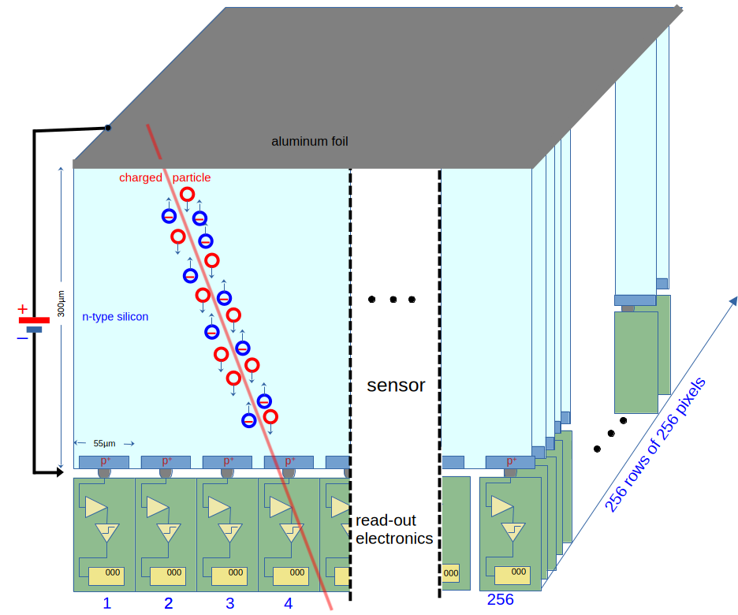

Der Chip wird im sogenannten "Frame-Modus" betrieben, d.h. alle Pixel werden
am Ende der Belichtungzeit gleichzeitig ausgelesen, wodurch ein Frame
(entsprechende einem Einzelbild eines Films) mit den deponierten Energien
pro Pixel entsteht.
Wird der *miniPIX* im Time-over-Threshold-Modus ("*ToT*") betrieben, geben die
Pixelwerte die Zeit an, während der das Signal einen gegebenen Schwellenwert 
überschreitet, gemessen in Takten der Chip-Clock mit einer Frequenz von etwa 
10 MHz. *ToT* ist für große Energiedepositionen oberhalb von 50 keV linear mit der 
Energiedeposition verknüpft. Die funktionale Abhängigkeit von der deponierten 
Energie $E$, einschließlich Schwelleneffekten, wird durch die folgende Funktion 
angenähert

   $ToT\,=\;a\,E +b - {c}/{(E-t)}$

Typische Werte der Kalibrationskonstanten sind $a$ = 1,6, $b$=23, $c$=23 und 
$t$=4,3. 
Jeder Pixel besitzt eine individuelle, in einer gerätespezifischen Datei 
gespeicherten Kalibration, die mit jedem Gerät mitgeliefert und bei der Initialisierung 
geladen wird. Diese Kalibration wird angewendet, um Pixelwerte in Einheiten von 
keV zu erhalten.
Die Kalibration ist zuverlässig bis zu Pixelenergien von etwa einem MeV; darüber 
hinaus zeigt die Antwort eine starke Nichtlinearität mit einem Überschwingen 
zwischen etwa einem und zwei MeV und einer Sättigung oberhalb von zwei MeV.
Für Einzelheiten siehe die Artikel von J. Jakubek, *Precise energy calibration 
of pixel detector working in time-over-threshold mode*, NIM A 633 (2011), 5262-5265, 
und M. Sommer et al., *High-energy per-pixel calibration of timepix pixel detector 
with laboratory alpha source*, NIM A 1022 (2022) 165957.

Seine hohe Empfindlichkeit und die räumliche Kartierung von Energiedepositionen 
sowie die digital aufgezeichneten Daten machen den *miniPIX* anderen, klassischen 
Detektoren überlegen. Zwar erlaubt er dieselben typischen Lehrbuchmessungen, wie 
etwa Messungen von Raten oder Eindringtiefen verschiedener Strahlungsarten, doch 
eröffnen sich weit umfangreichere Möglichkeiten:

- direkte Beobachtung, wie Strahlung mit Silizium wechselwirkt, 
- Unterscheidung der Strahlungsarten anhand der Pixelmuster, 
- Demonstration der Poisson-Statistik durch Zählen von Objekten in den aufgezeichneten Frames, 
- Abhängigkeit der gemessenen Raten vom Abstand zur Quelle,
- Energiemessungen von α-Teilchen und ihres Energieverlusts in Materie,
- Energieverlust von β-Teilchen in Materie,
- Untersuchungen von Photonenwechselwirkungen in Materie (dominiert durch den Compton-Prozess),
- Energieverlust von Myonen und dessen Fluktuationen entlang der Spur.

Es gibt noch weitere Vorteile für die Anwendung in Praktika oder auch in
Schulversuchen:

- Verwendung schwach aktiver radioaktiver Proben, um natürliche Radioaktivität 
  in Experimenten unter Beteiligung der Schülerinnen und Schüler zu untersuchen, 
- vernachlässigbare Rauschraten, effiziente Unterdrückung von Untergrund und 
  wohldefinierte Nachweiszeit,
- frei einstellbare Belichtungszeit zur Anpassung an unterschiedliche Strahlungsintensitäten,
- digitale Überlagerung vieler aufgezeichneter Frames, um auch bei schwach 
  aktiven Quellen merkmalsreiche Bilder zu erhalten,
- Speicherung der Daten auf der Festplatte für eine spätere, vertiefte Analyse 
  von Teilchensignaturen,
- unterschiedliche Stufen der Vorverarbeitung aufgezeichneter Frames zur 
  Anpassung an den Wissensstand der Lernenden,
- Nutzung ein und desselben Detektors für viele verschiedene Arten von Messungen.

Besonders der letzte Punkt ist wichtig, da beim *miniPIX* die Eigenschaften der 
Strahlung selbst in den Mittelpunkt rücken statt der Besonderheiten des 
klassischen Arsenals an Nachweistechniken wie Elektrometer, Ionisationskammer, 
Geigerzähler, Szintillationszähler oder Silizium-Einkristalldetektoren.  

Als Beispiel ist unten die grafische Darstellung einer Datennahme mit *mPIXdaq* 
mit einer Überlagerung von 10 Frames gezeigt, die jeweils mit einer 
Belichtungszeit von 1 s aufgezeichnet wurden. Die Clusterbildung zusammenhängender 
Pixel und die Klassifizierung der Muster erfolgen in Echtzeit während der 
Datenerfassung, und die Ergebnisse werden als animierte Histogramme dargestellt. 
Auch der Verlauf der Anzahl beobachteter Objekte pro Frame über die letzten 300 
Frames wird angezeigt und demonstriert die Poisson-Natur der zugrundeliegenden 
Prozesse der Entstehung und des Nachweises radioaktiver Teilchen.
Weitere Einzelheiten zur Echtzeitanalyse in *mPIXdaq* folgen weiter unten.

Energiespektren von γ-Strahlen können mit dem *miniPIX* nicht gemessen werden, 
da das kleine Sensorvolumen nicht ausreicht, um alle Energiedepositionen 
vollständig zu enthalten. Für die γ-Spektroskopie wird daher ein 
Gammaspektrometer mit einem Szintillationskristall empfohlen, z.B. eines 
der sehr kostengünstigen und hinreichend präzisen Geräte von 
[RadiaCode](https://radiacode.com/).

Beispiele erfolgreich durchgeführter Messungen in den Studierendenpraktika der 
Fakultät für Physik am Karlsruher Institut für Technologie werden im Folgenden 
vorgestellt und diskutiert. 

## Analyse der Strahlung natürlicher Proben

Die hohe Empfindlichkeit, verbunden mit der Fähigkeit, verschiedene Strahlungsarten 
klar zu unterscheiden, ermöglicht einen neuen Zugang zur Einführung in das Thema 
Radioaktivität. Die Strahlung schwach aktiver, natürlicher Quellen genügt bereits, 
um typische Signaturen zu identifizieren und mit den unterschiedlichen 
Eigenschaften ihrer Wechselwirkung mit Materie in Verbindung zu bringen. 

Hier wird eine kleine Probe natürlicher Pechblende (Uraninit, Urandioxid) als 
Einstieg in die Untersuchung radioaktiver Phänomene gewählt.
Ein typisches, mit *mPIXdaq* aufgezeichnetes *miniPIX*-Frame-Bild ist in der 
folgenden Abbildung gezeigt.
Pixelenergien sind, wie in der Legende auf der rechten Seite des Bildes angegeben, 
auf einer logarithmischen Skala farbkodiert. 

> 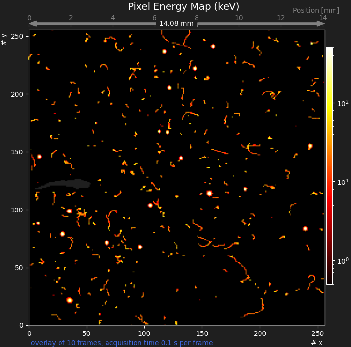

Drei Arten von Signaturen sind deutlich zu unterscheiden: kreisförmige "Blobs" 
von α-Teilchen, lange "Würmer" von β-Teilchen und typischerweise kleine Objekte 
mit nur sehr wenigen Pixeln durch Energieübertragung von γ-Strahlen auf Elektronen 
im Silizium. 

Vergrößerte Ansichten typischer α-, β- und γ-Signaturen zeigen dies deutlich. Zu 
beachten ist, dass die Länge der β-Spuren von ihrer Energie und dem Einfallswinkel 
abhängt; üblicherweise sind sie nicht vollständig im empfindlichen Volumen des 
*miniPIX*-Sensors enthalten. 
γ-Strahlen übertragen typischerweise nur einen Bruchteil ihrer Energie über den 
Compton-Prozess auf Elektronen und führen daher zu Signaturen mit nur einem oder 
sehr wenigen aktiven Sensorpixeln. Die vollständige Übertragung der γ-Energie an 
Elektronen über den Photoeffekt ist in seltenen Fällen ebenfalls möglich.

> 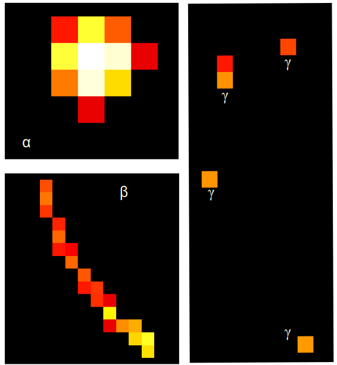

Eine **dünne Kunststofffolie** als Absorber führt zur vollständigen Unterdrückung 
aller α- und niederenergetischen β-Signaturen. Wie aus der unten gezeigten 
Abbildung deutlich wird, ist die Rate der aufgezeichneten Objekte deutlich 
reduziert, und die typischen Signaturen von α-Teilchen fehlen vollständig. 

> 

Ein **3 mm dicker Aluminiumabsorber** genügt, um alle α- und β-Teilchen 
vollständig zu unterdrücken, sodass nur γ-Strahlen den Sensor erreichen. Ein 
typisches Bild ist unten gezeigt.
Alle Spuren entstehen durch γ-Wechselwirkungen im oder nahe am empfindlichen 
Volumen des Detektors; viele umfassen nur ein oder sehr wenige Pixel. Längere 
Spuren treten auf, wenn ein erheblicher Anteil an Energie auf Elektronen 
übertragen wird. 

> 

Diese Bildfolge veranschaulicht in schöner Weise viele Eigenschaften der 
Radioaktivität:  

- es gibt drei sehr unterschiedliche Signaturtypen der Radioaktivität aus 
  natürlichen Quellen: sehr intensive kreisförmige Muster (α), lange Spuren (β) 
  und niederenergetische Depositionen mit nur einem oder sehr wenigen aktiven 
  Pixeln (γ),
- α- und β-Teilchen lassen sich leicht abschirmen,
- γ-Strahlen sind wesentlich durchdringender und schwerer abzuschirmen,
- Signaturen von γ-Strahlen sehen sehr ähnlich aus wie jene niederenergetischer 
  Elektronen, was zu dem Schluss führt, dass Photonen mit Materie wechselwirken, 
  indem sie ihre Energie auf Elektronen übertragen, die schließlich freie 
  Ladungen (bzw. Elektron-Loch-Paare in einem Halbleiter) erzeugen. 

Geeignete radioaktive Proben mit Aktivitäten von einigen 10 Bq sind frei 
erhältlich und können bei Lehrmittelanbietern erworben werden, z.B.
[NTL](https://ntl.de/radioaktivitaet/4006-dr201-1c-columbit.html).

### Pädagogische Überlegungen

Aus pädagogischer Sicht ist es sehr reizvoll, einen Kurs über Radioaktivität mit 
experimentellen Beobachtungen eines natürlichen Phänomens zu beginnen und es
Schülerinnen und Schülern bzw. Studierenden zu ermöglichen, die Eigenschaften 
der Strahlung selbst zu entdecken.  
Bei diesem Ansatz treten der historische Kontext sowie die Abfolge der 
Entwicklungen technologischer Nachweismethoden in den Hintergrund. Der Einsatz 
moderner Nachweistechniken direkt zu Beginn legt den Schwerpunkt auf das 
Phänomen der Radioaktivität selbst und auf die Wechselwirkung von Strahlung 
mit Materialien.  
Darüber hinaus vermeidet die hohe Empfindlichkeit des miniPIX-Detektors und 
seine Fähigkeit, verschiedene Strahlungsarten klar zu unterscheiden, den Einsatz 
künstlicher, hochaktiver radioaktiver Quellen, um Signale oberhalb der 
Untergrundzählrate zu erzeugen.
Mit dem *miniPIX*-Gerät ist es möglich, eine untergrundfreie Zählung und 
Energiebestimmung von α-Teilchen oder eine Zählung von β-Teilchen und γ-Strahlen 
mit schwach aktiven Quellen durchzuführen.   
Dieser Ansatz erlaubt Untersuchungen mit Quellen wesentlich geringerer Aktivität, 
als sie in klassischen Experimenten benötigt werden, z.B. zur Untersuchung der 
Absorption von α-Teilchen in Luft.  
Im Gegensatz dazu wird bei einem klassischen Strahlungsdetektor, z.B. einem 
Geiger-Müller-Zähler, beim Hinzufügen von Absorbern lediglich eine Verringerung der 
Zählrate beobachtet, es ist jedoch keine Unterscheidung nach dem Ursprung der "Klicks"
möglich. Daher wird eine hochaktive α-Quelle benötigt, um eine vollständige Absorption 
zu demonstrieren, wobei unvermeidliche Untergrundzählungen durch γ-Strahlen weiterhin 
vorhanden sind. 

Bilder wie die oben gezeigten können mit dem Programm *mPIXdaq* erzeugt werden, 
oder auch mit dem vom Hersteller mit dem *miniPIX*-Detektor mitgelieferten 
Grundprogramm *Pixet*. 
*mPIXdaq* stellt jedoch einen einfachen und transparenten Algorithmus zur 
Clusterbildung von Pixeln und zur Charakterisierung von Clustereigenschaften bereit, 
der sich  ausschließlich auf Methoden stützt, die bereits von Studierenden im 
Grundstudium beherrscht werden. 
*mPIXdaq* ermöglicht eine hochselektive Aufzeichnung bestimmter Clustertypen und 
diskriminiert damit gewünschte Signaturen wirkungsvoll gegen Untergrund. 
Die *miniPIX*-Daten können auch als Motivation für jüngere Schülerinnen und 
Schüler dienen, komplexe Methoden der digitalen Datenverarbeitung und -analyse 
zu erlernen.

Die Algorithmen sind schnell genug, um bei niedrigen Raten online eingesetzt zu 
werden und liefern so quantitative Ergebnisse zu Teilchenraten und 
Energiespektren. 
Ein Beispiel für die Energiespektren linearer und kreisförmiger Cluster sowie 
einzelner Pixel ist unten gezeigt. 

  >  

## Echtzeitanalyse der aufgezeichneten Daten  

*mPIXdaq* führt eine Online-Analyse der aufgezeichneten Datenframes durch und 
stellt die Ergebnisse als animierte Histogramme dar, die während der 
Datenerfassung fortlaufend aktualisiert werden.
Rohdaten oder geclusterte Framedaten sowie Clustereigenschaften im *.csv*-Format 
können mit *mPIXdaq* erzeugt und zur späteren Analyse auf der Festplatte 
gespeichert werden. 
Zusätzlich zu dem sehr nützlichen visuellen Eindruck wird es damit möglich, 
computerbasierte Methoden einzusetzen, um die Eigenschaften der 
Energiedepositionen verschiedener Teilchenarten im Detail zu untersuchen. 

In einem ersten Schritt der Analyse werden zusammenhängende Pixelbereiche,
sogenannte Cluster, in jedem Frame mithilfe der Methode *label()* der 
Bildverarbeitungsbibliothek *scipy.ndimage* bestimmt.  
Die wichtigsten Merkmale jedes Clusters sind die Position in Pixelkoordinaten,
die Anzahl der Pixel, die Summe aller Pixelenergien und die maximale Energie
in einem einzelnen Pixel des Clusters. Position und Größe eines 
Clusters werden durch die "Bounding Box" angenähert, ein rechteckiges Gebiet, das 
alle Pixel des Clusters enthält. Ein α-Teilchen aktiviert die meisten Pixel in 
dieser Box, d.h. die Anzahl der Pixel ist gegeben durch das Produkt aus Breite 
*w* und Höhe *h* der Bounding-Box. β-Teilchen dagegen aktivieren nur Pixel 
entlang ihrer Spur, und die minimale Anzahl aktiver Pixel entspricht der Länge 
der Diagonalen der Box. 

Weitere interessante Clustermerkmale sind die geometrische Form des Clusterbereichs 
und die Form der Energieverteilung über die Pixel.
Zur Charakterisierung der geometrischen Form wird die Kovarianzmatrix der 
Pixelkoordinaten, ${\rm cov}(x_i, y_i)$, verwendet. Gespeichert werden die 
Halbachsenlängen der Hauptachsen (bzw. der großen und kleinen Halbachse) sowie 
die Winkelorientierung der Hauptachse der Kovarianzellipsen der Cluster. 
Nahezu identische Halbachsenlängen kennzeichnen eine kreisförmige Geometrie, 
während stark unterschiedliche Werte charakteristisch für lineare Topologien 
sind. 
Das Verhältnis der beiden Halbachsenlängen wird daher als Maß für die 
"Rundheit" des Clusters verwendet, das bereits eine gute Trennung von α-
und β-Teilchen ermöglicht.

Eine weitere, sehr sensitive Variable ist die Kovarianzmatrix der 
Energieverteilung in den Clustern, ${\rm cov}(E(x_i, y_i))$. Bei α-Teilchen 
weist diese Verteilung ein Maximum in der Mitte auf und fällt zu den Rändern 
hin steil ab, was zu einer kleinen Varianz führt. Die Eigenschaften der 
Kovarianzellipsen der Energieverteilung werden analog zu denen der geometrischen 
Ellipsen gespeichert.  
Ein kleines Verhältnis der Längen der großen Halbachsen der beiden Ellipsen, 
genannt "Flachheit" ("flatness"), ist eine sehr charakteristische Signatur von 
α-Teilchen.

Optional kann zusätzlich zu den Clustereigenschaften eine Liste der zu jedem 
Cluster beitragenden Pixel für eine vertiefte Offline-Analyse gespeichert 
werden. 

Als Ausgangspunkt für eigene Analysen bietet das *mPIXdaq*-Paket ein 
*Jupyter-Notebook*, *analyze_mPIXclusters.ipynb*, zur Verwendung mit einem 
lokalen oder entfernten *Jupyter*-Dienst. In gängigen *Python*-Umgebungen lässt 
sich ein solcher Server leicht einrichten, wie auf der Projekt-Homepage 
[_jupyter.org_](https://jupyter.org/) dokumentiert ist.  
Das im *mPIXdaq*-Paket enthaltene Analysebeispiel zeigt, wie die Ausgabedateien 
eingelesen werden, und bietet zudem eine Beispielanalyse. Der Code stützt sich 
auf das Paket [_pandas_](https://pandas.pydata.org/), das sich als etablierter 
Standard für die Analyse großer Datensätze durchgesetzt hat. 

Die folgenden Clustermerkmale werden von *mPIXdaq* für jeden Pixelcluster 
während der Online-Verarbeitung ermittelt:

['time', 'x_mean', 'y_mean', 'n_pix', 'energy', 'e_mx', 'x_mn', 'y_mn', 'w', 'h',  
 'var_mx', 'var_mx', 'var_mn', 'angle', 'xE_mean', 'yE_mean', 'varE_mx', 'varE_mn']

    time    : Zeit seit dem Start der Datenerfassung, zu der das Frame aufgezeichnet wurde
    x_mean  : mittlere x-Position des Clusters (in Pixelnummern)
    y_mean  : mittlere y-Position des Clusters (in Pixelnummern)
    n_pix   : Anzahl der Pixel im Cluster
    energy  : Energie des Clusters (= Summe der Pixelenergien) in keV
    e_mx    : maximale Pixelenergie
    x_mn    : minimales x der rechteckigen Bounding Box, die den Cluster enthält
    y_mn    : minimales y der Bounding Box
    w       : Breite der Bounding Box
    h       : Höhe der Bounding Box
    var_mx  : maximale Varianz der geometrischen Clusterform (in Pixeln)
    var_mn  : minimale Varianz der geometrischen Clusterform (in Pixeln)
    angle   : Orientierung des Clusters (0 = entlang der x-Achse, pi/2 = entlang der y-Achse)
    xE_mean : mittleres x der Energieverteilung (in Pixelnummern)
    yE_mean : mittleres y der Energieverteilung (in Pixelnummern)
    varE_mx : maximale Varianz der Energieverteilung  
    varE_mn : minimale Varianz der Energieverteilung 

Dieser Satz an Variablen erlaubt bereits sehr detaillierte Untersuchungen der 
Eigenschaften von Energiedepositionen im *miniPIX*-Detektor. Eine nahezu perfekte 
Trennung der verschiedenen Strahlungsarten wird möglich und erlaubt untergrundfreie 
Selektionen von α- und β-Spuren, die Zählung ihrer Raten sowie die Bestimmung der 
Energiespektren von α-Teilchen.

Als weitere Option enthält eine Datei mit Clusterdaten im *yaml*-Format die 
Positionen und Energien aller beitragenden Pixel. Damit lassen sich 
anspruchsvollere Analysestrategien erproben. So ist es beispielsweise möglich, 
β-Spuren zu identifizieren, die im aktiven Volumen des Detektors stoppen,
indem die deutliche Zunahme der deponierten Energie genutzt wird, wenn 
die Elektronen im Material sehr langsam werden. Die gezielte Auswahl solcher
Spuren eröffnet begrenzte Möglichkeiten zur β-Spektroskopie.

## Vertiefte Themen für Praktika an Hochschulen

Typische (klassische) Experimente der Kernphysik, wie Energiespektren
und Energieverlust von α-Teilchen in Luft oder das Durchdringungsvermögen 
und die Absorption von β-Strahlung, lassen sich mit dem *miniPIX*-Detektor 
problemlos durchführen. Seine feinkörnige Ortsauflösung ermöglicht dabei
zusätzliche Einblicke, die sonst nicht zugänglich wären. 

Zur Unterstützung quantitativer Experimente wird mit diesem Paket das 
*Python*-Skript `calculate_dEdx.py` zur Bestimmung des (mittleren) spezifischen 
Energieverlusts (dE/dx) von Elektronen und α-Teilchen in Luft und Silizium 
bereitgestellt. Der berechnete Energieverlust von Teilchen (bzw. die im 
absorbierenden Material deponierte Energie) ist wichtig, um die gemessenen 
Signale mit theoretischen Erwartungen in Beziehung zu setzen.     
Die berechneten Energiedeposits basieren auf modifizierten Versionen der 
Bethe-Bloch-Beziehung für den Energieverlust geladener Teilchen in Materie 
und stellen sinnvolle Näherungen dar. Die derzeit maßgeblichste Informationsquelle 
zu Energieverlusten von Elektronen, Photonen und Heliumkernen (α-Teilchen) sind 
die tabellierten Daten des amerikanischen NIST (ESTAR, ASTAR und PStar), siehe 
[_NIST Standard Reference Database_](
https://www.nist.gov/pml/stopping-power-range-tables-electrons-protons-and-helium-ions).

Eine Auswahl an Experimenten mit dem *miniPIX*-Detektor und dem *mPIXdaq*-Paket 
wird in den folgenden Unterkapiteln beschrieben.

### Reichweite von α-Teilchen in Luft  

Die **Reichweite** von α-Teilchen und der Energieverlust in Luft lassen sich 
direkt mit dem *miniPIX* bestimmen, indem er anstelle eines anderen Detektors 
in einen bestehenden Aufbau eingesetzt wird. Mit dem *mPIXdaq*-Paket werden 
Signaturen von α-Teilchen ohne jeglichen Untergrund identifiziert, und ihre 
Energien werden mit ausreichender Präzision gemessen, um die Energieverschiebung 
als Funktion des Abstands zwischen Quelle und Detektor zu beobachten.  

Das erwartete Verhalten der gemessenen α-Energien als Funktion der durchdrungenen 
Luftstrecke, wie es mit *calculate_dEdx.py* bestimmt wurde, ist in der Abbildung 
unten dargestellt.

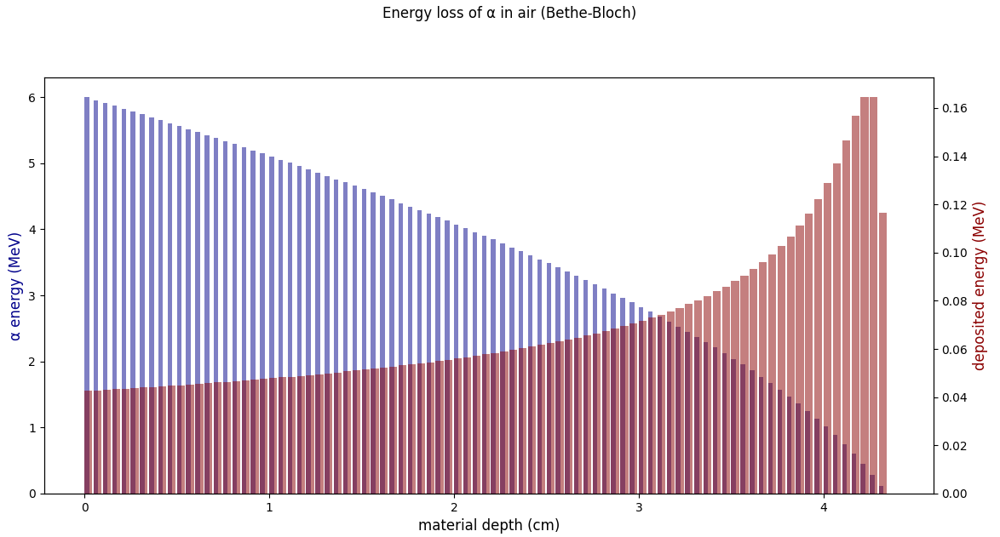

Der Energieverlust pro 0,5 mm durchquerter Luftstrecke, entsprechend der 
deponierten Energie, ist in Rot dargestellt; er steigt gegen Ende der α-Reichweite, 
wenn die Teilchen sehr langsam werden, um fast das Vierfache an. Dieses Verhalten 
veranschaulicht den Bragg-Peak der deponierten Energie, der für die Strahlentherapie 
relevant ist. 

Quantitative Messungen zur Demonstration des Energieverlusts in Luft (bzw. des 
„Bremsvermögens") lassen sich durchführen, wenn eine dünne, vorzugsweise offene 
und monoenergetische α-Quelle, z. B. Am-241, zur Verfügung steht. α-Teilchen 
werden anhand der oben erläuterten Cluster-Eigenschaften ausgewählt, indem ein 
hoher mittlerer Energiedeposit pro Pixel, eine kreisförmige Clusterform und eine 
nicht-flache Energieverteilung gefordert werden.  
Hier ein Codebeispiel, unter der Annahme, dass die Daten in einem *pandas*-Dataframe 
*df* gespeichert sind:

    # define useful quantities
    # - mean energy per pixel
    df['Epix_mean'] = df['energy'] / df['n_pix']
    # - circularity of cluster shape as the ratio of the sizes in x and y
    df['circularity'] = df['var_mn'] / np.maximum(df['var_mx'].to_numpy(), 0.001)
    # - flatness of energy distribution 
    df['flatness'] = df['varE_mx'] / np.maximum(df['var_mx'].to_numpy(), 0.001) 

    # apply cuts on these quantities
    dEdx_cut = 80
    circularity_cut = 0.3
    flatness_cut = 0.4
    is_high_dEdx = df['Epix_mean'] > dEdx_cut
    is_circular = df['circularity'] >= circularity_cut
    is_flat = df['flatness'] > flatness_cut

    # loose definition of alpha candidate by shape
    shape_is_alpha = is_circular & ~is_flat
    # a loose definition of an alpha
    is_cand_alpha = shape_is_alpha | is_high_dEdx
    # a tight definition of an alpha
    is_alpha = shape_is_alpha & is_high_dEdx
    
Um zuverlässige Energiemessungen zu erhalten, ist es wichtig, Cluster mit 
Pixelenergien über 1200 keV auszuschließen, da die Detektorantwort aufgrund 
sättigender Pixelladungen nichtlinear wird. Tatsächlich wird die Energie in 
solchen Fällen deutlich überschätzt. Eine Abhilfe besteht darin, Ereignisse zu 
verwerfen, bei denen α-Teilchen die Mitte eines Pixels treffen, was zur Definition 
eines „sauberen Alphas" mit zuverlässiger Energiebestimmung führt:

    is_clean_alpha = is_alpha & (df['e_mx'] < 1200.)

oder, wenn auch niederenergetische α-Teilchen mit ein bis drei aktiven Pixeln 
einbezogen werden sollen:

    is_clean_alpha = is_cand_alpha & (df['e_mx'] < 1200.)

Ein Beispiel für solche Messungen mit einer dünnen, offenen Am-241-Quelle und dem 
*miniPIX* in verschiedenen Abständen von der Quelle ist unten dargestellt. Die 
Energieauflösung (volle Breite bei halber Höhe) liegt in der Größenordnung von 5%. 

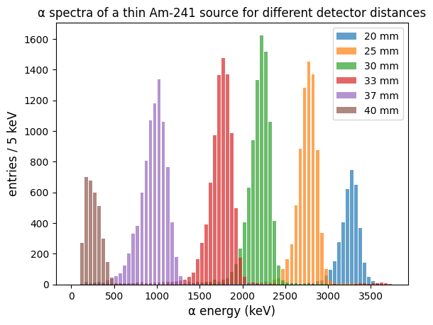.

Der Abstand zwischen den Peaks, d. h. der Energieverlust in Luft, steigt bei 
niedrigeren Energien erwartungsgemäß an. Der Energieverlust beträgt etwa 
100 keV/mm bei einer Energie von 3 MeV und steigt bei 1 MeV auf etwa 200 keV/mm. 

Die mittleren Energien, die aus den angepassten Peakpositionen als Funktion des 
Abstands des *miniPIX* von der Am-241-Quelle gewonnen wurden, sind zusammen mit 
den theoretischen Erwartungen aus der Bethe-Bloch-Formel unten dargestellt. Die 
vertikalen Fehlerbalken geben die Standardabweichung der Spektren an; die 
Unsicherheit auf die mittlere Energie ist sehr klein und nicht sichtbar.

Die beobachtete Reichweite von 4,1 cm für α-Teilchen aus Am-241 mit einer Energie 
von 5,5 MeV entspricht gut der Vorhersage. Bei kleineren Abständen gibt es jedoch 
Abweichungen von der Erwartung, die höchstwahrscheinlich durch das bekannte 
nichtlineare Verhalten des *miniPIX* bei hohen α-Energien verursacht werden: 

   - Der Schnitt auf die maximale Energie in einem einzelnen Pixel verzerrt die 
      bestimmte Energie hin zu niedrigeren Werten.
   - Die Schicht aus totem Material vor dem empfindlichen Bereich des *Timepix*-Chips 
     führt zu einer kleinen energieabhängigen Korrektur in der Größenordnung von 
     100–200 keV, entsprechend dem Energieverlust in 1 mm Luft.  
   - Der Energieverlust hängt von der Luftdichte und damit von Temperatur und 
     Luftdruck ab. Die gestrichelten und strichpunktierten Kurven zeigen diesen 
     Effekt für Variationen der Luftdichte von ±5 %, der typischen Größenordnung 
     von Schwankungen bei unterschiedlichen Wetterbedingungen.

Eine sorgfältige Kalibrierung des *miniPIX* für hohe α-Energien ist erforderlich, 
wenn präzisere Untersuchungen bei hohen α-Energien > 2 MeV gewünscht werden. 

### Messung des Energieverlusts von β-Strahlung.  

Absorptionskurven werden durch Messung der Rate von β-Spuren als Funktion der 
Dicke des Absorbermaterials bestimmt, das zwischen einer β-Quelle 
(typischerweise Sr-90/Y-90) und dem *miniPIX*-Detektor platziert wird. Wie bei 
Experimenten mit klassischen Detektoren handelt es sich hierbei um reine 
Ratenmessungen, da β-Spuren im empfindlichen Volumen des *miniPIX* nicht 
vollständig absorbiert werden und eine Messung ihrer Energie nur möglich ist, 
wenn die Spuren vollständig enthalten sind, d. h. bei Energien unter 200 keV.  

Die interessierende Größe bei solchen Messungen ist der Massenabsorptions- 
(bzw. Massenschwächungs-)koeffizient, $\mu / \rho$ in Einheiten von cm²/g. 
Er wird aus der Abhängigkeit der Zählrate von der durchquerten Materialdicke 
gewonnen. Typischerweise besteht das Absorbermaterial aus sehr dünnen 
Aluminiumfolien von einigen zehn µm Dicke.

Bei diesem Experiment hängen die gemessenen Energien vom Energiespektrum der von 
der Quelle emittierten β-Strahlung ab, das mit den Absorptionseigenschaften des 
Materials gefaltet ist. 

Glücklicherweise lassen sich diese beiden Effekte mit dem *miniPIX*-Gerät 
entflechten, wie im Folgenden gezeigt wird. 

#### Absorption in Silizium  

Der Energieverlust von β-Strahlung in Silizium lässt sich direkt mit dem 
*miniPIX* untersuchen, da die Pixel gleichzeitig als Absorber- und 
Nachweismaterial dienen. Die entlang einer β-Spur in den Pixeln deponierten 
Energien zeigen unmittelbar den Energieverlust (dE/dx) entlang der Spur. 
Da die β-Energie beim Durchqueren des Siliziums genau um die in den Pixeln 
gemessene Energie abnimmt, stellt die in jedem Pixel aufgezeichnete Energie 
eine Messung der Energieabhängigkeit des spezifischen Ionisationsverlusts in 
Silizium dar. 

Der erwartete mittlere Energieverlust pro Pixel, wie er mit *calculate_dEdx.py* 
unter Verwendung einer modifizierten Bethe-Formel berechnet wurde, zeigt einen 
starken Anstieg am Ende der Spuren, wo die Elektronen langsam werden. Vorhergesagt 
wird eine mittlere Energiedeposition von etwa 20 keV für Elektronen mit Energien 
zwischen 0,2 und 1,5 MeV, die auf einige zehn keV für Elektronen mit kinetischen 
Energien unter 200 keV ansteigt.

  > 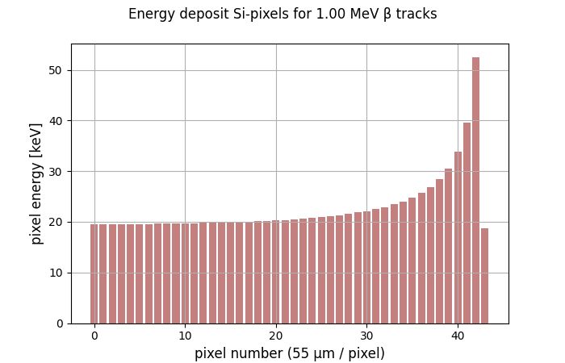 

Ein Beispiel für eine solche lange Spur eines β-Teilchens ist in der Pixel-Map
unten dargestellt. Man beachte, dass die Schwankungen der Energiedeposits um 
den Mittelwert bei dünnen Absorberschichten groß sind. Die Energiedeposits 
in den einzelnen Pixeln liegen sehr nahe an den theoretischen Erwartungen. 

  >  

Das Bild wurde mit dem *Jupyter*-Notebook *analyze_mPIXclusters* und der Funktion 
*plot_cluster()* aus *mpixdaq.mpixhelpers* erstellt, indem Nicht-α-Spuren mit 
einer großen Pixelzahl ausgewählt wurden. Das Teilchen tritt oben links in den 
Detektor ein und verliert dann in jedem Pixel Energie, während es das empfindliche 
Siliziumvolumen durchquert. Es kommt schließlich in der unteren linken Ecke zum 
Stillstand, wo der Energiedeposit pro Pixel den erwarteten Anstieg zeigt. 

In einer umfassenderen Analyse wird die Elektronenenergie durch Aufsummieren aller 
Energieverluste in den einzehnen Pixeln ausgehend vom Stopppunkt ermittelt. 
Werden viele solcher Spuren erfasst, lässt sich der Energieverlust pro Pixel als 
Funktion der Elektronenenergie bestimmen. Wie an der obigen Elektronenspur zu 
erkennen ist, ist der Energiedeposit pro Pixel nicht konstant, sondern zeigt 
große, nicht-gaußförmige Schwankungen, die näherungsweise durch eine 
Landau-Verteilung mit einem langen Ausläufer zu großen Energiedeposits hin 
beschrieben werden, welcher auf seltene, aber intensive Wechselwirkungen 
zurückzuführen ist.
Wichtig ist außerdem, dass der Weg einer Spur innerhalb eines Pixels nicht genau 
bekannt ist, da sie den empfindlichen Bereich unter einem unbekannten 
Höhenwinkel bezüglich der Pixelebene durchqueren kann. Zudem haben Spuren, die 
die Pixel nicht in x- oder y-Richtung durchqueren, eine um bis zu einen Faktor 
$\sqrt{2}$ längere Weglänge, und die Energie von Spuren, die an den Pixelkanten 
verlaufen, kann auf benachbarte Pixel aufgeteilt sein. Durch geeignete Auswahl 
der Spuren lassen sich diese Probleme abmildern.
Lange Spuren haben einen kleinen Neigungswinkel zur Pixelebene, und Energien
benachbartet Pixel lassen sich für Spuren entlang der x- bzw. y-Richtung durch
Projektion auf die x- bzw. y-Achse korrekt aufsummieren. So erhält man eine gute
Näherung der Energie der Elektronen an jeder einzelnen Pixelpostion und kann die
im Pixel deponierte Energie als Funktion der Elektronenergie untersuchen. 

Die Daten wurden mit einer Strontium-90-Quelle aufgenommen, indem 10000 Frames 
mit einer Belichtungszeit von je 50 ms ausgelesen wurden, was einen großen 
Datensatz von insgesamt 350000 Clustern ergab. Daraus wurden 680 Spuren 
ausgewählt, die die oben beschriebenen strengen Auswahlkriterien erfüllen.
Der Stopppunkt der Spuren wird identifiziert, indem ein Energiedeposit von mehr 
als 70 keV in den letzten beiden Pixeln gefordert wird.
Die mittleren deponierten Energien pro Pixel für lange β-Spuren, die die 
Pixelebene unter einem Winkel von nicht mehr als 22,5° zur x- oder y-Richtung 
durchqueren, sind im Graphen unten dargestellt. Der Pixel, in dem die Spur endet, 
ist mit 1 bezeichnet.

 >  

Die gemessenen mittleren Energien entsprechen gut der zuvor diskutierten 
theoretischen Erwartung. Die Energiedeposits werden mit zunehmendem Abstand vom 
Stopppunkt, d. h. mit steigender Spurenergie, kleiner. Der mittelwert in Pixel 15 
beträgt 21,8 keV, was ebenfalls gut mit der theoretischen Erwartung übereinstimmt.

Für einige Pixel sind die vollständigen Energieverteilungen dargestellt. Sie 
stimmen gut mit den an die Histogramme angepassten Landau-Verteilungen überein, 
die als gestrichelte Linien dargestellt sind.

 >  

### Wechselwirkungen von γ-Strahlung mit Silizium 

Bei ausreichender Abschirmung erreichen nur γ-Strahlen die empfindliche Schicht 
des *miniPIX*. Eine Sammlung von Signaturen, die durch Gamma-Wechselwirkungen 
erzeugt werden, ist unten dargestellt. Als radioaktive Quelle diente ein 
schwach-aktiver Stein (Uranerz) aus dem Schwarzwald, abgeschirmt mit 3 mm 
Aluminium. Alle Signaturen sehen wie Elektronen am Ende ihrer Reichweite aus. 

 >  

Das Energiespektrum fällt typischerweise sehr steil ab, und jede Modellierung 
hängt stark von den Eigenschaften der Umgebungsstrahlung unter den jeweiligen 
Umweltbedingungen ab.

Eine saubere Photonenquelle mit 59,5 keV erhält man, indem die α-Teilchen einer 
Am-241-Quelle abgeschirmt werden. Das Energiespektrum von Clustern mit weniger 
als 5 Pixeln ist im Histogramm unten dargestellt. Der Photopeak bei 59,5 keV ist 
deutlich sichtbar, ebenso wie Einträge bei niedrigerer Energie. Die maximale 
Energie von 19 KeV für Elektronen, die durch Compton-Streuung der einfallenden 
Photonen erzeugt werden, ist ebenfalls deutlich sichtbar, zusammen mit weiteren 
niederenergetischen Einträgen, die von Röntgenstrahlung aus der Quelle oder dem 
Sensormaterial stammen.  

> 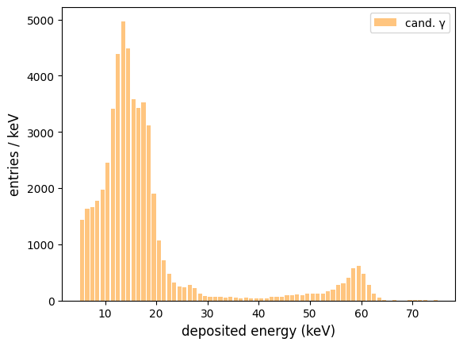

### Umgebungsstrahlung 

Umgebungsstrahlung auf einem normalen Niveau von 0,1 µSv/h führt zu einer 
Wechselwirkungsrate von etwa 25 Photonensignalen pro Minute im aktiven 
*miniPIX*-Volumen von 0,059 cm³. Dies stellt eine ansehnliche Nachweiseffizienz 
dar, die einen kleinen Geigerzähler um einen Faktor zwei bis drei übertrifft.
Der *miniPIX* kann also auch für die Präzisionsdosimetrie eingesetzt 
werden. Dennoch ist diese Rate niedrig im Vergleich zu typischen 
Zählraten von 180 pro Minute, die in einem CsI(Tl)-Kristall mit einem Volumen 
von einem cm³ in einem RadiaCode-102 γ-Spektrometer beobachtet werden.

Eine Überlagerung von 300 *miniPIX*-Frames mit je 1 s Belichtungszeit ist in 
der Abbildung unten dargestellt. Dieses sehr detailreiche Bild zeigt deutliche 
Signaturen von Photonen. Die Rate einzelner Pixel liegt bei etwa 0,5 Hz – auch 
andere Signaturen mit einer geringen Pixelzahl stammen von γ-Wechselwirkungen, 
die die Rate dominieren. 
Anders als bei den oben genannten Szintillationszählern möglich, sind hier auch 
sieben deutliche Signaturen von α-Teilchen sowie eine große Zahl von 
Elektronenspuren zu sehen.  

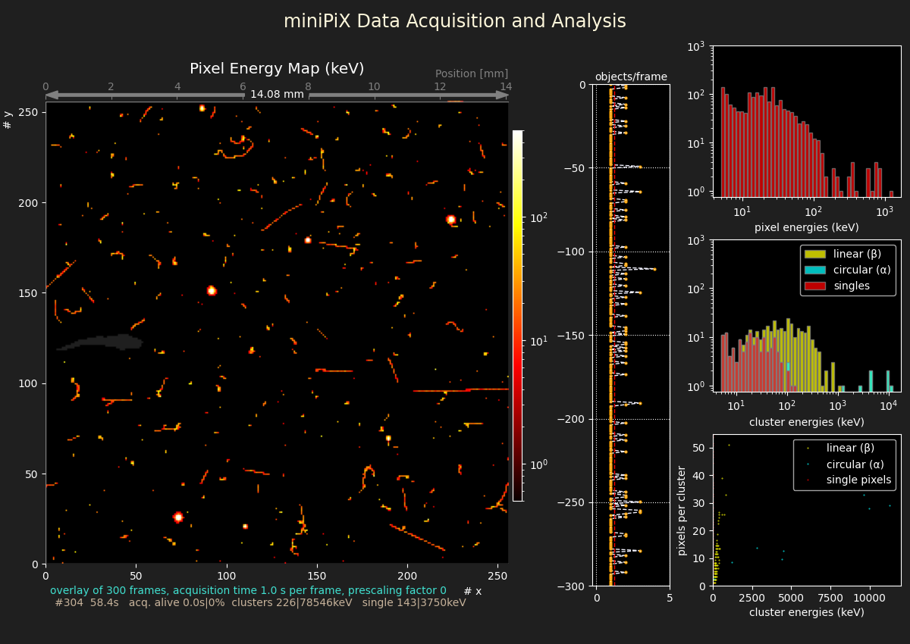 

Die α-Signaturen stammen von Zerfällen des Edelgases Radon (Rn-222 und Rn-224) 
aus den Uran- und Thorium-Zerfallsreihen. Radon entsteht durch radioaktive 
Zerfälle dieser Elemente in Baumaterialien und im Erdinneren.
Als reaktionsträges Edelgas wird Radon aus dem Material freigesetzt und 
reichert sich in der Luft an, insbesondere in schlecht belüfteten Räumen. 
Radon und seine Tochternuklide (Po, Bi, Pb) erzeugen α-Teilchen mit typischen 
Energien von etwa 5–7 MeV. Da sie durch Wechselwirkungen mit Luftmolekülen 
rasch Energie verlieren, sind die im *miniPIX* beobachteten Energien typischerweise 
kleiner.

Die lange, gerade Spur nahe der Mitte auf der rechten Seite des Bildes ist ein 
Beispiel für ein Myon aus der kosmischen Strahlung, das den Detektor unter einem 
flachen Winkel von etwa 10° durchquert. Der Sensor war so ausgerichtet, dass die 
*x*-Achse vertikal nach oben zeigte.  
Myonen sind schwer und streuen daher kaum im Silizium, was zu sehr geraden 
Spuren führt. Außerdem sind sie hochenergetisch und minimal-ionisierend, weshalb 
ihr Ionisationsverlust entlang der Spur konstant ist. Dies steht im Gegensatz 
zu β-Elektronen, einen großen Teil ihrer Anfangsenergie verlieren und deren
Ionisation dann mit abfallender Energie ansteigt.   
Spuren von Myonen lassen sich nur dann von Elektronensignaturen unterscheiden, 
wenn die Spuren lang genug sind, d. h. wenn sie den empfindlichen Bereich unter 
einem flachen Winkel durchqueren, sodass viele Pixel ansprechen. Man beachte, 
dass ein Myon unter 45° nur 5 Pixel auslöst und ein Myon unter 30° 10 Pixel. 
Die meisten Myonen treffen unter 90° von oben ein, und wenn der Sensor richtig 
ausgerichtet ist, ist ein nennenswerter Anteil des gesamten Myonenflusses 
im *miniPIX* beobachtbar.  
Mit einer Reihe von Messungen bei unterschiedlichen Detektorausrichtungen werden 
Untersuchungen sowohl der Rate als auch der Richtung von Myonen möglich. Dies 
erfordert jedoch lange Messzeiten, da die erwartete Myonenrate auf Meereshöhe, 
integriert über alle Einfallswinkel, nur etwa 1/cm²/min beträgt. 
Zwei deutliche Myonenspuren, gefunden in einem Datensatz der mit einer 
Gesamtaufnahmezeit von 10000 s aufgezeichnet wurde, sind unten dargestellt.

> 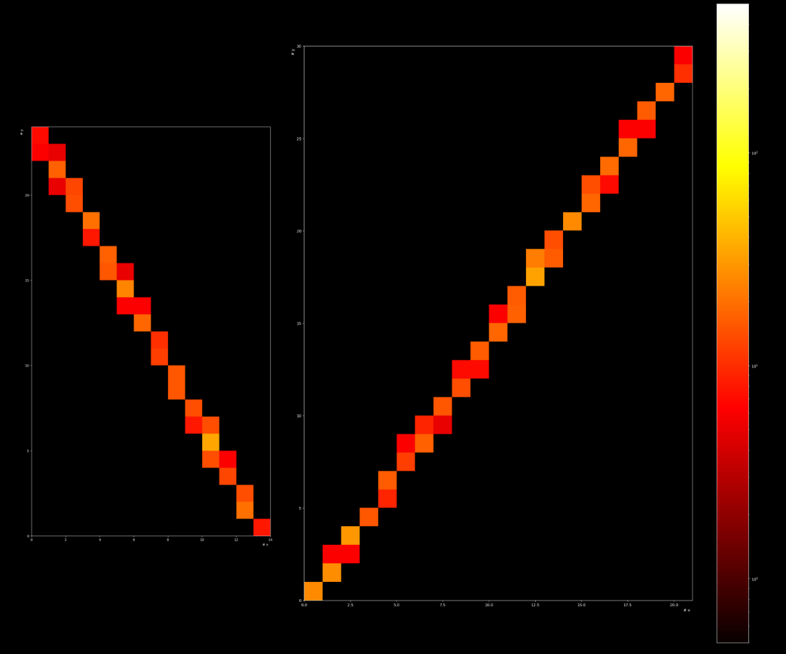 

Das Beispiel einer Aufnahme der Umgebungsstrahlung veranschaulicht auch die 
Nützlichkeit des *miniPIX* als **Dosimeter** zur Überwachung radioaktiver 
Umgebungen. Unterschiedliche Bedingungen im Freien, in einem gut belüfteten 
Raum oder in den typischerweise schlecht belüfteten Kellern von Gebäuden sind 
interessante Orte für Studien. 

Radon und seine Zerfallsprodukte lassen sich mit einem Staubsauger leicht auf 
einem Papiertuch oder auf der Oberfläche eines elektrostatisch aufgeladenen 
Luftballons anreichern. Eine Erhöhung um einen Faktor zehn im Vergleich zu 
natürlichen Strahlungsniveaus, sowohl für α- und β-Teilchen als auch für 
γ-Strahlung, ist leicht erreichbar.

Ein Beispiel für Teilchenraten als Funktion der Zeit, gemessen an einem 
Papiertuch, das 10 Minuten lang dem Luftstrom eines Staubsaugers im Keller 
eines Gebäudes ausgesetzt war, ist unten dargestellt.

> 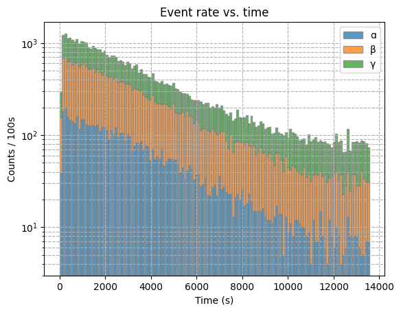 

Ausgehend von einer Untergrundrate von etwa 0,3 Hz springt die Rate der 
nachgewiesenen Cluster bzw. Einzelpixel bei Exposition des Sensors mit 
dem Tuch auf über 10 Hz und fällt dann exponentiell mit der Zeit ab.  

Am Ende der Radon-Zerfallsreihe entsteht Pb-210 mit einer Halbwertszeit von 
22 Jahren, das über einen zweifachen β-Zerfall zu Bi-210 und Po-210 mit 
anschließendem α-Zerfall schließlich das stabile Pb-206-Nuklid erreicht. 
Pb-210 stellt eine bedeutende Quelle natürlicher Umgebungsstrahlung dar und 
ist in Gebieten mit hohen Radonwerten angereichert. Diese langlebige Komponente
ist für den flachen Teil verantwortlich, der im Ratenverlauf jenseits von 11000 s
zu sehen ist und etwa um den Faktor drei über dem anfänglichen Untergrundniveau liegt.  
Die kurzlebigen, aus Radonzerfällen entstehenden Nuklide bieten einen der 
seltenen Fälle, in denen ein exponentielles Zerfallsgesetz direkt beobachtet 
werden kann. Zu beachten ist jedoch, dass es sich dabei wegen der Erzeugung 
radioaktiver Tochternuklide, die zu den registrierten Zerfallsprodukten 
beitragen, nicht um eine exakte Exponentialfunktion handelt.  

Radon-Daten in der Datei *data/Radon_clusters.yml.gz* werden zusammen mit 
dem  *mPIXdaq*-Paket ausgeliefert und können mit dem Befehl 
   >run_mPIXdaq.py -r data/Radon_clusters.yml.gz 
gelesen und dargestellt oder mit den oben erwänten und unten detaillierter
beschriebnen  *Jupyter*-Notebooks analysiert werden. 

### Absorption von γ-Strahlen in Materialien

Untersuchungen der Absorption von γ-Strahlen in unterschiedlichen Materialien 
als Funktion der durchdrungenen Materialdicke und der anfänglichen γ-Energie 
lassen sich mit dem *miniPIX*-Detektor unkompliziert durchführen. Mit einem 
Satz von γ-Quellen wie abgeschirmtem Am-241, Cs-137, Na-22 oder Co-60 steht 
für solche Messungen eine ausreichend große Variation der Anfangsenergien im 
Bereich von 60 bis 1330 keV zur Verfügung. 
Absorberplatten aus Blei mit Dicken im Bereich von 1–25 mm oder Aluminiumblöcke 
mit 15–25 mm Dicke sind ebenfalls nützliche Hilfsmittel für solche Experimente.

Das Ergebnis einer Messreihe mit einer Cs-137-Quelle und Blei-Absorberplatten 
ist in der Abbildung unten dargestellt. Im Gegensatz zu dem, was bei 
α-Spektren beobachtet wurde, bleibt die Form der γ-Spektren nahezu unverändert, 
wenn sich die Dicke der Absorptionsschicht ändert. Die Rate nimmt jedoch mit 
zunehmender Absorberdicke stark ab. 

>   

Dieses Verhalten weist auf einen qualitativen Unterschied zwischen α- und 
γ-Strahlung hin. γ-Strahlen wechselwirken nur selten mit Materie, und 
typischerweise wird in dünnen Absorberschichten nur eine einzige Wechselwirkung 
beobachtet. Das wechselwirkende γ-Quant überträgt seine Energie auf ein Elektron, 
das dann im Material absorbiert wird. Infolgedessen wird das γ-Quant aus dem 
einfallenden Strahl entfernt. Während die Strahlung eine Tiefe $l$ des Materials 
durchdringt, nimmt die Zahl der verbleibenden Photonen $N(l)$ um $dN$ ab, 
während die Wechselwirkungsrate proportional zu $N(l)$ ist. Dies führt zu einer 
erwarteten exponentiellen Abhängigkeit der verbleibenden Photonenzahl, 
$N(l) = N_0 \cdot \exp{(- \mu \, l)}$.
$\mu$ ist dabei der sog. Massenabsorptions- (bzw. Schwächungs-)koeffizient des 
Materials, der aus einer Messreihe mit variierender Absorberdicke und einfallender 
γ-Energie bestimmt werden kann. Häufig wird anstelle des Schwächungskoeffizienten 
die Absorptionslänge $x_a = 1/\mu$ verwendet. 
Dieses exponentielle Verhalten wird in der Abbildung unten bestätigt, die die 
gemessene γ-Rate als Funktion der durchdrungenen Dicke von Eisenabsorbern zeigt.

>  

Zu beachten ist, dass eine Absorberplatte vorhanden war, die alle von der 
radioaktiven Quelle emittierten α- und β-Teilchen unterdrückte. Die Messungen 
mit zusätzlichen Absorberplatten hinter der Abschirmung bestätigen den 
erwarteten exponentiellen Zusammenhang zwischen der γ-Rate und der Absorberdicke.

#### γ-Absorption zur Klassifizierung von Materialien

Sobald das besondere Verhalten der γ-Strahlungsabsorption experimentell 
nachgewiesen ist, zeigt eine Variante des Experiments, wie sich Materialien 
anhand ihres charakteristischen Schwächungskoeffizienten identifizieren lassen.   
Eine Materialprobe der Dicke $d$ wird zwischen einer γ-Quelle mit einem 
Aluminium-Absorber (zur Beseitigung von α- und β-Strahlung) und einem 
miniPIX-Detektor platziert. 
Aus den mit und ohne Probe beobachteten Raten $I$ und $I_0$ ergibt sich 
unmittelbar der (lineare) Schwächungskoeffizient des Materials:

$\mu = ln(\frac{I_0}{I}) / d$. 

Ist zusätzlich die Dichte der Probe bekannt, kann der Massenabsorptions-
koeffizient, $\mu_m = \mu / \rho$ (in Einheiten von cm²/g), mit tabellierten 
Werten verglichen werden, um den Materialtyp zu bestimmen.

Zu beachten ist, dass die mit dem hier vorgeschlagenen einfachen Aufbau 
bestimmten Schwächungskoeffizienten kleiner sind als die tabellierten Werte, 
da auch Compton-gestreute Photonen registriert werden, während sie nach strenger 
Definition eigentlich ausgeschlossen werden sollten. Dies lässt sich durch die 
Verwendung von Kollimationsröhren erreichen, die nur direkte Wege der 
γ-Strahlung von der Quelle zum *miniPIX* zulassen. 

## Beispielanalyse in einem *Jupyter*-Notebook 

Das *mPIXdaq*-Paket enthält ein *Jupyter*-Notebook sowie einige *Python*-Module 
im Unterverzeichnis `analysis/`, die viele der oben beschriebenen 
Analyseschritte veranschaulichen. Kleine Datenbeispiele im Unterverzeichnis 
`data/` dienen als Beispiele zum Ausprobieren und zur Weiterentwicklung von 
Analysecode.

-  **_Jupyter_-Notebook** zur Analyse von Clusterdaten im Unterverzeichnis `analysis/`:

    - `analyze_mPIXclusters.ipynb`
    - `LandauFit.py` zur Anpassung einer Landau-Verteilung 
    - `peakFitter.py` zur Suche nach und Anpassung einer Gaußkurve an Peaks in Spektren

- **Datensätze** als Beispiele für die *Jupyter*-Notebook-Analyse im Unterverzeichnis `data/`:

    - BlackForestStone.yml.gz *# Daten, aufgenommen mit einem schwach-aktiven Stein (Uranerz) aus dem Schwarzwald*
    - BlackForestStone.csv.gz *# Eigenschaften der Cluster des Schwarzwaldsteins*
    - BlackForestStone_clusters.yml.gz *# Cluster-Eigenschaften und Pixeldaten des Schwarzwaldsteins*
    - gammaRadiation_clusters.yml.gz *# Schwarzwaldstein, abgeschirmt mit 3 mm Aluminium*
    - ambientRadiation_clusters.yml.gz *# Langzeitmessung der Umgebungsstrahlung*
    - Radon_clusters.yml.gz *# Cluster- und Pixeldaten von Radon-Zerfallsprodukten* 

Das *Jupyter*-Notebook enthält eine ausführliche Dokumentation und sollte 
eigenständig verständlich sein, um die Analysemethoden und Algorithmen 
nachzuvollziehen und für eigene Untersuchungen anzupassen. Nach Installation 
der *Jupyter*-Umgebung wird das Notebook über die Kommandozeile mit 
`> jupyter-lab analyze_mPIXclusters.ipynb` gestartet. 

Das Notebook behandelt folgende Themen:  

1. Datenimport in ein *pandas*-Dataframe
2. Überblick über Merkmale und Datenqualitätsprüfungen
3. Klassifizierung von Clustern
4. Untersuchung von α-Teilchen
5. Untersuchung von β-Strahlung
6. Untersuchung von γ-Wechselwirkungen
7. Identifizierung von Spuren kosmischer Myonen
8. Raten und Energien von α-, β-, γ-Strahlung
9. Zugriff auf und detaillierte Analyse von Pixeldaten
10. Landau-Verteilung der Pixelenergien entlang von β-Spuren

## Praktische Hinweise zum experimentellen Aufbau

Der *miniPIX" ist ein sehr empfindliches Gerät. Die dünne Folie vor dem Sensor darf 
nicht berührt werden. Außerdem kann Licht durch die dünne Folie dringen und zu starkem
Rauschen führen. Im Dauerbetrieb bei Zimmertemperatur erwärmt sich der Sensor auf über
40°C und überschreitet damit die vom Hersteller *Advacam* empfohlene optimale
Betriebstemperatur von 22°C.
Es sind daher Massnahmen empfehlenswert, um die sichere Verwendung auch unter
eher rauen Praktikumsbedingungen und stabileb Betrieb für Langzeitmessungen 
sicher zu stellen.

Im Bild unten ist der im Physikalischen Praktikum am KIT verwendete Aufbau sowie einige
der zusätzlichen Bauteile gezeigt. 

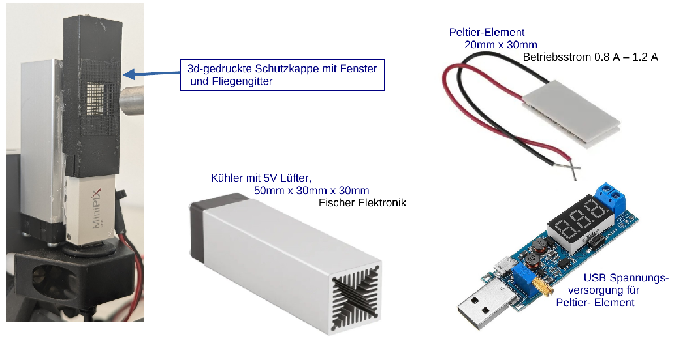

Eine im 3d-Druck gefertigte, verschiebbare Abdeckung schützt den Sensor vor Licht und
Berührung. Wenn α-Strahlung gemessen werden soll, wird die Abdeckung verschoben, 
so dass die mit einem Fliegengitter abgedeckte Öffnung den Sensor frei gibt, dieser 
aber immer noch vor versehentlicher Berührung geschützt ist.  
Ein auf der Sensorrückseite mit einem wärmeleitenden Kleber angebrachtes Peltier-Element
ist mit einem innenbelüfteten Kühlkörper mit Lüfter verbunden. Die Stromversorgung für
das Peltier-Element von 0.8 - 1.2 A bei ca. 2 V Versorgungsspannung liefert ein
regelbarer DC-DC-Konverter. 

Mit diesem Aufbau kann der *miniPIX* auch unter Praktikumsbedingungen sicher und über 
lange Messzeiten stabil betrieben werden. 
